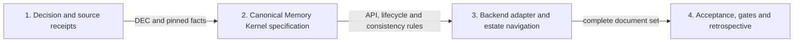

# Memory Kernel architecture delivery plan

Status: approved architecture; documentation-only execution.

## Work graph

## Task 1 — decision and evidence

`Carries: MEM-REQ-001, MEM-REQ-006, MEM-REQ-007`

- Append DEC-0014 under the active coordination lease.
- Add immutable upstream receipts to the source ledger.
- Add Memory Kernel terms to the canonical glossary.
- Check: `pnpm docs:check`.

## Task 2 — canonical specification

`Carries: MEM-REQ-001, MEM-REQ-002, MEM-REQ-003, MEM-REQ-004, MEM-REQ-005`

- Expand `docs/specification/memory-and-learning.md` with component boundaries,
  data model, lifecycle, consistency, conceptual API, retrieval and learning.
- Include component, state and write/query sequence diagrams.
- Preserve contract `0.1.0` schemas; name future activation work explicitly.
- Check: `pnpm docs:check` and requirement coverage review.

## Task 3 — adapter and reference architecture

`Carries: MEM-REQ-006, MEM-REQ-007`

- Add the pinned `mcp-memory-service` adapter architecture and safety gates.
- Compare Graphiti, Mem0 and Postgres/pgvector at the adapter boundary.
- Link the canonical specification from the estate scenario, README and DOCMAP.
- Check: `pnpm docs:check` and Mermaid parsing in `pnpm run check`.

## Task 4 — proof and closeout

`Carries: MEM-REQ-001, MEM-REQ-002, MEM-REQ-003, MEM-REQ-004, MEM-REQ-005, MEM-REQ-006, MEM-REQ-007`

- Run `pnpm run check` and `git diff --check`.
- Record acceptance against every `MEM-REQ-*` with file and command receipts.
- Record the direct-backend compatibility lesson in the retrospective.
- Reconcile coordination, merge through the private repository workflow and
  release the lease on every exit path.

No implementation checker is added: the output is architecture documentation,
and the existing documentation/full gates are the correct executable boundary.
