# Approved design — Fabric Agent Contract 0.1.0

- **Approved:** through the operator design interview ending 2026-08-26
- **UI verdict:** yes, documentation is the user-facing surface; v0.1 has no executable UI
- **Shape:** a profile and conformance layer over MCP, A2A and local terminal adapters

## Architecture

The contract separates five concerns:

1. **Description:** versioned manifests describe providers, capabilities,
   profiles and compatibility claims.
2. **Admission:** discovery, identity checks, shape validation, protocol
   negotiation and semantic probes produce an immutable admission decision.
3. **Binding:** a project pins an admitted capability to a role or node together
   with its execution context, grants, policy and checker.
4. **Execution:** an orchestrator coordinates scoped work and receives typed
   results, artifacts, observations and evidence without depending on provider
   internals.
5. **Learning:** retrospectives compare a failed attempt with a verified
   correction and propose a new versioned setting. They cannot mutate a running
   agent or overwrite history.

The common object contract is storage-agnostic. Schemas carry identifiers,
relations, state and integrity constraints; adapters translate those objects to
their own persistence and transport.

## Main components

| Component | Purpose | Depends on | Owns |
|---|---|---|---|
| Contract core | identifiers, envelopes, versions, classifications | JSON Schema 2020-12 | common definitions |
| Provider profiles | map MCP, A2A and local runners to common capabilities | core, pinned upstream protocols | profile requirements |
| Registry and admission | discover, verify, probe, admit, suspend and replace providers | core, profiles | admission records |
| Project binding | resolve an admitted capability for a role or work node | registry, governance, context | binding revisions |
| Coordination | prevent conflicting shared writes and record what actually happened | binding, lease backend | claims and coordination events |
| Result and evidence | separate claims, scope, proof, artifacts and unknowns | core | result envelope and evidence links |
| Memory and learning | hold project observations, promoted insights, retros and proposals | evidence, governance, versioning | memory records and promotions |
| Governance and context | constrain secrets, accounts, data, retention and external effects | core | grants, execution contexts, pools |
| Conformance | turn normative clauses into fixtures and a report | all contract modules | check catalogue and reports |

## Data flow

```mermaid
flowchart LR
  D[Discover provider] --> V[Validate manifest and identity]
  V --> N[Negotiate protocol revision]
  N --> P[Run semantic probes]
  P --> A{Admission decision}
  A -->|accepted| B[Create versioned project binding]
  A -->|rejected| Q[Evidence-backed rejection]
  B --> C[Pin execution context and policy]
  C --> L[Claim scoped work]
  L --> X[Execute through MCP, A2A, or local adapter]
  X --> R[Typed result and artifacts]
  R --> K[Independent checker]
  K -->|verified| M[Project memory and as-built record]
  K -->|failed| T[Retro and correction]
  T --> U[Versioned learning proposal]
  U -->|approved| B2[New binding or setting revision]
```

## Failure and degradation

- Invalid or incompatible declarations fail before a provider receives project
  context.
- A failed semantic probe leaves an admission record with evidence; it never
  becomes a binding.
- An expired lease prevents further shared writes. Recovery reconciles the
  branch and residue before another claim is issued.
- A rate-limited account may fall back only to another account in the pinned,
  approved project pool. The switch is an observable event.
- An unavailable optional specialist degrades to an explicit missing capability;
  it does not change base-role cardinality.
- Failed external actions do not retry beyond the grant and idempotency policy.
- Conflicting memory is preserved as competing claims with provenance; global
  promotion waits for independent evidence and CEO approval.
- Three entries into the same stage without a changed hypothesis trip a loop
  guard and require a new plan or human decision.

## User paths and states

### Agent author

Path: choose a profile → write manifest → validate locally → expose discovery →
receive admission report → correct or publish a compatible revision.

States: draft, schema-invalid, discoverable, identity-unverified,
protocol-incompatible, probe-failed, admitted, suspended, replaced.

### Project operator

Path: discover admitted capabilities → inspect trust and evidence → add provider
to project allowlist → create versioned binding → choose default terminal and
project account pool → optionally override an agent → observe runs → roll back by
creating a new revision.

States: empty registry, no compatible provider, permission denied, partial
capability coverage, expired grant, depleted account pool, checker failed,
binding superseded.

Errors name the failing gate, preserve a receipt, and state the next permitted
action. Secret values and provider-private reasoning never appear in reports.

## Testing strategy

Every normative object has positive and negative fixtures. Cross-object tests
exercise admission-to-binding, claim-to-result, rollback, fallback, promotion,
and retro flows. CI also compiles every schema, parses Mermaid, checks internal
links, validates version consistency, and records a conformance report. A planted
negative fixture must be observed failing before final green acceptance.

## Rejected alternatives

- **New Fabric wire protocol:** rejected because it duplicates established MCP
  and A2A transports and raises adapter cost.
- **One universal provider object with transport-specific free-form fields:**
  rejected because compatibility could not be validated mechanically.
- **Global-first memory:** rejected because sensitive records and project-local
  context would cross boundaries before review.
- **Mutable current settings:** rejected because runs could not be reproduced and
  retrospectives could silently rewrite their own evaluator.

## Global constraints

- Contract version: `0.1.0`.
- Schema dialect: `https://json-schema.org/draft/2020-12/schema`.
- Canonical schema prefix: `https://fabric.passioncode.ai/agent-contract/0.1.0/`.
- Runtime floor for repository validation: Node.js `>=20`.
- Package manager: pnpm, pinned through `packageManager`; frozen lockfile in CI.
- Implementation language for validators: TypeScript with strict type checking.
- Schema validator: Ajv's dedicated 2020-12 build plus `ajv-formats`.
- Test runner: Vitest in non-watch mode.
- Documentation: Markdown with Mermaid source only; Figma disabled.
- Repository: private, unlicensed, `private: true`, no package publication.
- Models: provider-owned and outside base contract 0.1.0.
- Secrets: opaque references only; ambient environment denied.
- External actions: draft-only without a named scoped expiring grant.
- Canonical knowledge: merged Git revisions; unmerged branches never enter the canonical KB.

## Self-review

- REQ coverage: 21 in brief, 21 covered, difference ∅
- Named checks: 10 named, 2 resolve at this commit, 8 are explicit build targets, 0 marked `review`
- Decisions: checked against DEC-0001..DEC-0013 and four rejected stage-2 options — no contradiction
- Cost: 29 surfaces/10 guards/21 REQs now, 9 components/7 failure guards/21 REQs at stage 2 — grown because each normative seam now has a schema or owning document
- Hygiene: 3 checks, 0 findings, 0 open
- Placeholders: 0 · Ambiguity: 3 found, 3 resolved inline (model ownership, discovery versus access, rollback semantics)
