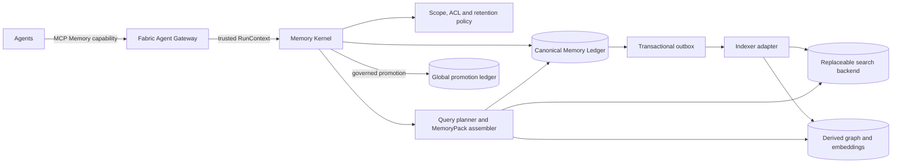

# Memory Kernel architecture design

`covers: MEM-REQ-001, MEM-REQ-002, MEM-REQ-003, MEM-REQ-004, MEM-REQ-005, MEM-REQ-006, MEM-REQ-007`

Status: approved by the operator on 2026-08-26. This design refines DEC-0003,
DEC-0004 and DEC-0012 without changing contract `0.1.0` machine schemas.

## Decision

Fabric owns a transport-neutral Memory Kernel. The kernel authenticates scope,
stores canonical revisions and evidence links, applies retention and promotion
policy, detects conflicts, and assembles bounded context packs. Search engines,
vector stores and knowledge graphs are replaceable data-plane adapters whose
indexes can be rebuilt from the canonical ledger.

The first recommended adapter is a pinned private deployment of
`mcp-memory-service`. Agents do not address that service directly. They call the
Fabric Memory API through the gateway; the kernel calls the backend over an
internal adapter interface. MCP is the agent-facing capability transport, REST
or an in-process SDK is the backend seam, and A2A remains the peer-task protocol.

## Why this split

- A backend can improve retrieval without acquiring authority over identity,
  permissions, promotion, deletion or truth.
- Project memory remains physically and logically isolated. Global memory accepts
  only governed promotions and links back to project evidence.
- Exact reads and conflict resolution remain deterministic even if semantic
  indexing is delayed or unavailable.
- The platform can replace the first backend with Graphiti, Mem0 or a custom
  Postgres/pgvector adapter without changing agent contracts.

## Components and ownership

The gateway owns authenticated caller and run identity. The kernel owns policy
and canonical state. The ledger owns immutable revisions and tombstones. Backend
indexes own only derived, rebuildable projections.

## Canonical semantics

Memory is classified on two independent axes: function and scope. Functions are
working, episodic, semantic and experiential. Scopes are run, agent-private,
project and global. A transcript or log is evidence/archive, not automatically a
memory record. A decision remains canonical in its governed source; memory holds
an exact-revision pointer and retrieval projection.

Writes are proposals. The kernel validates trusted scope, classification,
evidence, expected revision and policy before appending a revision. Concurrent
updates use compare-and-swap; last-write-wins is forbidden. Indexing is eventual,
but a run receives read-after-write through a ledger overlay. Exact lookup never
depends on the vector index.

Retrieval applies authorization and hard scope filters before lexical, vector or
graph search. It returns supported conflicts together, ranks authority,
freshness and relevance, and emits a token-bounded `MemoryPack` with citations,
unknowns and an opaque consistency cursor.

## Lifecycle and learning

New observations may become supported facts only with evidence. Conflict,
staleness, supersession, archival and deletion are explicit states. Consolidation
may propose a summary or learning but cannot self-approve or rewrite source
records. Retrospectives capture a failed attempt and independently verified
correction; approved learnings target only a future versioned setting.

Project-to-global movement is promotion, never replication. It requires
anonymization, conflict search, independent evidence or an explicit CEO
exception, classification checks and CEO approval. Global records retain source
pointers and can be withdrawn if their source or policy becomes invalid.

## First backend and alternatives

The pilot pins `mcp-memory-service` by immutable commit or image digest, runs one
store per project plus a separate global store, uses a versioned multilingual
embedding model, caps retrieval output and treats its graph and consolidation as
derived suggestions. Direct exposure of its MCP endpoint is blocked until it
passes the Fabric MCP `2026-07-28` profile because its pinned source still tests
an older protocol revision.

Graphiti is the preferred future adapter when temporal graph traversal justifies
the extra graph database and model dependency. Mem0 is a managed/OSS option whose
feature parity must be evaluated separately. Postgres plus pgvector remains the
lowest-level adapter when operational control matters more than packaged memory
features.

## Consequences

- The documentation defines a conceptual Memory API and adapter SPI now; wire
  schemas and runtime implementation require a future contract revision.
- Backend loss reduces semantic recall but does not destroy canonical memory.
- Ledger loss is a recovery incident and therefore requires encrypted backups,
  restore drills and auditable tombstone propagation.
- Retrieval quality, false recall, staleness, unresolved conflicts, context cost
  and accepted learning rate become explicit operational measures.

## Self-review

All seven memory requirements are represented. The design adds no new wire
protocol, keeps storage independence, preserves project-first/global-promotion
semantics, and prevents an LLM or retrieval backend from becoming the authority
for access control or truth. Deployment and implementation remain deliberately
outside this architecture-only run.
