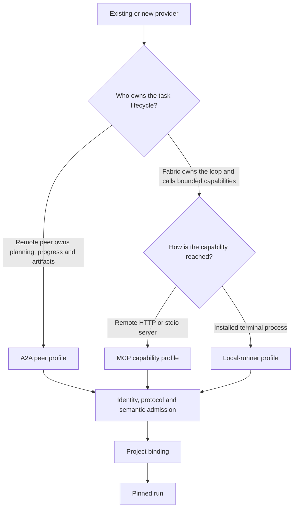
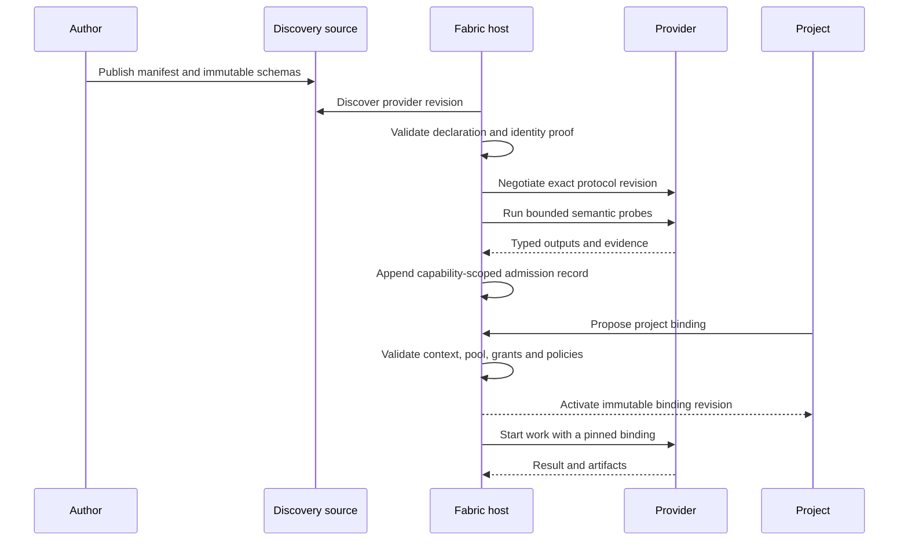
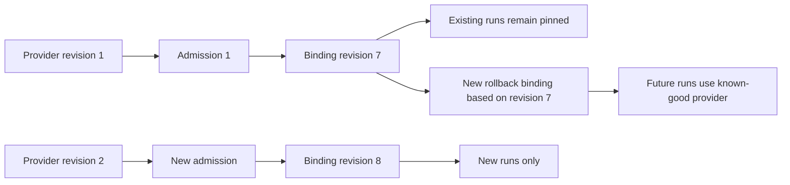

# Creating and connecting compatible agents

This guide is the practical entry point for an agent author and a Fabric project
operator. The normative contract remains in the linked specifications and JSON
Schemas. Contract version `0.1.0` is architecture and validation material: it does
not yet ship a Fabric registry service, host runtime, SDK or CLI.

## What compatibility means

A compatible integration has four independent proofs:

1. a versioned provider manifest validates against the
   [manifest schema](../../schemas/manifest.schema.json);
2. its declared MCP, A2A or local-runner revision negotiates successfully;
3. safe semantic probes prove each advertised capability;
4. a project creates an immutable binding that supplies the allowed execution
   context, account pool, grants and policies.

Passing the manifest schema proves declaration shape only. Discovery, admission
and project authorization are separate states.

## Choose one profile per capability



| Profile | Use when | Exact contract revision | Provider must expose |
|---|---|---|---|
| A2A peer | the remote agent accepts an outcome and owns its opaque task lifecycle | A2A `1.0` | HTTPS Agent Card, skill IDs, REST/JSON-RPC/gRPC binding, task/cancel behavior and probes |
| MCP capability | Fabric owns the loop and calls bounded tools, resources or prompts | MCP `2026-07-28` | streamable HTTP or stdio connection, exact feature names and probes |
| Local runner | Fabric starts an installed terminal agent | `fabric-local-runner/0.1` | executable reference, argument array, typed input/result locations, cancellation, heartbeat and probes |

One provider may offer several capabilities and use different profiles for them.
One capability cannot switch profile inside a run; a new binding revision is
required. See the normative [profile rules](../specification/profiles.md).

## Map an existing system

| Existing surface | Compatible path | Boundary |
|---|---|---|
| Native A2A agent | declare an A2A capability directly | Fabric observes protocol-visible task state, messages, evidence and artifacts, not private reasoning |
| Native MCP server | declare each host-shaped capability through MCP | the server is a capability provider, not automatically an autonomous peer |
| Claude Code, Codex, Cursor, DeepSeek CLI or another terminal agent | add a local-runner declaration and result adapter | the project chooses the runtime; model choice stays inside the provider |
| Ordinary HTTP API with bounded operations | wrap it with an MCP adapter | Fabric remains responsible for the task loop |
| Ordinary HTTP API that starts and owns long-running autonomous jobs | wrap it with an A2A peer adapter | the adapter maps the service job lifecycle to A2A tasks |
| Web application with no stable API or CLI | not directly compatible | add a supported API/CLI first; browser automation is not a Fabric base profile |

The protocol choice is made per capability, not per vendor. An external product
may therefore expose research as an A2A peer and a deterministic lookup operation
as MCP.

## Recommended provider project

The repository layout is a packaging recommendation, not a required wire shape:

```text
provider-project/
├── fabric-agent.json
├── schemas/
│   ├── capability-input.schema.json
│   └── capability-output.schema.json
├── fixtures/
│   └── admission-input.json
├── probes/
│   └── assertions.md
├── src/
│   └── provider implementation or adapter
├── agent-card.json
├── Dockerfile
└── README.md
```

`agent-card.json` is needed only for A2A. A local runner may not need a
`Dockerfile`. Secrets never belong in the manifest, fixture, argument string or
repository.

## Provider manifest responsibilities

The [manifest schema](../../schemas/manifest.schema.json) is authoritative. At a
minimum, the author declares:

| Area | Required responsibility |
|---|---|
| Provider identity | stable absolute URI, monotonic revision, canonical content hash, creation provenance, identity method and supported contract versions |
| Capability identity | stable URI and semantic name independent of implementation or model |
| Data contract | absolute input/output JSON Schema references |
| Effects | side-effect class, idempotency behavior and accepted data classifications |
| Protocol profile | exactly one MCP, A2A or local-runner declaration for the capability |
| Admission proof | bounded fixtures, timeout, side-effect ceiling, result schema and assertions |

Start from an executable positive fixture rather than copying a documentation
snippet:

- [A2A provider manifest](../../fixtures/positive/manifest-a2a.json)
- [MCP provider manifest](../../fixtures/positive/manifest-mcp.json)
- [local-runner provider manifest](../../fixtures/positive/manifest-local.json)

Every revision changes the manifest revision and content hash. A moving URL may
be used for discovery, but a run pins immutable provider, admission and binding
revision references.

## Inputs, outputs and evidence

Provider-specific input/output schemas describe the capability payload. Fabric
also normalizes every completed or stopped invocation into the common
[result envelope](../../schemas/result.schema.json):

| Collection | Meaning |
|---|---|
| `done` | atomic claims about work completed |
| `proof` | resolvable evidence supporting those claims |
| `scope` | project, run, node, binding and allowed write scopes |
| `notVerified` | claims or surfaces that were not independently checked |
| `artifacts` | immutable typed outputs |

A2A artifacts map into Fabric artifacts. MCP and local-runner outputs are wrapped
by their host adapter. A successful transport response is not proof that the
semantic task succeeded. The full rules live in
[results and evidence](../specification/results-and-evidence.md).

## Discovery, admission and binding



The current lifecycle is:

1. **Publish:** expose a manifest, referenced schemas, protocol endpoint or local
   executable reference, and admission fixtures.
2. **Discover:** add the manifest through direct configuration, a private
   registry, an A2A well-known Agent Card, MCP configuration or a local catalogue.
3. **Validate declaration:** compile the JSON Schemas and reject invalid or
   unsupported revisions before credentials or project data are supplied.
4. **Verify identity:** prove the provider subject through the method declared in
   the manifest.
5. **Negotiate protocol:** connect using exactly MCP `2026-07-28`, A2A `1.0` or
   `fabric-local-runner/0.1` for contract `0.1.0`.
6. **Probe semantics:** run bounded, non-publishing fixtures and evaluate declared
   result assertions.
7. **Admit capability:** append an immutable admission record for every capability
   whose independent gates passed.
8. **Bind project:** pin the admitted provider together with project execution,
   account, data, coordination, grant and checker policies.
9. **Run:** resolve the active binding once and keep the run pinned to it.

The normative lifecycle and failure states are in
[registry, admission and binding](../specification/registry.md).

## What a project binding controls

The [binding schema](../../schemas/binding.schema.json) pins:

- project and capability;
- provider and admission revisions;
- profile kind;
- execution context and project account pool;
- grants and data policy;
- coordination and checker policies;
- optional role and node scope.

This allows the same provider to serve several projects without sharing their
accounts, filesystem, data or grants. A provider is never trusted because another
project admitted or bound it.

## Replacement and rollback



Replacement never mutates an active run. A new provider revision receives a new
admission decision and project binding. Rollback is also a new revision based on a
known-good earlier payload; it does not reactivate or edit history. See
[immutable configuration versioning](../specification/versioning.md).

## What exists now

| Available in this repository | Not implemented in contract `0.1.0` |
|---|---|
| normative MCP/A2A/local-runner profiles | hosted provider registry or admission service |
| manifest, admission, binding, result and policy schemas | `fabric agent` CLI and provider SDK |
| positive and negative compatibility fixtures | runtime execution and account materialization |
| schema/semantic validation harness and CI | live protocol probes against third-party providers |
| UX scenarios for authoring, admission, binding and recovery | web UI or marketplace |

From this repository today, run:

```bash
pnpm install --frozen-lockfile
pnpm run check
```

That command proves the contract schemas, fixtures and documentation are
internally consistent. It does not admit an external implementation. Until the
host runtime exists, connecting a real provider means preparing the provider
bundle and adapter above for a future admission run; the contract repository by
itself cannot start or authorize it.

## Proposed authoring automation

The intended future CLI surface is shown to define the workflow, not as an
installed command:

```text
fabric agent init
fabric agent validate ./fabric-agent.json
fabric agent probe ./fabric-agent.json
fabric agent admit ./fabric-agent.json
fabric agent bind --project <project> --capability <capability>
fabric agent list
fabric agent rollback --binding <revision>
```

An implementation project for this CLI/SDK must add schemas for its command
results, connect admission records and bindings to a host runtime, test real
protocol negotiation and preserve the lifecycle above. Installation alone must
never imply admission.

## Author checklist

- [ ] Provider ID is stable and every published revision is immutable.
- [ ] Each capability has one semantic name and one selected profile.
- [ ] Protocol revision exactly matches the contract or is rejected explicitly.
- [ ] Input and output schemas resolve without credentials.
- [ ] Effects, idempotency and data classifications are honest.
- [ ] Admission probes are bounded, repeatable and cannot publish, charge or
  message real recipients.
- [ ] Results separate completed claims, proof and unverified claims.
- [ ] Cancellation, timeout and partial results preserve useful artifacts.
- [ ] No chain-of-thought, ambient environment or secret enters a contract field.

## Operator checklist

- [ ] Manifest shape, identity, protocol and semantic probes have separate verdicts.
- [ ] Admission applies only to the capabilities that passed.
- [ ] Binding references belong to the selected project and are immutable.
- [ ] Execution context exposes allowlisted secret references, not secret values.
- [ ] Account overrides stay inside the project's pinned account pool.
- [ ] External effects have matching scoped grants.
- [ ] Checker and coordination policies are pinned before the run starts.
- [ ] Replacement or rollback creates a new binding and leaves existing runs pinned.
