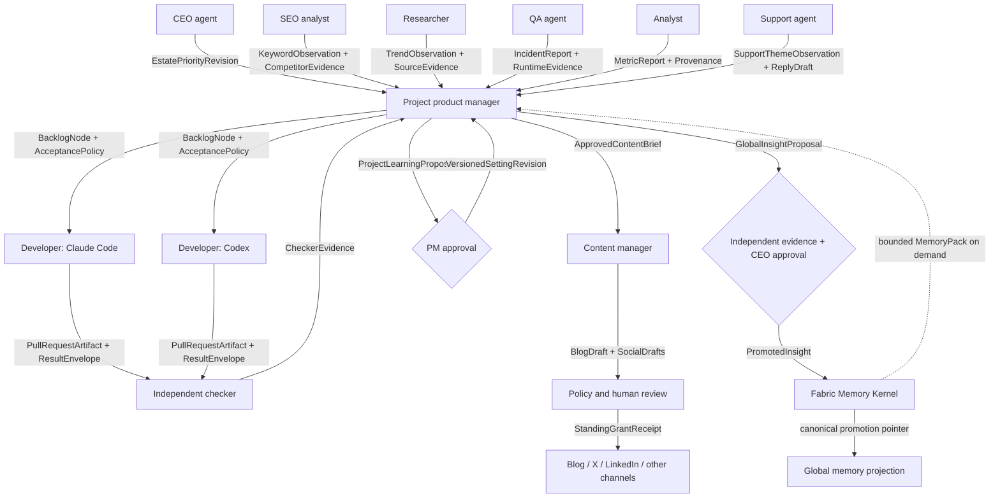

# Reference estate: project delivery and growth loop

`covers: REQ-006, REQ-007, REQ-008, REQ-010, REQ-011, REQ-012, REQ-013, REQ-014, REQ-016`

This scenario is non-normative. Roles beyond CEO, per-project product manager and
developers are examples dynamically registered through the contract.

## Components

| Agent | Scope | Consumes | Produces | Typical effects |
|---|---|---|---|---|
| CEO | estate | project reports, promoted insight proposals | estate priorities, global approvals | policy revision |
| Product manager | one project | all specialist reports, goals, incidents | prioritized backlog and work graph | project-setting approval |
| Developer (Claude Code, Codex or other local/A2A provider) | claimed node/worktree | backlog node, committed docs, context | branch, PR, result and evidence | Git push/PR under grant |
| Documentation developer | project | accepted backlog, canonical KB | committed documentation | Git only |
| SEO analyst | project | search data and public competitor pages | keyword observations, ranking changes | none by default |
| Researcher | project | trend sources | sourced topic observations | none by default |
| Content manager | project | approved briefs, brand and SEO evidence | blog/social drafts | publish only with standing grant |
| QA | project/runtime | logs, production health, crash groups | incident observations and reports | ticket/draft by default |
| Analyst | project | approved metrics | metric report with provenance | none |
| Support | project/channel | email, bot or userbot messages | drafts, support observations | reply only with standing grant |

## Named payload flow

## Project development sequence

1. Canonical committed documentation is indexed into project memory.
2. Product manager creates dependency-aware backlog nodes and write scopes.
3. Developers claim independent nodes; each receives a branch/worktree and its
   project execution context. Claude/Codex account selection stays within the
   project pool.
4. Developers push PR artifacts. Independent checkers verify acceptance and
   overlap; low-risk green PRs auto-merge.
5. Merge becomes canonical, triggers as-built reconciliation and KB indexing.
6. QA and analytics observe production or release evidence and report to the
   product manager.
7. Product manager reprioritizes. Failed cycles create retros and proposed future
   revisions; no agent rewrites its current instructions.

## Content and support sequence

SEO and research observations remain evidence-bearing inputs. The product manager
chooses priorities; the content manager drafts channel-specific artifacts.
Publication is denied without a matching scoped, expiring grant. Support behaves
the same way: raw personal messages stay project-only, replies default to drafts,
and only anonymized themes may become global insight proposals.

## Failure example

If the selected Claude account is rate-limited, the execution-context adapter
chooses the next eligible account in the pinned project pool and emits an
`account-switched` coordination event. If the whole pool is unavailable, the node
becomes blocked; it is not silently moved to another project's pool or another
provider. The product manager may approve a new pool revision or rebind the node
to an admitted Codex provider.

## Memory path

All roles use the host-shaped [Memory Kernel](../specification/memory-and-learning.md).
They do not address a vector store or graph directly. Project observations remain
isolated; approved global insights are pointers with evidence, and retrieval
returns a bounded, cited `MemoryPack`. The first private backend pilot is the
[`mcp-memory-service` adapter](mcp-memory-service-adapter.md), which remains
replaceable and non-canonical.
