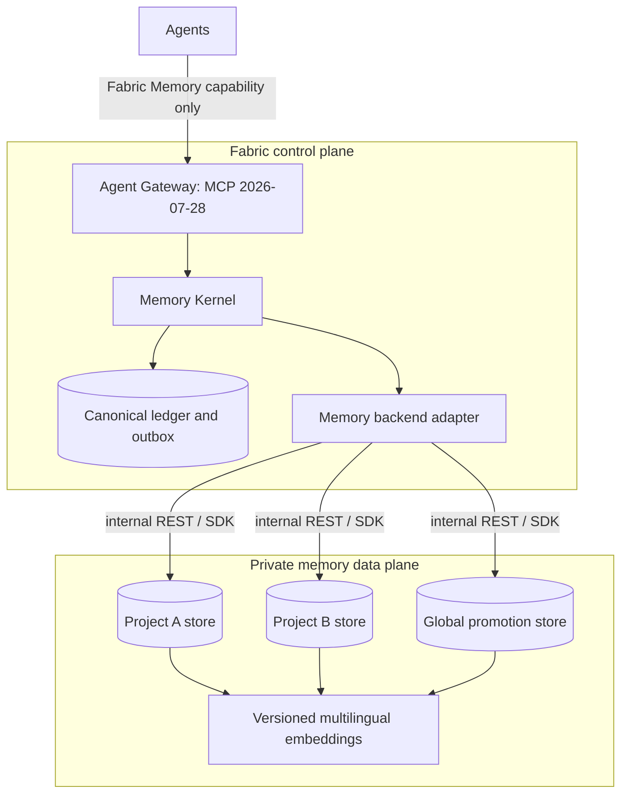

# Reference adapter: `mcp-memory-service`

`covers: MEM-REQ-006, MEM-REQ-007`

Status: recommended private pilot backend, not a mandated dependency. DEC-0014
keeps the Memory Kernel storage-agnostic. The pinned evidence is listed in the
[external source ledger](../evidence/sources.md).

## Deployment boundary

Each project receives a separate logical namespace and, for the pilot, a
separate database file or service instance. The global promotion store is
separate. Agent credentials cannot reach the backend. The adapter selects the
store from trusted `RunContext`; request payload fields cannot override it.

The first pilot uses an internal-only endpoint, encrypted volume and backups,
service identity per project, network allowlist and immutable container digest.
Cloud/hybrid deployment is deferred until the private path proves isolation,
restore, deletion and bounded retrieval.

## Protocol decision

Agents speak the Fabric MCP profile pinned to `2026-07-28`. The backend seam is
internal REST or an in-process SDK because the pinned `mcp-memory-service` source
tests an older MCP revision. Directly registering its MCP endpoint as the
canonical Fabric Memory capability is prohibited until a conformance probe proves
negotiation, tool shapes, authentication, cancellation, errors and size limits
against the pinned Fabric profile.

A2A is not used for storage. It remains appropriate when an independent memory
curator agent is delegated a task, but that agent still proposes mutations
through the Memory Kernel.

## Adapter mapping

| Memory backend SPI | Pilot mapping | Kernel responsibility retained |
|---|---|---|
| `upsertProjection` | create/update backend memory and metadata after outbox commit | canonical ID, revision, scope and evidence validation |
| `search` | bounded hybrid lexical/vector search; optional relation candidates | authorization, canonical fetch, conflicts, rerank and pack budget |
| `deleteProjection` | delete by canonical projection key and verify absence | tombstone authority and deletion completion |
| `health` | service, database, embedding and index checks | admission, quarantine and degraded-mode decision |
| `exportProjection` | provider export for migration comparison | canonical export comes from the ledger |
| `rebuild` | clear/recreate derived indexes from a ledger replay | projection version and replay cursor |

Backend metadata carries only opaque tenant key, canonical ID/revision,
classification bucket, validity bounds and projection version required for hard
filtering. It MUST NOT receive credentials or raw evidence beyond content
approved for indexing.

## Retrieval configuration

- Use a pinned multilingual embedding model for mixed Russian/English projects;
  the pilot candidate is `paraphrase-multilingual-MiniLM-L12-v2`.
- Record model identifier, digest, vector dimension, chunking and normalization
  as one immutable projection version. A change triggers a parallel reindex and
  measured cutover, never an in-place mixture of vectors.
- Set hard `limit` and response-character/token caps. The kernel applies its own
  lower `MemoryPack` budget after canonical hydration.
- Treat entity relations and graph traversal as derived candidates. The backend
  graph is not populated or trusted merely because the feature is enabled.
- Treat consolidation output as a proposal. It cannot merge, delete, promote or
  supersede canonical records by itself.
- Keep exact decisions and requested revisions on the ledger path; semantic
  search is not an exact-read substitute.

## Admission and operating gates

The pilot is admitted only when all gates have receipts:

1. Pin a reviewed commit no older than the security-fixed `11.8.5` line and an
   immutable image digest; scan dependencies and image contents.
2. Prove two-project isolation with negative cross-tenant queries and direct
   datastore inspection.
3. Prove write, index, query, update conflict, tombstone, deletion and complete
   rebuild from a ledger snapshot.
4. Measure RU/EN retrieval, supported-conflict visibility, false recall, missed
   recall, p95 pack latency, context tokens and projection lag on a project corpus.
5. Interrupt the backend during writes and prove the outbox replay is idempotent.
6. Restore an encrypted backup, replay tombstones before serving and verify that
   deleted records remain absent.
7. Export the projection and demonstrate migration to a no-op or alternative
   adapter without changing canonical IDs.

Failure of isolation, deletion, deterministic rebuild or bounded output blocks
the pilot. Lower retrieval quality permits an iteration only if exact paths and
canonical truth remain intact.

## Alternatives

| Adapter | Best fit | Main cost or risk | Recommendation |
|---|---|---|---|
| `mcp-memory-service` | fast self-hosted pilot with packaged hybrid retrieval and local storage | current MCP mismatch, default/model configuration and graph quality need explicit control | first private pilot behind the adapter |
| Graphiti | temporal entity/fact graph with episode provenance and validity windows | graph database plus model dependency; more operational surface | add when temporal traversal beats the pilot on evals |
| Mem0 | packaged memory APIs and managed/OSS choices | managed and OSS capabilities are not interchangeable; revalidate privacy and feature claims | evaluate as a second adapter, not as contract semantics |
| Postgres + pgvector | maximum ownership, SQL isolation and custom ranking | more application code for extraction, conflict handling and graph behavior | fallback when platform control outweighs packaged features |

The recommendation is intentionally reversible: Fabric invests in the ledger,
policy, adapter tests and evaluation corpus, not in provider-specific identities.

## Pilot sequence

Shadow mode receives committed ledger events but cannot affect agent context.
Canary mode may supply candidates to the kernel while exact paths and a kill
switch remain available. Production admission is a separate immutable decision,
not a consequence of completing installation.
