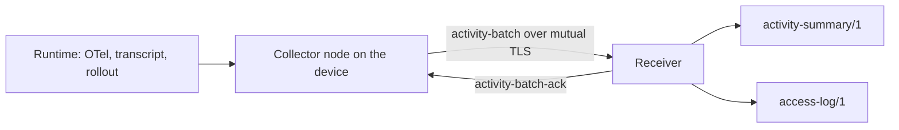

# Activity telemetry `fabric-activity/0.1`

DEC-0030 · rule codes `FAC-SEM-037`…`FAC-SEM-040` (and `FAC-SEM-045`, [devices](devices.md#attribution))
· schemas [`telemetry-event`](../../schemas/telemetry-event.schema.json),
[`activity-batch`](../../schemas/activity-batch.schema.json),
[`activity-batch-ack`](../../schemas/activity-batch-ack.schema.json),
[`activity-summary`](../../schemas/activity-summary.schema.json),
[`access-log`](../../schemas/access-log.schema.json), shared definitions in
[`activity-common`](../../schemas/activity-common.schema.json)

Activity telemetry records **when an agent session worked, waited or idled, and what each model
call used** — for debugging, for memory of how work went, and for spend reconciliation. A collector
on a device reads what coding-agent runtimes already emit (OpenTelemetry exports, transcripts,
rollout files, the desktop switchboard, process sampling). It turns that into telemetry events of
this shape and sends them in batches to an organization server (the **receiver**). Only a receiver
builds summaries.

The contract names every field it defines and closes every object it defines. A collector MUST NOT
add content or person attributes: no prompt, response, command line, window title or diff, and no
name, address, team or rank. A person appears only as an opaque `user.id`, in raw events only;
summaries have no person dimension. `FAC-SEM-037` is a **best-effort key filter** — a deny-list of
names checked in every spelling, plus a refusal of home paths in values — and not a proof that no
content passes. The schema's bounds on extension data (two levels, short tokens without whitespace)
are the stronger guard.

The key words MUST, MUST NOT, SHOULD and MAY are used as in RFC 2119. The protocol is its own
(`protocol: "fabric-activity/0.1"`), beside `fabric-service/0.1`; a manifest declares nothing for
it. The device side — enrollment, signed policy, check-in, health and attribution — is
[`fabric-device/0.1`](devices.md).

## Personal data and purpose

Telemetry events and check-ins that carry a `user.id`, or come from a device bound to a person, are
**personal data**. A receiver:

- MUST process them only for the purposes, and keep them only for the retention, that the
  organization's notice or policy states to the people concerned. The device policy carries the raw
  retention (`retention.raw_days`, [devices](devices.md#policy)).
- MUST record every read of a person's raw data in that person's [access log](#access-log) and MUST
  let the person read it.

The contract defines no score, rank or comparison of persons, and no field for one. Presence-derived
values are **estimates**, not observations of a person:

- an interval's `state` (each of `agent_working`, `awaiting_input` and `idle`);
- its `attended` flag;
- the durations a summary sums from them.

Each one comes from the `method` the event names, with the `idleThresholdSeconds` it used. The
[kinds](#kinds) below use the same wording.

## Telemetry event

Schema: [`telemetry-event.schema.json`](../../schemas/telemetry-event.schema.json). Fields are
`camelCase`, as in the rest of the contract; dots appear only inside identifiers (`kind`, `source`,
policy key names).

### Envelope

| Field | Meaning |
|---|---|
| `eventId` | The idempotency key ([below](#event-id)). |
| `kind` | `session.interval`, `usage.line`, `buffer.overflow`, an extension `x-<namespace>.<kind>`, or a kind a later revision adds. |
| `source` | Where the collector read it. Open vocabulary; known: `claude_code.otel`, `claude_code.transcript`, `codex.otel`, `codex.rollout`, `switchboard`, `process`. |
| `sourceKey` | Present exactly when `eventId` is derived. Either the source's own id of the record (a request id, a line uuid) or, for a key derived from a file, `hmac-sha256:` under the device's telemetry key ([below](#event-id)). Never a path: the schema refuses a slash and every encoded home-directory fragment. |
| `collector.id`, `collector.epoch`, `seq` | The stream position ([below](#streams)). |
| `occurred` | The device's wall clock when it happened. |
| `bootId`, `monotonicNs` | A monotonic reading ([below](#clocks)). |
| `received` | Set by the receiver when it stores the event. A device never sends it (the batch schema refuses it). |
| `user.id` | Optional and opaque: an organization membership id or a local profile id. The receiver sets it from the binding recorded for the event's epoch ([attribution](devices.md#attribution)). The pattern refuses `@` and spaces, so an e-mail address does not fit; a name-like id does, so issuing opaque values is the issuer's duty. |
| `session.id`, `session.parent` | The runtime's session, and the session that launched it when one agent started another. |
| `project.id` | The project the session worked in, as the organization names it. |
| `runtime.name`, `runtime.version` | The runtime (open vocabulary: `claude_code`, `codex`, …). |
| `skill` | The skill the work ran under, when the runtime reports one (Claude Code's `skill.name`). |
| `launch.via` | How the session was started: `fabric`, `terminal`, `ide`, `desktop`, `switchboard`, `cron`, `agent`, `other`. |
| `git.branch` | The branch, at most 100 characters from `[A-Za-z0-9._/-]`. When the policy key `telemetry.git_branch` says `hash`, it is `hmac-sha256:` of the name under the device's telemetry key, so a dictionary of common branch names cannot reverse it. When the key says `omit`, the field is absent. |
| `task.ref.system`, `task.ref.key` | The task the session served, in the tracker that owns it. |
| `run.task` | The host's run or work-graph node, when a host launched the session. |
| `data` | The kind's own fields. |

### Clocks

Three clocks are kept apart on purpose, and a reader never replaces one with another:

- `occurred` orders events for a person reading them;
- `monotonicNs` orders events of one boot on one device across wall-clock changes. It is the
  nanoseconds of a monotonic clock **that keeps counting during sleep** — `CLOCK_BOOTTIME` on Linux,
  `mach_continuous_time` on macOS, `QueryInterruptTimePrecise` on Windows — so interval durations do
  not shrink across a sleep. Readings compare only within one `bootId`. It is a decimal string, as
  OTLP's JSON encoding writes 64-bit times, because it passes 2^53 after about 104 days of uptime.
  It is at most 2^64 − 1 (`FAC-SEM-039`);
- `received` is the receiver's own.

### Kinds

**`session.interval`** — a stretch of one session in one state. It requires `session`, `project`
and `runtime`. `data`:

- `start` and `end` (`end` ≥ `start`, `FAC-SEM-039`);
- `state`: `agent_working`, `awaiting_input` or `idle` — an estimate by `method`
  ([purpose](#purpose));
- `method`: what produced the estimate (open vocabulary: `otel`, `hook`, `transcript`, `rollout`,
  `process`, `switchboard`);
- optional `idleThresholdSeconds`: the silence after which `agent_working` becomes `idle`;
- optional `attended`: an estimate by `method` of whether the session's interface reported a person
  present, sent only when the method can tell;
- optional `outcome`, on the last interval of a session: how it ended (open vocabulary: `completed`,
  `failed`, `abandoned`, `interrupted`, `unknown`).

**`usage.line`** — one model call. It requires `session`, `project` and `runtime`. `data`: `model`,
`tokens` (`input`, `output`, optional `cacheRead`, `cacheWrite`), `cost`, and `dedupeKey`.

- **An unknown cost is `null`, never `0`** (as in the service usage report, DEC-0021). `cost.usd` is
  either a number with a `cost.basis`, or `null` with no basis. The bases are:
  - `provider`: the provider charged it;
  - `price-list`: computed from a published list;
  - `client-estimate`: the runtime's own estimate, such as Claude Code's `cost_usd`.

  A zero client estimate for a call that used tokens is an unknown cost, so it is reported `null`
  (`FAC-SEM-038`). A zero from a price list that says the model is free stands.
- `dedupeKey` names the call itself — the provider's request id when the source has one — so the
  same call read from two sources is counted once. Lines that share a `dedupeKey` agree on model,
  tokens and cost (`FAC-SEM-038`).

**`buffer.overflow`** — the collector dropped events it could not keep. `data.dropped`:

- `ranges`: disjoint, non-touching ranges of this stream, all below this event's own seq;
- `events`: their total length (`FAC-SEM-039`);
- optional `byKind`: a list of `{kind, count}`. It is a list, so a kind name is a value and never
  read as a key by `FAC-SEM-037`.

A collector never drops an overflow event without carrying its ranges into the next one.

**Extension and unknown kinds.** A collector MAY emit its own kinds as `x-<namespace>.<kind>`. Any
kind a reader does not know — an extension, or a core kind a later revision of this protocol adds —
carries bounded `data`: at most two levels, scalar values, strings of at most 64 characters with no
whitespace and no absolute path (schema `activity-common#/$defs/extData`). A receiver MUST accept
and store an event of an unknown kind, count it in its stream, and never reject the batch for it.
It MUST NOT interpret the event's `data`. A new core kind is therefore an additive change within
`0.1`.

### No content, no person

`FAC-SEM-037` applies to every telemetry event, and to every event in a batch. Each key at any
depth is split into words — at `camelCase` boundaries, `_`, `-` and `.` — and refused when:

- a word, or a pair of adjacent words, names content (`prompt`, `response`, `text`, `message`,
  `command`, `diff`, `title`, `cwd`, `tool_input`, `window_title`, …);
- a word or a pair names a person (`email`, `team`, `manager`, `author`, `rank`, `review`,
  `display_name`, …);
- a word starts with a prefix that ranks a person's standing or output;
- the key is `user` anywhere but the event's own `/user`.

A value that holds a home directory is refused too, in plain and in encoded form: `/Users/<name>`,
`/home/<name>`, `~/`, `C:\Users\<name>`, and the forms runtimes write into file names
(`-Users-<name>-`, `C--Users-<name>`, `-home-<name>-`, `%2FUsers%2F`) — `HOME_PATH` in the same
module. A branch such as `feature/home-page` is not a home directory. The word lists live in [`src/activity-rules.ts`](../../src/activity-rules.ts)
(`CONTENT_WORDS`, `PERSON_WORDS`, `PERSON_PAIRS`, `PERSON_PREFIXES`). A receiver MUST refuse such an
event (`rejected[].reason` `content-field` or `person-field`) rather than strip it, so the collector
that produced it is fixed.

A collector MUST drop content and person attributes at the source. Claude Code's export carries
`user.email` when available, and can be configured to log prompt text, tool input and raw API bodies
([monitoring](https://code.claude.com/docs/en/monitoring-usage)). None of these reaches an event.

### Event id

`eventId` makes delivery idempotent: a receiver keeps one event per (`device.id`, `eventId`).

- An event read from a source that can be read again — an export that is retried, a transcript that
  is re-scanned after a restart — MUST carry a **derived** id, so a second read yields the same id.
  The id is `sha256:` followed by the hex SHA-256 of the canonical JSON of
  `{"key": <sourceKey>, "source": <source>}`, using the canonical form of
  [settings backups](service.md#settings-backup). The event carries that `sourceKey` (schema).
  `FAC-SEM-039` checks the derivation ([`activityEventId`](../../src/activity-rules.ts)).
- When the source has no id of its own, the record is identified by its place in a file. A
  **path-derived key MUST be hashed**: the `sourceKey` is `hmac-sha256:` and the hex HMAC-SHA-256 of
  the canonical JSON `{"offset": <byte offset>, "path": <path relative to the runtime's own
  directory>}`. A plain relative path leaks the person: Claude Code's project directories encode
  the home directory into the name (`-Users-<name>-…`).
- The HMAC key is the device's **telemetry key** ([`pathSourceKey`](../../src/activity-rules.ts),
  [`hashedBranch`](../../src/activity-rules.ts)): 32 random bytes the collector generates once per
  device, keeps beside its stream state, and never sends. A re-read on the same device yields the
  same key. The same telemetry key hashes `git.branch`. A collector that loses its telemetry key has
  lost its stream state too, and re-enrolls. Usage lines it reads again are still counted once by
  their `dedupeKey`.
- An event the collector originates itself — an interval it computed, an overflow — carries a ULID
  ([spec](https://github.com/ulid/spec)) and no `sourceKey`. The ULID is persisted with the event
  before the first send.

### Streams

A **collector node** is one sequence-emitting collector instance on a device; a device hosts one or
more. A stream is (`device.id`, `collector.id`, `collector.epoch`): a collector id is unique only
within its device, so every receiver keys streams by device as well. `seq` numbers a stream from 1,
by 1, with no reuse.

**The epoch is issued by the organization server**, never chosen by the collector. Each enrollment
returns a `streamEpoch` greater than every epoch issued to that device before
([devices](devices.md#enrollment)), and every collector on the device uses it from then on. A
collector that loses its persisted counter — a reinstall, a reset — MUST re-enroll the device. It
then starts again at seq 1 under the new epoch, which is not evidence of tampering. A collector that
still holds buffered events of an earlier epoch may finish sending them.

**A batch carries a contiguous slice of each stream, oldest first.** A collector buffers events in
seq order, drops only from the head (the oldest), and sends from the head. So within one batch the
seqs of a stream are consecutive (`FAC-SEM-039`). A gap can open only between what the receiver
already holds and the first seq of a batch — the events the collector dropped. The overflow event
that accounts for them is newer than every event still buffered, so it can arrive several batches
later.

## Batch and acknowledgement

Schemas: [`activity-batch.schema.json`](../../schemas/activity-batch.schema.json),
[`activity-batch-ack.schema.json`](../../schemas/activity-batch-ack.schema.json).

A device sends `{protocol, device.id, batchId?, sent, events[1..1000]}` over its enrolled
mutual-TLS channel. **The receiver attributes the batch to the client certificate**, not to the body:

- `device.id` MUST equal the certificate's device;
- every event's `user.id` MUST equal the user bound when the event's epoch was issued, or be absent
  when that epoch was issued with no user — so events of an earlier epoch stay with the person they
  belong to after the device is re-enrolled to someone else.

A mismatch is refused (`FAC-SEM-045`, [devices](devices.md#attribution)). The receiver answers:

- `accepted`, `duplicates`, `rejected[]` — one of the three for every event, so
  `accepted + duplicates + rejected.length` equals the batch's event count (`FAC-SEM-039`). A
  duplicate (`device.id`, `eventId`) is accepted again and counted, never an error. A retried batch
  is harmless.
- `rejected[]` — `eventId` and `reason`: `schema`, `content-field`, `person-field`, `stream`,
  `attribution`. **A rejected event is consumed with a rejection.** The collector does not resend
  it, and the stream does not stall on it.
- `acks[]` — for every stream the batch carried, `seq` and optional `held`, both computed over
  **everything the receiver holds for the stream across batches** — the same state it judges tamper
  evidence from ([`mergeStreams`](../../src/activity-rules.ts),
  [devices](devices.md#tamper-evidence)):
  - `seq` is the highest seq up to which every seq is **consumed**: held, rejected, or accounted for
    by an overflow, whichever batch brought it. Seq 0 means nothing yet.
  - `held` lists the consumed ranges above `seq`.

  An ack names no more and no less (`FAC-SEM-039`; [`contiguousAcks`](../../src/activity-rules.ts),
  which merges ranges and never walks seq by seq). Example: a receiver holds 5…1004 from earlier
  batches and receives the overflow at 1005 that accounts for 1…4. The ack is 1005, not 4.

**What the device keeps, and where the next batch starts.**

- A device keeps every event above `seq` that is not in a `held` range, and MAY drop the rest.
- The next batch starts at the device's oldest kept event that it has not yet sent on this
  connection. Events already in flight are not sent again until their batch fails or goes
  unacknowledged; then the device sends again from its oldest kept event.
- So a gap at the head of a stream, whose overflow is still buffered behind newer events, does not
  stall delivery: the device keeps sending forward, and the ack jumps when the overflow arrives.
- When its buffer fills, a device drops the oldest kept events and emits one `buffer.overflow`
  naming them. It never renumbers.
- The check-in reports dropped ranges whose overflow is not yet acknowledged, so a receiver can tell
  a pending overflow from a hidden gap ([devices](devices.md#tamper-evidence)).

## Summary

Schema: [`activity-summary.schema.json`](../../schemas/activity-summary.schema.json), format
`activity-summary/1`.

**A summary is built by a receiver, from many devices' events; a device never produces one** (the
schema has no producer kind, and `FAC-SEM-040` refuses one). A device sends events. A summary is a
set of **cells** between `from` and `to` inclusive, one per combination of:

- **agent** (`runtime.name`);
- **skill** (`skill`, optional);
- **project** (`project.id`);
- **UTC day**;
- **outcome** (the session's last `outcome`, else `unknown`).

A cell carries:

- `counts`: `sessions`, `intervals`, `usageLines`, `unpricedLines`;
- `durations`, each an estimate under the cell's `method` and the summary's `idleThresholdSeconds`:
  - `agentSeconds`: time spent `agent_working`;
  - `waitHumanSeconds`: time spent `awaiting_input`;
  - `waitAgentSeconds`: time a session waited on a session it launched, joined by `session.parent`;
  - `attendedSeconds`: time covered by `attended` intervals;
- `usage`: `tokens` and `cost`.
  - A cell whose every line is unpriced costs `null`.
  - A cell with some priced lines carries the known part, which a reader shows as a lower bound.
  - A known cost names its basis (schema), `mixed` when its lines differ (`FAC-SEM-038`).

**There is no person dimension.** The schema names every field a cell may carry. `FAC-SEM-040`
refuses a person key anywhere, two cells for one dimension tuple, and a day outside the range.

## Access log

Schema: [`access-log.schema.json`](../../schemas/access-log.schema.json), format `access-log/1`.

Every read of a subject's data is recorded. That covers raw activity keyed by their `user.id`, and
anything keyed by **a device bound to them**: health, check-ins and policy, which reveal for example
that the device is `logging_disabled`. Each entry records:

- `at`: when the read happened;
- `reader`: an opaque `user.id` or a `service`, and its `role`;
- `scope`: what was read (open vocabulary: `activity.raw`, `device.health`, `device.check_in`,
  `device.policy`);
- `device`: the device, when the read was keyed by one;
- `range`: the time range read;
- `purpose`: a sentence;
- `requestId`: the receiver's own request id.

A receiver that stores activity telemetry MUST record these reads and MUST let the subject read
their own log. Reads of summaries, which carry no person, are not logged per subject.

## Mapping to OpenTelemetry

A collector that also exports events as OpenTelemetry log records
([log data model](https://opentelemetry.io/docs/specs/otel/logs/data-model/), stable) maps them as
below. Names outside OpenTelemetry's conventions take the `fabric.` prefix. This is a mapping step,
not an identity: the runtimes' own exports use other names (Claude Code: `input_tokens`, `cost_usd`,
`cache_creation_tokens`).

| JSON path | OpenTelemetry |
|---|---|
| `occurred` | LogRecord `Timestamp` |
| `kind` | LogRecord `EventName` (`fabric.activity.` + kind) |
| `received` | not exported: the receiver's own |
| `eventId`, `source`, `sourceKey` | attributes `fabric.event_id`, `fabric.source`, `fabric.source_key` |
| `collector.id`, `collector.epoch`, `seq` | attributes `fabric.collector.id`, `fabric.collector.epoch`, `fabric.seq` |
| `bootId`, `monotonicNs` | attributes `fabric.boot_id`, `fabric.monotonic_ns` |
| `user.id` | attribute `user.id` |
| `session.id`, `session.parent` | attributes `session.id`, `fabric.session.parent` |
| `project.id`, `skill`, `launch.via`, `task.ref.*`, `run.task` | attributes `fabric.project.id`, `fabric.skill`, `fabric.launch.via`, `fabric.task.system` / `fabric.task.key`, `fabric.run.task` |
| `runtime.name`, `runtime.version` | resource `service.name`, `service.version` |
| `git.branch` | attribute `vcs.ref.head.name` |
| `data.model` | attribute `gen_ai.request.model` |
| `data.tokens.input`, `.output` | attributes `gen_ai.usage.input_tokens`, `gen_ai.usage.output_tokens` |
| `data.tokens.cacheRead`, `.cacheWrite` | attributes `gen_ai.usage.cache_read.input_tokens`, `gen_ai.usage.cache_creation.input_tokens` |
| `data.cost.usd`, `data.cost.basis`, `data.dedupeKey` | attributes `fabric.cost.usd`, `fabric.cost.basis`, `fabric.dedupe_key` |
| other `data.*` | attributes `fabric.data.*` |

## Semantic rules

| Code | Kind | Rule |
|---|---|---|
| `FAC-SEM-037` | `activity-batch`, `telemetry-event` | no key whose words name content or a person, in any spelling, at any depth, extension data included; `user` only as the event's own `/user`; no home directory, plain or encoded, in any value |
| `FAC-SEM-038` | `activity-batch`, `activity-summary`, `telemetry-event` | an unknown cost is `null`, never `0`: no zero client estimate for a call that used tokens; one `dedupeKey`, one model, tokens and cost; a summary cell's cost is `null` exactly when every line is unpriced |
| `FAC-SEM-039` | `activity-ack`, `activity-batch`, `telemetry-event` | `monotonicNs` fits in 64 bits; an interval ends after it starts; an overflow's ranges are disjoint, precede it and add up to its count; a `sourceKey` derives the `eventId`; each stream in a batch is consecutive with no repeated id; an ack's counts add up to the batch, it names the batch's device, each stream's ack is its highest consumed seq over all batches, and `held` names only consumed seqs above it |
| `FAC-SEM-040` | `activity-summary` | no person dimension, content key or path; no producer kind; one cell per agent × skill × project × day × outcome; every day inside `from`…`to` |

`activity-ack` checks `{known?, batch, ack}`: `known` is the receiver's stream state before the
batch (`[{collector, held, accounted}]`), then the batch, then the answer.

- Fixtures: `fixtures/positive/telemetry-event-*`, `activity-*` and `access-log.json`;
  `fixtures/negative/telemetry-event-*`, `activity-*` and `access-log-*`.
- Rule inputs: `fixtures/semantic/telemetry-event-*` and `activity-*`.
- Tests: `test/activity-rules.test.ts`.

## Not decided here

- (OQ-0009 a) A minimum cell size for summaries, so that a project one person works on alone does
  not identify them through the project dimension.
- (OQ-0009 b) What a receiver does when raw retention expires: delete, or keep under a stricter
  scope.
- (OQ-0009 c) An OTLP logs endpoint carrying the same records beside HTTPS batches.
