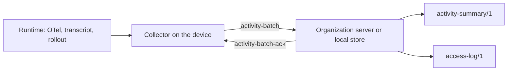

# Activity telemetry `fabric-activity/0.1`

DEC-0030 · rule codes `FAC-SEM-037`…`FAC-SEM-040` · schemas
[`activity-event`](../../schemas/activity-event.schema.json),
[`activity-batch`](../../schemas/activity-batch.schema.json),
[`activity-batch-ack`](../../schemas/activity-batch-ack.schema.json),
[`activity-summary`](../../schemas/activity-summary.schema.json),
[`access-log`](../../schemas/access-log.schema.json), shared definitions in
[`activity-common`](../../schemas/activity-common.schema.json)

Activity telemetry records **when an agent session worked, waited or idled, and what it spent** —
for debugging, for memory of how work went, and for spend reconciliation. A collector on a device
reads what coding-agent runtimes already emit (OpenTelemetry exports, transcripts, rollout files, the
desktop switchboard, process sampling), turns it into events of this shape and sends them in batches
to an organization server or a local store. Readers aggregate events into summaries.

It records **no content and no person attribute**: no prompt, response, command line or diff, and no
name, address, team or rank. A person appears only as an opaque `user.id`, and only in raw events;
summaries have no person dimension at all. Whoever reads a person's raw data is recorded in an
[access log](#access-log) that person can read.

The key words MUST, MUST NOT, SHOULD and MAY are used as in RFC 2119. It is a protocol of its own
(`protocol: "fabric-activity/0.1"`), beside `fabric-service/0.1`; a manifest declares nothing for it.
The device side — enrollment, signed policy, check-in, health — is
[`fabric-device/0.1`](devices.md).

**Spelling.** Activity telemetry spells its fields as OpenTelemetry attributes do: `snake_case`
leaves, and dotted names (`session.id`, `cost.usd`, `tokens.cache_read`) for paths into nested
objects. A collector that exports an event as an OpenTelemetry log record
([log data model](https://opentelemetry.io/docs/specs/otel/logs/data-model/)) flattens the paths into
attribute keys of the same spelling. The rest of the contract keeps its `camelCase`.

## Event

Schema: [`activity-event.schema.json`](../../schemas/activity-event.schema.json).

### Envelope

| Field | Meaning |
|---|---|
| `event_id` | The idempotency key of the event ([below](#event-id)). |
| `kind` | `session.interval`, `usage.line`, `buffer_overflow`, or an extension `x-<namespace>.<kind>`. |
| `source` | Where the collector read it. Open vocabulary; known: `claude_code.otel`, `claude_code.transcript`, `codex.otel`, `codex.rollout`, `switchboard`, `process`. |
| `source_key` | Optional: the source's own id of the record — a transcript line id, an API request id. |
| `node.id`, `node.epoch`, `seq` | The stream position ([below](#streams)). |
| `occurred` | The device's wall clock when it happened. |
| `monotonic_ns` | The device's monotonic clock in nanoseconds, a decimal string: it passes 2^53 after about 104 days of uptime, beyond what a JSON number holds exactly. |
| `received` | Set by the receiver when it stores the event. A device never sends it (the batch schema refuses it). |
| `user.id` | Optional, opaque: an organization membership id or a local profile id. Never an e-mail address or a name — the pattern admits neither `@` nor a space. |
| `session.id`, `session.parent` | The runtime's session, and the session that launched it when one agent started another. |
| `project.id` | The project the session worked in, as the organization names it. |
| `runtime.name`, `runtime.version` | The runtime (open vocabulary: `claude_code`, `codex`, …). |
| `launch.via` | How the session was started: `fabric`, `terminal`, `ide`, `desktop`, `switchboard`, `cron`, `agent`, `other`. |
| `git.branch` | The branch the session worked on. |
| `task.ref.system`, `task.ref.key` | The task the session served, in the tracker that owns it. |
| `run.task` | The host's run or work-graph node, when a host launched the session. |
| `data` | The kind's own fields. |

Three clocks are kept apart on purpose: `occurred` orders events for a person, `monotonic_ns` orders
them on one device across wall-clock changes, `received` is the receiver's own. A reader never
replaces one with another.

### Kinds

**`session.interval`** — a stretch of one session in one state. Requires `session`, `project` and
`runtime`. `data`: `start`, `end` (`end` ≥ `start`, `FAC-SEM-039`), `state` (`agent_working`,
`awaiting_input`, `idle`), `method` (how the state was determined, open vocabulary: `otel`, `hook`,
`transcript`, `rollout`, `process`, `switchboard`), optional `idle_threshold_s` (the silence after
which `agent_working` becomes `idle`) and optional `attended` (whether the session's interface had a
person present, only when the source can tell).

**`usage.line`** — one model call. Requires `session` and `project`. `data`: `model`, `tokens`
(`input`, `output`, optional `cache_read`, `cache_write`), `cost`, and `dedupe_key`.

- **An unknown cost is `null`, never `0`** (as in the service usage report, DEC-0021). `cost.usd` is
  a number with `cost.basis` — `provider` (the provider charged it), `price-list` (computed from a
  published list), `client-estimate` (the runtime's own estimate, such as Claude Code's `cost_usd`) —
  or `null` with no basis. A zero client estimate for a call that used tokens is an unknown cost, and
  is reported `null` (`FAC-SEM-038`); a zero from a price list that says the model is free stands.
- `dedupe_key` names the call itself — the provider's request id when the source has one — so the
  same call read from two sources (an OTel export and a transcript) is counted once. Lines that share
  a `dedupe_key` agree on model, tokens and cost (`FAC-SEM-038`).

**`buffer_overflow`** — the collector dropped events it could not keep. `data.dropped`: `events`,
`from_seq`, `to_seq` (the dropped range of this stream, before this event's own seq; `events` equals
its length, `FAC-SEM-039`), optional `by_kind` counts. The overflow is how a gap is accounted for: a
gap no overflow covers is evidence of tampering ([devices](devices.md#health)).

**Extensions `x-<namespace>.<kind>`** — a collector MAY emit its own kinds under its own namespace,
with any `data` object. A reader that does not know an extension kind MUST ignore it — store it, count
it in its stream, never reject the batch for it — and MUST NOT interpret its `data`. Every other kind
is defined here; a kind that is neither is refused by the schema.

### No content, no person

The schemas close every object they define. Extension `data` is open, so `FAC-SEM-037` scans every
key at any depth, and each of its dotted segments, for content (`prompt`, `response`, `content`,
`text`, `message`, `transcript`, `stdout`, `argv`, `diff`, …) and person attributes (`person`,
`email`, `display_name`, `team`, `department`, `manager`, `score`, `rating`, …); `user` is allowed only
as the event's own `/user`. A receiver MUST refuse such an event (`rejected[].reason`
`content-field` or `person-field`) rather than strip it, so the collector that produced it is fixed.

A collector MUST drop content and person attributes at the source. Claude Code's export carries
`user.email` when available and can be configured to log prompt text, tool input and raw API bodies
([monitoring](https://code.claude.com/docs/en/monitoring-usage)); none of these reaches an event. The
lists live in [`src/activity-rules.ts`](../../src/activity-rules.ts) (`CONTENT_KEYS`, `PERSON_KEYS`).

### Event id

`event_id` makes delivery idempotent: a receiver keeps one event per (`device.id`, `event_id`).

- An event read from a source that can be read again — an export that is retried, a transcript that
  is re-scanned after a restart — MUST carry a **derived** id, so a second read yields the same id:
  `sha256:` and the hex SHA-256 of the canonical JSON of `{"key": <source_key>, "source": <source>}`
  (the canonical form of [settings backups](service.md#settings-backup)). Such an event carries its
  `source_key`, and `FAC-SEM-039` checks the derivation
  ([`activityEventId`](../../src/activity-rules.ts)). When the source has no id of its own, the
  collector uses the tuple that identifies the record in it (for a rollout line, the file and the
  line's byte offset) as `source_key`.
- An event the collector originates itself — an interval it computed, an overflow — carries a ULID
  ([spec](https://github.com/ulid/spec)), persisted with the event before the first send.

### Streams

A **node** is one sequence-emitting collector instance on a device; a device hosts one or more.
`(node.id, node.epoch)` names a stream and `seq` numbers it from 1, by 1, with no reuse. The epoch
starts at 1 and increases when the collector loses its persisted counter (a reinstall, a reset); a new
epoch starts again at seq 1. Within a batch each stream runs forward (`FAC-SEM-039`).

## Batch and acknowledgement

Schemas: [`activity-batch.schema.json`](../../schemas/activity-batch.schema.json),
[`activity-batch-ack.schema.json`](../../schemas/activity-batch-ack.schema.json).

A device sends `{protocol, device.id, batch_id?, sent, events[1..1000]}` over its enrolled mutual-TLS
channel ([devices](devices.md#enrollment)). The receiver answers:

- `accepted`, `duplicates` — a duplicate (`device.id`, `event_id`) is accepted again and counted, never
  an error; a retried batch is harmless.
- `rejected[]` — `event_id` and `reason`: `schema`, `content-field`, `person-field`, `stream`.
- `acks[]` — for every stream the batch carried, the **highest contiguous seq** the receiver holds;
  seq 0 means nothing yet. The dropped range of a `buffer_overflow` counts as delivered. An ack names
  no more and no less (`FAC-SEM-039`; [`contiguousAcks`](../../src/activity-rules.ts)).

A device keeps every event until an ack covers it, then MAY drop it. When its buffer fills, it drops
the oldest unacknowledged events and emits one `buffer_overflow` naming them; it never renumbers.

## Summary

Schema: [`activity-summary.schema.json`](../../schemas/activity-summary.schema.json), format
`activity-summary/1`.

A summary is a set of **cells**, one per **agent** (`runtime.name`) × **skill** (optional) ×
**project** × **UTC day** × **outcome** (open vocabulary: `completed`, `failed`, `abandoned`,
`interrupted`, `unknown`), between `from` and `to` inclusive. A cell carries:

- `counts`: `sessions`, `intervals`, `usage_lines`, `unpriced_lines`;
- `durations`: `agent_s` (time `agent_working`), `wait_human_s` (time `awaiting_input`),
  `wait_agent_s` (time a session waited on a session it launched, joined by `session.parent`),
  `attended_s` (time `attended` intervals cover); with the summary's `idle_threshold_s` and the cell's
  `method`, so two summaries computed differently are not compared as if they were the same;
- `usage`: `tokens` and `cost`. A cell whose every line is unpriced costs `null`; one with some priced
  lines carries the known part, which a reader shows as a lower bound; a known cost names its basis,
  `mixed` when its lines differ (`FAC-SEM-038`).

**There is no person dimension.** The schema names every field a cell may carry, and `FAC-SEM-040`
refuses a person key anywhere, two cells for one dimension tuple, and a day outside the range. A
`producer` names the device or server that built the summary.

## Access log

Schema: [`access-log.schema.json`](../../schemas/access-log.schema.json), format `access-log/1`.

Every read of a subject's raw activity — and of any other scope keyed by their `user.id` — is
recorded: `at`, the `reader` (an opaque `user.id` or a `service`, and its `role`), the `scope` read
(open vocabulary: `activity.raw`, `activity.summary`, `device.health`, `device.policy`), the time
`range` read, a `purpose` sentence, and the receiver's `request_id`. A server that stores activity
telemetry MUST record these reads and MUST let the subject read their own log; the subject sees the
reader's role and purpose, not a reason to trust them. Reads of summaries, which carry no person, need
not be logged per subject.

## Semantic rules

| Code | Kind | Rule |
|---|---|---|
| `FAC-SEM-037` | `activity-event`, `activity-batch` | no content key and no person key at any depth, extension data included; `user` only as the event's own `/user` |
| `FAC-SEM-038` | `activity-batch`, `activity-event`, `activity-summary` | an unknown cost is `null`, never `0`: no zero client estimate for a call that used tokens; one `dedupe_key`, one model, tokens and cost; a summary cell's cost is `null` exactly when every line is unpriced, and a known cost names its basis |
| `FAC-SEM-039` | `activity-ack`, `activity-batch`, `activity-event` | an interval ends after it starts; an overflow's range precedes it and matches its count; a `source_key` derives the `event_id`; each stream in a batch runs forward with no repeated id; an ack is the highest contiguous seq of every stream it names, and names every stream the batch carried |
| `FAC-SEM-040` | `activity-summary` | no person dimension or content key; one cell per agent × skill × project × day × outcome; every day inside `from`…`to` |

`activity-ack` checks `{known?, batch, ack}`: the receiver's positions before the batch, the batch and
the answer. Fixtures: `fixtures/positive/activity-*`, `access-log.json`, `fixtures/negative/activity-*`,
`access-log-*`, and the rule inputs `fixtures/semantic/activity-*`; tests
`test/activity-rules.test.ts`.

## Not decided here

- (OQ-0009) A minimum cell size for summaries, so that a project one person works on alone does not identify
  them through the project dimension.
- How long a receiver keeps raw events: the device policy carries `retention.raw_days`
  ([devices](devices.md#policy)); what a server does at expiry is its own.
- A transport other than HTTPS batches (an OTLP logs endpoint carrying the same records).
