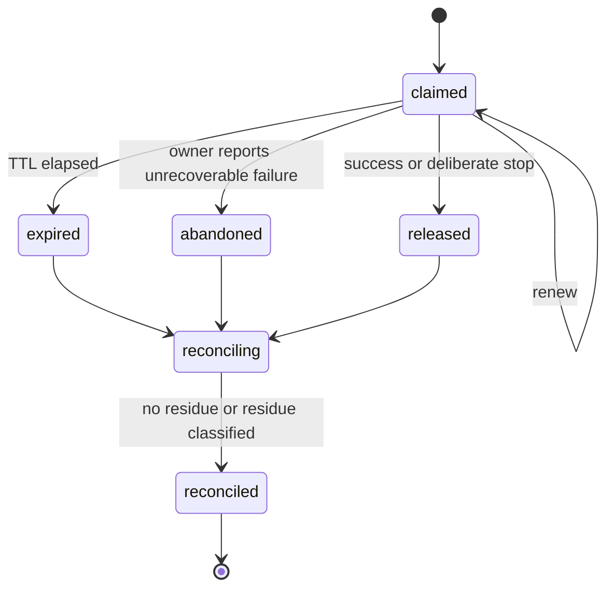
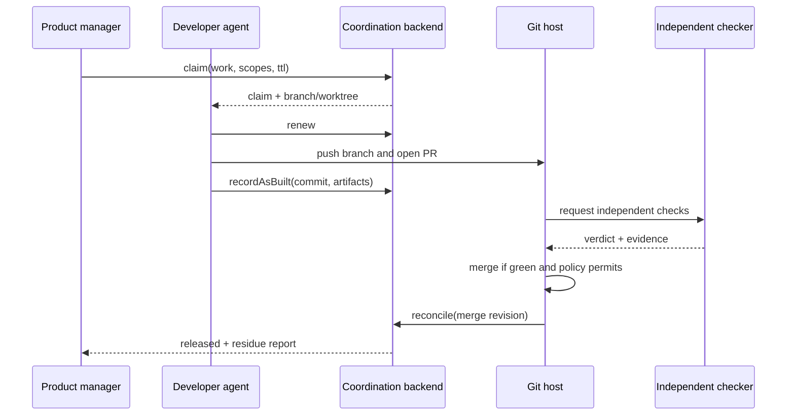

# Multi-agent coordination and Git integration

`covers: REQ-010, REQ-011`

Coordination semantics are mandatory for shared project work and
storage-agnostic. A lease backend supplies atomic exclusion; Git supplies durable
intent and implementation history; a knowledge system supplies retrieval, never
atomicity.

## Operations

| Operation | Required behavior |
|---|---|
| `claim(workId, owner, scopes, ttl)` | atomically create an expiring claim if no conflicting live claim exists |
| `renew(claimId, owner, ttl)` | extend only the same owner's live claim |
| `release(claimId, owner, outcome)` | close claim on success, failure or cancellation |
| `reserveId(namespace, owner, count, ttl)` | atomically reserve never-reused identifiers |
| `recordAsBuilt(claimId, revision, artifacts)` | link actual branch/commit/output to claimed intent |
| `reconcile(claimId)` | compare record plane, lease plane, branch and artifacts; classify residue |

## Write scopes

A claim names logical resources and, when applicable, guarded paths or registries.
Scopes conflict when they are identical, one contains the other, or project policy
declares them mutually exclusive. A lease authorizes coordination only; project
governance and Git protections still apply.

## Claim lifecycle

Every path releases or reconciles. Expiry does not prove the writer stopped; a
new owner MUST inspect branch and residue before writing the same scope.

## Git workflow for multiple developers

1. Product manager creates a work node with acceptance criteria and write scope.
2. Developer claims it and receives a dedicated branch and worktree.
3. Direct commits to the integration branch are forbidden.
4. Developer records as-built commit and opens a PR.
5. An independent checker that did not author the change verifies acceptance,
   tests, overlap and policy.
6. Green low-risk PRs MAY auto-merge. Security, secrets, data migration,
   permissions, external publication and policy changes require manual approval.
7. Merge triggers reconciliation, claim release and canonical KB ingestion.

## Idempotency and residue

Every coordination command has an idempotency key. Duplicate delivery returns the
original decision. Residue categories are `none`, `uncommitted-files`,
`unpushed-commit`, `open-pr`, `merged-unreconciled`, `external-effect` and
namespaced extensions. Residue is evidence, never silently discarded.
