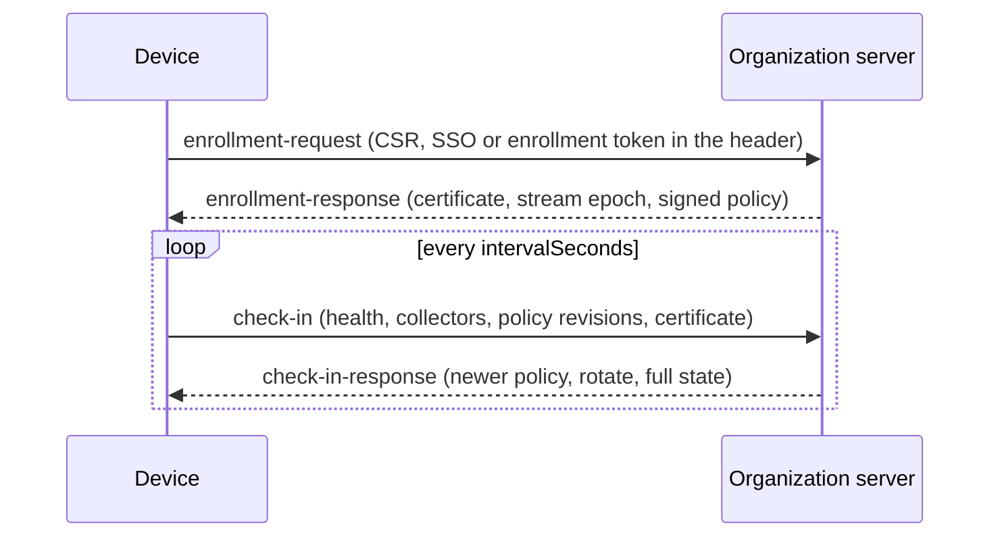

# Devices `fabric-device/0.1`

DEC-0031 · rule codes `FAC-SEM-041`…`FAC-SEM-045` · schemas
[`device-enrollment`](../../schemas/device-enrollment.schema.json),
[`device-policy`](../../schemas/device-policy.schema.json),
[`device-check-in`](../../schemas/device-check-in.schema.json),
[`device-health`](../../schemas/device-health.schema.json), shared definitions in
[`device-common`](../../schemas/device-common.schema.json)

A **device** is a computer on which collector nodes send [activity telemetry](activity.md) to an
organization server. This protocol covers three things:

- how a device is enrolled;
- how it receives policy the organization signed;
- how it checks in, so the server can tell whether its telemetry is complete.

Its shapes follow OpenTelemetry's agent-management protocol
([OpAMP](https://opentelemetry.io/docs/specs/opamp/)):

- a sequence-numbered status report;
- a remote configuration the agent acknowledges by revision;
- a request for full state after a gap;
- certificate rotation through a certificate signing request.

The key words MUST, MUST NOT, SHOULD and MAY are used as in RFC 2119. Every document carries
`protocol: "fabric-device/0.1"` and a `kind`. Fields are `camelCase`; policy key names are dotted
identifiers. Check-ins and health of a device bound to a person are personal data, under the
[purpose rules](activity.md#purpose) of activity telemetry.

## Enrollment

Schema: [`device-enrollment.schema.json`](../../schemas/device-enrollment.schema.json).

1. The device generates a key pair in hardware that does not export it, and a PKCS#10 certificate
   signing request (RFC 2986) signed by that key. The key's `storage` is `secure-enclave`, `tpm` or
   `platform-keystore`, it is `exportable: false`, and it MAY carry a platform `attestation`.
   `publicKeySha256` is the SHA-256 of the DER SubjectPublicKeyInfo in the CSR; the server checks it
   against the CSR and records it as the device's key on record.
2. It sends an `enrollment-request` with `org.id`, `device.id` and `platform`, the key
   description, the CSR, and `auth.method`:
   - `sso` — a person signs in through the organization's single sign-on; the server binds the
     certificate to that person's `user.id`;
   - `enrollment-token` — unattended creation by device management (MDM); `tokenId` names the
     token. The certificate binds a `user.id` only when the token names the person the device is
     assigned to. Otherwise the device is enrolled unassigned until an SSO sign-in re-enrolls it.

   **The proof — the SSO session or the token's secret — travels in the `Authorization` header,
   never in the body** (the schema refuses any other `auth` field). The server takes the user from
   the proof, not from the request.
3. The server answers an `enrollment-response`:
   - the certificate: `der`, `serial`, `notBefore`, `notAfter`, `issuer`, and the `binding` to
     `org.id`, `device.id` and, when known, `user.id`;
   - **`streamEpoch`**: the epoch every collector on the device uses from now on, greater than every
     epoch issued to this device before (`FAC-SEM-044`);
   - the check-in interval;
   - optionally the current signed server policy (never a `user` layer, schema).

The certificate is **short-lived**: at most 30 days (`FAC-SEM-044`), and SHOULD be 7. Its binding
names the organization and device of the request, and the signed-in user for an SSO enrollment
(`FAC-SEM-044`). Every later request — batches and check-ins — is made over mutual TLS with it.

**An enrolled device id is proven, not claimed.** A request for a `device.id` the server already
has on record is a re-enrollment. The server accepts it only with one of two proofs
(`FAC-SEM-044`):

- a CSR from the **key on record**: `publicKeySha256` equals the recorded key, and the CSR's own
  signature proves the device holds it;
- an **enrollment token issued by device management for that `device.id`**, for a device that lost
  its key (a wipe, a replaced board).

An SSO sign-in alone is not proof. Without this rule any member of the organization could enroll as
another person's device and make it look `tampered`. An administrator who retires a device removes
its record, and the next enrollment of that id is a first enrollment.

**Rotation and re-enrollment.** Before expiry, and SHOULD at two thirds of the lifetime, a check-in
response asks for `certificate.action: "rotate"`. The device then sends a new CSR from the same
hardware key and receives a new certificate under the same epoch. The device enrolls again from
step 2 when any of these happens:

- its certificate expired;
- a response says `re-enroll`;
- a collector on it lost its persisted counter ([streams](activity.md#streams)).

**Re-enrollment issues a new epoch and resets the device's policy-revision baseline**: a reinstalled
collector starts again at seq 1 and reports the policy revisions it holds now, and neither is
evidence of tampering. Nothing is renewed silently past `notAfter`.

## Attribution

**A receiver takes the device from the client certificate, and the user from the binding recorded
for each epoch — never from the body.** The server records, for every epoch it issues, the binding of
that enrollment (`org`, `device`, `user` when one was bound). For a batch or a check-in:

- `device.id` in the body MUST equal the certificate's device;
- every event's `user.id` MUST equal the user bound to **the event's epoch**, or be absent when that
  epoch was issued with no user;
- an event of an epoch with no recorded binding for this device is refused.

So when a device is re-enrolled to another person:

- events of the earlier epoch, still in the buffer, stay attributable to the person they belong to;
- events of an unassigned period carry no user;
- only events of the new epoch belong to the new person.

A mismatch is refused (`attribution` in the batch ack). A receiver that stores `user.id` writes the
epoch's bound value (`FAC-SEM-045`). So one device can never make another look `tampered`, or
attribute events to another person.

## Policy

Schema: [`device-policy.schema.json`](../../schemas/device-policy.schema.json).

A policy document is one **layer**, with a `revision`, `issuedAt` and `keys`. Each key is
`{value, locked?}`. The layer's `source` is one of:

- `mdm`: delivered by device management;
- `server`: delivered by the organization server;
- `user`: set on the device by the person using it.

| Key | Value | Meaning |
|---|---|---|
| `logging.required` | boolean | Activity telemetry must be on. Usually locked. |
| `build_channel.allowed` | `any`, `official`, `attested` | Which collector builds may run: any build, the organization's official build, or a build whose platform attestation verifies. |
| `telemetry.endpoint` | `https://` URL | Where batches go. Optional; when it is absent, batches go to the endpoint the device enrolled with. |
| `telemetry.git_branch` | `omit`, `hash`, `plain` | Whether events carry `git.branch`, its `sha256:`, or nothing. |
| `retention.raw_days` | integer, 1…3650 | How long raw events are kept before only summaries remain. |

**Unknown keys are kept and ignored**: a device that does not know a key MUST NOT reject the policy
for it. Extension keys are spelled `x-<namespace>.<key>`. A value has no fraction (schema). A
fraction is written as a string, because a signature covers canonical JSON, which has no form for
fractions ([settings backups](service.md#settings-backup)).

**Signature.** A `server` policy MUST be signed. An `mdm` policy MAY be, since its channel is the
operating system's managed preferences. A `user` layer is never signed and never delivered. The
signature is Ed25519 (RFC 8032) over the UTF-8 canonical JSON of the document without `signature`
([`policySigningInput`](../../src/device-rules.ts)), named by `keyId`. The device holds the
organization's trusted public keys **out of band** — through device management or its installer —
until OQ-0010 decides how a server publishes and rotates them.

**Revision.** A device applies a delivered policy only when both hold:

- its signature verifies under a trusted key;
- its revision is greater than the one the device holds for the same organization and layer
  (`FAC-SEM-041`).

It reports the revision it holds for each delivered layer in every check-in.

**Precedence and locks.** Precedence is `mdm` > `server` > `user`. The effective value of a key is
([`resolvePolicy`](../../src/device-rules.ts)):

1. if any layer **locks** the key, the value of the highest layer that locks it;
2. otherwise, the `user` layer's value, when it sets one;
3. otherwise, the value of the highest layer that sets it.

An unlocked value above the user layer is therefore a default the person may change; a locked one is
never overridden by a lower layer. A device MUST refuse a local change to a locked key and show the
key as locked. The `user` layer cannot lock (schema, `FAC-SEM-042`).

## Check-in

Schema: [`device-check-in.schema.json`](../../schemas/device-check-in.schema.json).

Every `intervalSeconds` the device sends a `check-in` (OpAMP `AgentToServer`):

- `sequenceNum` increases by one per check-in. On a gap the server answers with the flag
  `report_full_state`, and the next check-in carries `fullState: true`. A gap in check-ins is lost
  synchronisation, not tampering.
- `agent.version` and `agent.buildChannel` (`official`, `attested`, `unofficial`).
- `health.state` as the device sees itself, and `logging.enabled`.
- `collectors[]`, one per collector node:
  - `collector.id` and `collector.epoch`;
  - `lastSeq`: the highest seq assigned;
  - **`bufferedFrom`**: the lowest seq still buffered, or `lastSeq + 1` when the buffer is empty —
    every seq below it was sent or dropped;
  - **`dropped`**: the ranges dropped whose `buffer.overflow` event is not yet acknowledged;
  - `healthy`, and an optional `error`.
- `policy.layers[]`: for each delivered layer (`mdm`, `server`), the revision held (0 for none) and
  its `status` (`applied`, `applying`, `failed`). This is OpAMP's remote configuration status. The
  `server` layer is always reported, revision 0 when none arrived (schema), so a device cannot hide a
  revision by omitting the layer.
- `certificate.serial` and `notAfter`.

The server answers a `check-in-response` (OpAMP `ServerToAgent`): `nextCheckInSeconds`, `flags`, a
newer signed `policy` when there is one (never a `user` layer), and a `certificate.action`
(`rotate` or `re-enroll`) when one is due.

**Free text stays bounded.** Every `detail` and `error` string is one line of at most 200
characters with no absolute or home path (schema `device-common#/$defs/detail`). It MUST NOT name a
username or carry content.

## Health

Schema: [`device-health.schema.json`](../../schemas/device-health.schema.json).

The server judges each device's health from check-ins, batches and the effective policy. The state is
an open vocabulary; known states:

| State | When |
|---|---|
| `healthy` | Checking in, logging on, every collector healthy, no tamper evidence. |
| `degraded` | Checking in, but a collector reports an error or a policy failed to apply. |
| `offline` | No check-in for more than three intervals. |
| `inactive` | Checking in, but the collectors have produced no events for the period the server chooses. This says the collector is quiet; it says nothing about a person. |
| `logging_disabled` | The device reports logging off. When the effective policy requires logging, the state is at least this (`FAC-SEM-043`). |
| `tampered` | Evidence of tampering ([below](#tamper-evidence)). |
| `never_installed` | Enrolled or assigned, but no check-in ever. |
| `outdated` | The collector's version or build channel is not allowed by policy. |

`reasons[]` names what the judgement rests on (`code`, bounded `detail`). A reader shows an unknown
state as it is. Reads of a device's health are logged in its person's
[access log](activity.md#access-log).

### Tamper evidence

The server keeps, per stream and across batches, the seq ranges it **holds** (received, accepted or
rejected) and the ranges **accounted for** by overflows and by check-ins' `dropped`. All coverage is
computed by merging ranges, never seq by seq ([`tamperEvidence`](../../src/device-rules.ts),
[`mergeDeviceState`](../../src/device-rules.ts)). Evidence is:

- **a hole inside one batch**: a batch carries a contiguous slice of each stream;
- **a gap below `bufferedFrom`**: once a check-in says every seq below `bufferedFrom` was sent or
  dropped, a seq there that is neither held nor accounted for. Before that, a gap between batches is
  pending — its overflow may still be buffered;
- **an epoch the server never issued** to the device;
- **a collector counter that went back**: a `lastSeq` below a seq already held;
- **a buffer floor that went back**: a `bufferedFrom` below one the device reported before. Events
  leave a buffer only by acknowledgement or by an overflow, so the floor only rises;
- **a policy revision that went back**: a revision below one the device acknowledged since it last
  enrolled.

A reinstall re-enrolls, takes a new epoch, starts at seq 1 and resets the policy baseline, so it
produces none of these. When any of them is present, the state is `tampered` (`FAC-SEM-043`). The
server MAY reach `tampered` from other evidence too, such as an attestation that fails.

## Semantic rules

| Code | Kind | Rule |
|---|---|---|
| `FAC-SEM-041` | `device-policy-update` | a delivered policy is signed when it is a server policy, verifies under a trusted key, stays in its organization and layer, and moves its revision forward; a user layer is never delivered |
| `FAC-SEM-042` | `device-policy-resolution` | the effective settings are the resolution of the layers — lock first, then the user's value, then the highest default — with one layer per source and no lock in the user layer |
| `FAC-SEM-043` | `device-health-observation` | a health state is `tampered` when there is tamper evidence, and is `logging_disabled` or `tampered` when required logging is reported off |
| `FAC-SEM-044` | `device-enrollment` | re-enrolling a device on record needs a CSR from its key on record or a device-management token for that device; the certificate binds the request's organization and device, and the signed-in user for SSO; it lives at most 30 days; the stream epoch is above every epoch issued before |
| `FAC-SEM-045` | `device-attribution` | a batch's or check-in's device is the client certificate's device; every event's user is the user bound to its epoch, or absent when that epoch has none; an event of an epoch with no recorded binding is refused |

Each kind checks one input:

| Kind | Input |
|---|---|
| `device-policy-update` | `{current?, next, trustedKeys[{keyId, publicKey}]}`; `publicKey` is the raw 32-byte Ed25519 key in base64 |
| `device-policy-resolution` | `{layers, effective}` |
| `device-health-observation` | `{known: {deviceId, epochs, policyBaseline, streams[{collector, held, accounted, bufferedFrom?}]}, batch?, checkIn?, effective?, health}` |
| `device-enrollment` | `{request, response, issuedEpochs?, enrolled?: {keySha256}, token?: {tokenId, deviceId?}}` |
| `device-attribution` | `{binding, epochs: [{epoch, binding}], batch?, checkIn?}` |

Fixtures are `fixtures/positive/device-*` and `fixtures/negative/device-*`; the rule inputs are
`fixtures/semantic/device-*`. Tests: `test/device-rules.test.ts`.

## Not decided here

- (OQ-0010 a) Which attestation formats a server accepts for `build_channel.allowed: attested`.
- (OQ-0010 b) How a server publishes and rotates its trusted policy keys after enrollment.
- (OQ-0010 c) The period after which a quiet device is `inactive`.
