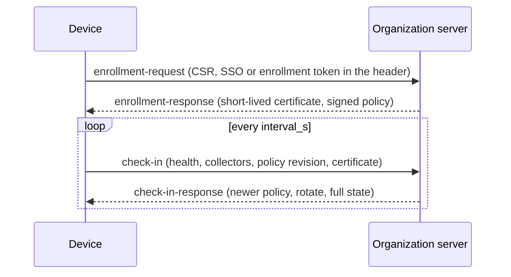

# Devices `fabric-device/0.1`

DEC-0031 · rule codes `FAC-SEM-041`…`FAC-SEM-044` · schemas
[`device-enrollment`](../../schemas/device-enrollment.schema.json),
[`device-policy`](../../schemas/device-policy.schema.json),
[`device-check-in`](../../schemas/device-check-in.schema.json),
[`device-health`](../../schemas/device-health.schema.json), shared definitions in
[`device-common`](../../schemas/device-common.schema.json)

A **device** is a computer on which a collector sends [activity telemetry](activity.md) to an
organization server. This protocol says how a device is enrolled, how it receives policy the
organization signed, and how it checks in so the server can tell whether its telemetry is complete.
Its shapes follow OpenTelemetry's agent-management protocol
([OpAMP](https://opentelemetry.io/docs/specs/opamp/)): a sequence-numbered status report, a remote
configuration the agent acknowledges by revision, a request for full state after a gap, and
certificate rotation through a certificate signing request.

The key words MUST, MUST NOT, SHOULD and MAY are used as in RFC 2119. Every document carries
`protocol: "fabric-device/0.1"` and a `kind`.

## Enrollment

Schema: [`device-enrollment.schema.json`](../../schemas/device-enrollment.schema.json).

1. The device generates a key pair in hardware that does not export it — `storage`
   `secure-enclave`, `tpm` or `platform-keystore`, `exportable: false`, with an optional platform
   `attestation` — and a PKCS#10 certificate signing request (RFC 2986) signed by that key.
2. It sends an `enrollment-request`: `org.id`, `device.id` and `platform`, the key description, the
   CSR, and `auth.method`:
   - `sso` — a person signs in through the organization's single sign-on; the server binds the
     certificate to that person's `user.id`;
   - `enrollment-token` — unattended creation by device management (MDM); `token_id` names the token.
     The certificate binds a `user.id` only when the token names the person the device is assigned
     to; otherwise the device is enrolled unassigned until an SSO sign-in re-enrolls it.

   **The proof — the SSO session or the token's secret — travels in the `Authorization` header, never
   in the body.** The server takes the user from the proof, not from the request.
3. The server answers an `enrollment-response`: the certificate (`der`, `serial`, `not_before`,
   `not_after`, `issuer`, and the `binding` to `org.id`, `device.id` and, when known, `user.id`), the
   check-in interval, and MAY carry the current signed server policy.

The certificate is **short-lived**: at most 30 days (`FAC-SEM-044`), SHOULD be 7. Its binding names
the organization and device of the request, and the signed-in user for an SSO enrollment
(`FAC-SEM-044`). Every later request — batches, check-ins — is made over mutual TLS with it.

**Rotation and re-enrollment.** A check-in response asks for `certificate.action: "rotate"` before
expiry (SHOULD at two thirds of the lifetime): the device sends a new CSR from the same hardware key
and receives a new certificate. A device whose certificate expired, or whose response says
`re-enroll`, enrolls again from step 2. Nothing is renewed silently past `not_after`.

## Policy

Schema: [`device-policy.schema.json`](../../schemas/device-policy.schema.json).

A policy document is one **layer**: `source` `mdm` (delivered by device management), `server`
(delivered by the organization server) or `user` (set on the device by the person using it), with a
`revision`, `issued_at` and `keys`. Each key is `{value, locked?}`.

| Key | Value | Meaning |
|---|---|---|
| `logging.required` | boolean | Activity telemetry must be on. Usually locked. |
| `build_channel.allowed` | `any`, `official`, `attested` | Which collector builds may run: any build, the organization's official build, or a build whose platform attestation verifies. |
| `telemetry.endpoint` | `https://` URL | Where batches go. Optional; absent means the endpoint enrollment gave. |
| `retention.raw_days` | integer, 1…3650 | How long raw events are kept before only summaries remain. |

**Unknown keys are kept and ignored**: a device that does not know a key MUST NOT reject the policy
for it. Extension keys are spelled `x-<namespace>.<key>`. A value that is a fraction is written as a
string, because a signature covers canonical JSON, which has no form for fractions
([settings backups](service.md#settings-backup)).

**Signature.** A `server` policy MUST be signed; an `mdm` policy MAY be (its channel is the
operating system's managed preferences); a `user` layer is never signed and never delivered. The
signature is Ed25519 (RFC 8032) over the UTF-8 canonical JSON of the document without `signature`
([`policySigningInput`](../../src/device-rules.ts)), named by `key_id`; the device holds the
organization's trusted public keys from enrollment.

**Revision.** A device applies a delivered policy only when its signature verifies under a trusted key
and its revision is greater than the revision it holds for the same organization and layer
(`FAC-SEM-041`). It reports the revision it holds in every check-in.

**Precedence and locks.** Precedence is `mdm` > `server` > `user`. The effective value of a key is
([`resolvePolicy`](../../src/device-rules.ts)):

1. if any layer **locks** the key, the value of the highest layer that locks it;
2. otherwise, the `user` layer's value, when it sets one;
3. otherwise, the value of the highest layer that sets it.

An unlocked value above the user layer is therefore a default the person may change; a locked one is
never overridden by a lower layer, and a device MUST refuse a local change to a locked key and show it
as locked. The `user` layer cannot lock (`FAC-SEM-042`).

## Check-in

Schema: [`device-check-in.schema.json`](../../schemas/device-check-in.schema.json).

Every `interval_s` the device sends a `check-in` (OpAMP `AgentToServer`):

- `sequence_num` increases by one per check-in. On a gap the server answers with the flag
  `report_full_state`, and the next check-in carries `full_state: true`; a gap in check-ins is lost
  synchronisation, not tampering.
- `agent.version` and `agent.build_channel` (`official`, `attested`, `unofficial`).
- `health.state` as the device sees itself, `logging.enabled`, and `collectors[]`: each node's
  `node.id`, `node.epoch`, `last_seq` assigned, `healthy`, optional `error`.
- `policy.revision` held (0 for none) and `status` (`applied`, `applying`, `failed`) — OpAMP's remote
  configuration status.
- `certificate.serial` and `not_after`.

The server answers a `check-in-response` (OpAMP `ServerToAgent`): `next_check_in_s`, `flags`, a newer
signed `policy` when there is one, and a `certificate.action` (`rotate` or `re-enroll`) when due.

## Health

Schema: [`device-health.schema.json`](../../schemas/device-health.schema.json).

The server judges each device's health from check-ins, batches and the effective policy. The state is
an open vocabulary; known states:

| State | When |
|---|---|
| `healthy` | Checking in, logging on, every collector healthy, streams complete. |
| `degraded` | Checking in, but a collector reports an error or a policy failed to apply. |
| `offline` | No check-in for more than three intervals. |
| `inactive` | Checking in, but no activity events for the period the server chooses. |
| `logging_disabled` | The device reports logging off. When the effective policy requires logging, the state is at least this (`FAC-SEM-043`). |
| `tampered` | Evidence of tampering ([below](#tamper-evidence)). |
| `never_installed` | Enrolled or assigned, but no check-in ever. |
| `outdated` | The collector's version or build channel is not allowed by policy. |

`reasons[]` names what the judgement rests on (`code`, `detail`). A reader shows an unknown state as
it is.

### Tamper evidence

From the positions the server already holds ([`tamperEvidence`](../../src/device-rules.ts)):

- **a seq gap** inside one `(node.id, node.epoch)` stream that no `buffer_overflow` accounts for;
- **an epoch that went back** for a node, in a batch or a check-in;
- **a collector counter that went back**: a check-in's `last_seq` below a seq already received in the
  same epoch;
- **a policy revision that went back** below one the device already acknowledged.

A new, higher epoch is not evidence by itself — it is what a reinstall looks like. When any of the
above is present, the state is `tampered` (`FAC-SEM-043`); the server MAY reach `tampered` from other
evidence too (an attestation that fails).

## Semantic rules

| Code | Kind | Rule |
|---|---|---|
| `FAC-SEM-041` | `device-policy-update` | a delivered policy is signed when it is a server policy, verifies under a trusted key, stays in its organization and layer, and moves its revision forward; a user layer is never delivered |
| `FAC-SEM-042` | `device-policy-resolution` | the effective settings are the resolution of the layers — lock first, then the user's value, then the highest default — with one layer per source and no lock in the user layer |
| `FAC-SEM-043` | `device-health-observation` | a health state is `tampered` when there is tamper evidence, and is `logging_disabled` or `tampered` when required logging is reported off |
| `FAC-SEM-044` | `device-enrollment` | the certificate binds the request's organization and device, the signed-in user for SSO, and lives at most 30 days |

Inputs: `device-policy-update` checks `{current?, next, trusted_keys[{key_id, public_key}]}` (the raw
32-byte Ed25519 key, base64); `device-policy-resolution` checks `{layers, effective}`;
`device-health-observation` checks `{known: {streams, policy_revision?}, batch?, check_in?, effective?,
health}`; `device-enrollment` checks `{request, response}`. Fixtures: `fixtures/positive/device-*`,
`fixtures/negative/device-*`, rule inputs `fixtures/semantic/device-*`; tests
`test/device-rules.test.ts`.

## Not decided here

- (OQ-0010) Which attestation formats a server accepts for `build_channel.allowed: attested`.
- How a server publishes and rotates its trusted policy keys after enrollment.
- The period after which a device that checks in without activity is `inactive`.
