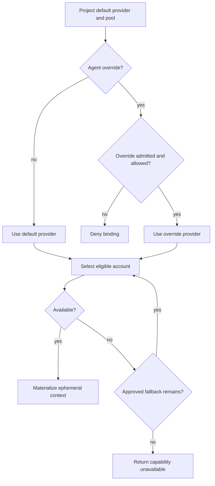

# Execution contexts and account pools

`covers: REQ-011, REQ-012, REQ-014`

Operator behavior is SCN-004 and SCN-006. DEC-0013 is normative.

## Project isolation

Each project pins one account-pool revision per provider or runner family. The
pool contains account references, priority, eligibility constraints, cooldown and
fallback order. Secret material lives in a secret manager and is referenced by an
opaque URI.

## ExecutionContext

An execution context revision declares:

- project and optional agent binding;
- provider/runner reference;
- working-directory policy and repository reference;
- allowlisted environment keys with literal non-secret values or secret refs;
- denied environment keys and ambient-environment policy `deny`;
- network, filesystem and tool scopes;
- account-pool revision and optional selected account reference;
- time, cost and concurrency limits;
- materialization and cleanup policy.

The host creates an ephemeral environment from the allowlist. It MUST NOT clone
the full parent `process.env`, shell profile, home-directory credentials or another
project's session.

## Selection

The operator chooses a default terminal provider per project. A binding MAY
override it for one agent. The selected provider and account MUST be present in
the project's admitted-provider allowlist and account pool. When the bound
capability is served by the local-runner profile, the host first resolves the
pinned runner route to one concrete provider
([Runner routes](runners.md#runner-routes)); account selection then proceeds as
below.

## Fallback

Fallback is allowed only for rate limit, provider unavailability, expired session
or policy-declared transient health failure. Authentication failure caused by a
revoked or invalid credential suspends that account and requires operator action
unless another already-approved account is eligible.

Every switch records from/to account references, reason, pool revision, run/node,
time and evidence. Runner switches under a pinned runner route record the same
facts for from/to candidate, runner kind and route revision
([Runner routes](runners.md#runner-routes)). A switch MUST NOT change provider
profile, model requirement or write scope implicitly.

## Cleanup

On completion, cancellation or expiry, the host revokes materialized credentials,
stops child processes and records cleanup evidence. Worktree cleanup waits until
Git reconciliation proves no uncommitted residue remains.
