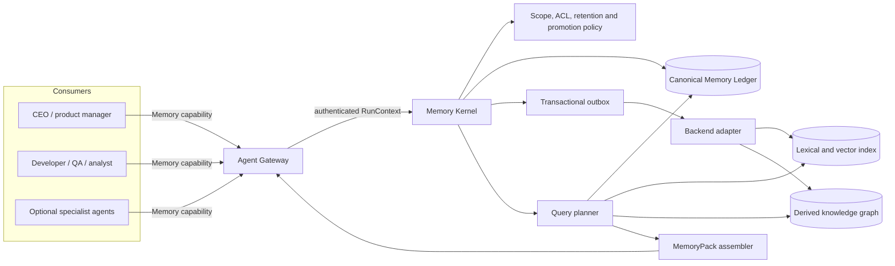
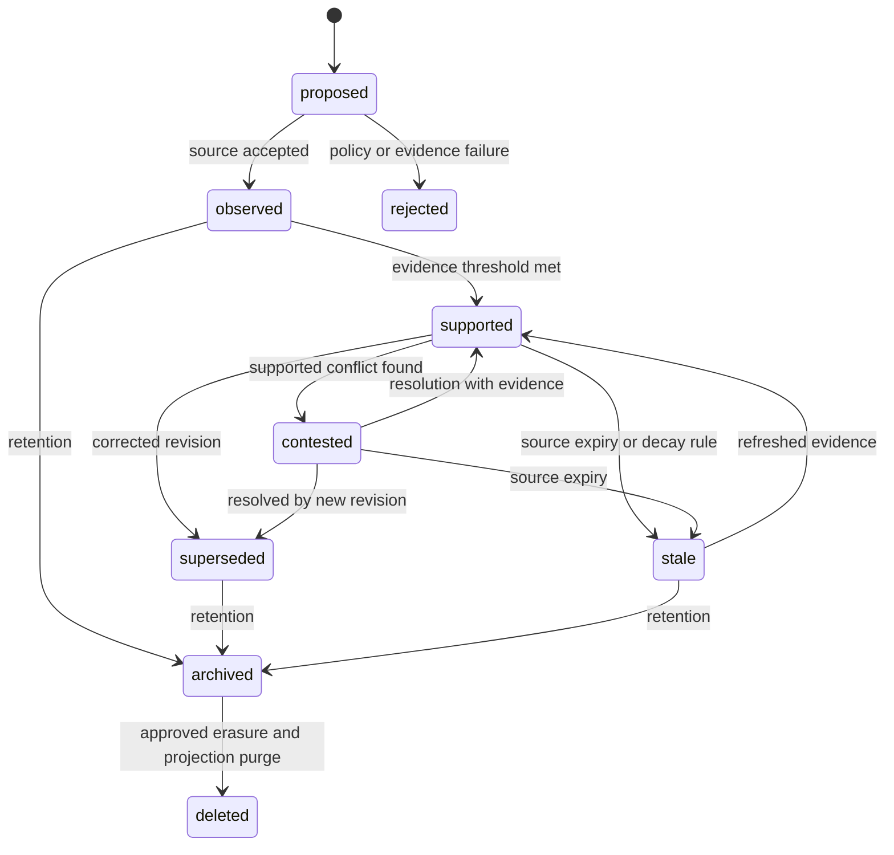
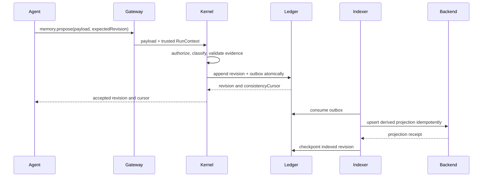
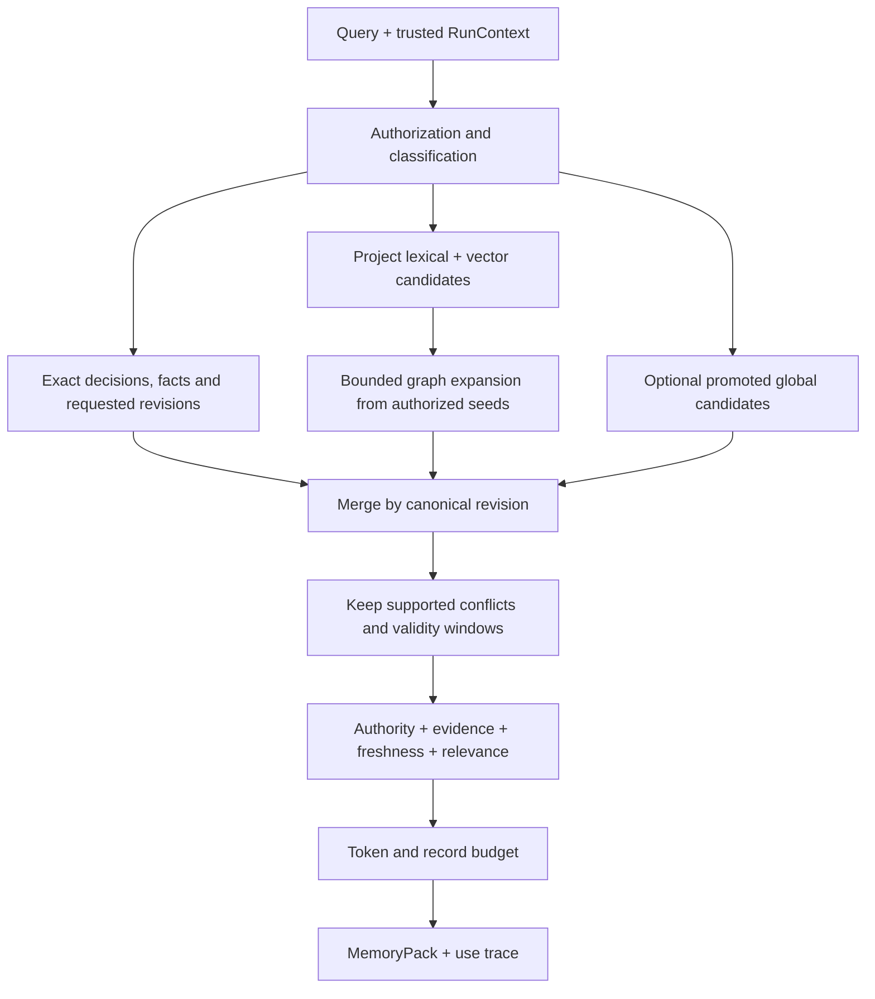

# Memory Kernel, retrospectives and learning

`covers: REQ-007, REQ-008, REQ-009, REQ-014, MEM-REQ-001, MEM-REQ-002, MEM-REQ-003, MEM-REQ-004, MEM-REQ-005`

Operator behavior is SCN-007 and SCN-008. DEC-0004 fixes project-first memory,
DEC-0012 fixes contrast-based learning, and DEC-0014 fixes the control-plane and
replaceable-backend boundary. This document is normative for architecture. The
existing contract `0.1.0` JSON schema remains the machine-readable shape; wire
activation of the conceptual API below requires a future versioned change.

## Invariants

1. Fabric is the authority for caller scope, policy, canonical revisions,
   evidence, conflicts, retention, promotion and context assembly.
2. An agent or backend MAY propose memory; neither may approve its own proposal
   or manufacture caller, project or classification identity.
3. The canonical memory ledger is append-only. Corrections supersede revisions;
   erasure creates an auditable tombstone and verified projection deletion.
4. Search, embeddings and graph edges are derived projections. They MUST be
   rebuildable without changing canonical identity or revision history.
5. Project content is private by default. Cross-project visibility occurs only
   through governed promotion.
6. Retrieval MUST be authorized, bounded and cited. Absence from a retrieval
   result is not proof that a record does not exist.

## Control plane and data plane



| Component | Owns | Must not own |
|---|---|---|
| Agent Gateway | authenticated org, project, agent, run and grants; protocol negotiation | memory truth or backend credentials exposed to agents |
| Memory Kernel | validation, revisions, conflicts, retention, promotion, query policy, use traces | provider-specific ranking internals |
| Canonical Memory Ledger | records, evidence links, state transitions, tombstones, outbox cursor | embeddings or mutable relevance scores |
| Backend adapter | indexing, search, health, export and rebuild for one provider | authorization, global promotion or destructive canonical writes |
| Query planner | hard filters, search plan, merge, rerank and context budget | silently resolving supported conflicts |
| Evidence/archive stores | immutable logs, documents, commits, incidents and metrics | automatic conversion of every event into memory |

Git revisions remain canonical for governed docs, specifications and ADRs. The
ledger points at exact committed revisions; an index MUST NOT present an unmerged
branch as canonical project knowledge. Runtime evidence stays in its owning store
and is linked by immutable URI and digest.

## Classification by function and scope

Function and scope are independent axes.

| Function | Meaning | Typical lifecycle |
|---|---|---|
| Working | temporary plan, scratch summary or unresolved hypothesis for one run | expires; never promoted directly |
| Episodic | what happened in a run, incident, interaction or delivery cycle | append-only observation; may support a later fact |
| Semantic | evidence-backed fact, entity relation, decision pointer or invariant | revised by evidence and validity interval |
| Experiential | verified contrast, heuristic or procedure learned from outcomes | proposal, independent verification, owner approval |

| Scope | Visibility | Isolation rule |
|---|---|---|
| Run | one run and its explicitly resumed descendants | local overlay; expires by policy |
| Agent-private | one agent identity inside one project | never visible to sibling agents unless shared explicitly |
| Project | admitted agents bound to one project and authorized classification | separate logical namespace and backend partition |
| Global | estate consumers authorized for the promoted classification | promotion ledger only; no raw project replication |

A full transcript, log stream or source document is evidence or archive, not
memory by default. Formation extracts a minimal claim or episode with provenance;
the source remains independently addressable.

## Canonical record

Each canonical revision has the following conceptual fields. Implementations may
normalize storage, but MUST preserve their semantics.

| Field | Meaning |
|---|---|
| `memoryId`, `revision` | stable identity plus monotonic immutable revision |
| `orgId`, `projectId`, `agentId`, `runId` | trusted scope; absent fields are allowed only when the selected scope permits it |
| `function`, `scope` | one function and one scope from the tables above |
| `statement` | minimal claim, episode summary or learning contrast |
| `state` | lifecycle state; never inferred only from backend rank |
| `provenance[]`, `evidence[]` | resolvable URI, digest, observed time and validity domain |
| `validFrom`, `validTo` | real-world validity, distinct from record creation time |
| `supersedes[]`, `conflictsWith[]` | explicit revision relationships |
| `confidence` | sourced assessment, not permission to hide disagreement |
| `classification`, `retentionPolicy` | access and lifecycle controls fixed by host policy |
| `embeddingVersion`, `indexedAt` | derived-projection receipts, not canonical meaning |

## Lifecycle



Conflicting supported records are returned together. Ranking MUST NOT silently
collapse disagreement. Decay changes retrieval weight or marks a revision stale;
it never removes provenance. A later revision may narrow a validity interval
without rewriting the earlier observation.

## Consistency and concurrency

| Operation | Required consistency | Failure behavior |
|---|---|---|
| Exact `memory.get` | strongly consistent ledger read at or after a supplied cursor | return unavailable rather than a stale projection |
| Proposal append | transactional ledger append plus outbox entry | no index write without a committed ledger revision |
| Concurrent correction | compare-and-swap on `expectedRevision` | return conflict with current revision; no last-write-wins |
| Same-run query after write | ledger overlay provides read-after-write | mark projection lag in the returned cursor |
| Semantic/graph retrieval | eventually consistent projection, bounded by hard scope filters | fall back to exact and lexical paths; report degraded sources |
| Project-to-global move | approval transaction creates a promotion record and source pointers | never copy raw source content as an implicit fallback |
| Deletion | canonical tombstone first, then idempotent projection purge | block completion until all configured backends attest purge or are quarantined |

The ledger transaction and backend index cannot share a distributed transaction.
A transactional outbox closes that gap. Index workers process idempotently by
`memoryId + revision + projectionVersion`; consumers use an opaque monotonic
cursor to request read-your-writes without depending on provider offsets.



## Conceptual Memory API

The agent-facing facade is host-shaped and transport-neutral.

| Operation | Caller | Result |
|---|---|---|
| `memory.query` | admitted agent with project binding | bounded `MemoryPack` plus use-trace identifier |
| `memory.get` | admitted agent or checker | exact authorized revision and relationships |
| `memory.propose` | any admitted agent | accepted proposal/revision or structured rejection/conflict |
| `memory.feedback` | consumer or checker | usefulness, correctness, outcome and cited use trace |
| `memory.promote` | agent proposes; CEO approves | governed global pointer or rejection |
| `memory.resolveConflict` | scope owner or delegated reviewer | new resolving revision; originals remain |
| `memory.forget` | privacy/retention authority | tombstone and projection-purge status |
| `memory.reindex`, `memory.export` | operator | rebuild/export receipt; no semantic mutation |

The gateway injects identity. An agent-supplied `projectId`, `agentId`, grant or
classification escalation is ignored and audited. A conceptual query is:

```yaml
intent: "prepare the next release plan"
functions: [semantic, experiential]
scopes: [project, global]
asOf: "2026-08-27T00:00:00Z"
minimumCursor: "opaque-run-cursor"
filters:
  entityIds: ["project:fabric"]
  states: [supported, contested]
budget:
  maxRecords: 24
  maxTokens: 6000
```

The returned `MemoryPack` contains selected record revisions, citations,
supported conflicts, excluded-stale counts, explicit unknowns, degraded sources,
token usage, the consistency cursor and a `useTraceId`. It never contains backend
credentials, inaccessible source snippets or an uncited synthesized fact.

## Retrieval and context assembly



Hard authorization, tenant, project, classification, validity and state filters
run before semantic ranking. Exact governed decisions and requested revisions
are loaded from the ledger. Hybrid lexical/vector search supplies candidates;
graph traversal expands only from already authorized seeds and is depth/budget
bounded. The planner then deduplicates by canonical revision, preserves
conflicts, reranks and assembles the pack.

Retrieval quality is evaluated end to end: citation precision, false recall,
stale recall, conflict visibility, task success and context cost. Vector similarity
alone is not an acceptance metric.

## Formation, evolution, use and retrospectives

1. **Formation:** events, documents and conversations remain in source stores.
   An extractor proposes minimal episodic or semantic records with provenance.
2. **Evolution:** evidence refresh, contradictions, validity changes and retention
   produce new revisions or state transitions. Consolidation creates proposals.
3. **Retrieval:** the query planner applies the pipeline above and emits a bounded
   pack with a use trace.
4. **Use:** the consuming run cites revisions in its result; later feedback links
   correctness and outcome to the use trace.
5. **Retrospective:** the project reviews failed paths, corrections, misleading or
   missing memory and unnecessary context. It may propose a future setting,
   checker, prompt, policy, schedule or memory revision.

A useful learning records goal, failed attempt, separately verified correction,
causal hypothesis, evidence, recurrence signal, scope and proposed change. It
MUST NOT mutate the active revision, target the current run, approve itself or
change its own acceptance checker. Product managers approve project proposals;
the CEO approves global proposals.

The project memory audit runs periodically and after material incidents. It
measures unsupported claims, unresolved conflicts, stale supported records,
orphaned evidence, false recall, missed recall, projection lag, deletion lag,
context tokens and accepted/rejected learning proposals. The audit proposes
repairs; it does not silently rewrite memory.

## Promotion and global memory

Any agent MAY propose a global insight. The proposal MUST:

- contain an anonymized insight rather than raw project content;
- cite at least two independent evidence groups, unless the CEO records an
  exceptional rationale;
- include conflict-search results and affected validity windows;
- pass classification, consent, residency and retention policy;
- receive CEO approval as a new immutable promotion revision.

Personal, credential, regulated and raw confidential content MUST NOT promote.
The global record links project sources through access-checked pointers; it does
not become their editable copy. If a source is withdrawn, expires or conflicts,
the promotion is reevaluated and may become contested, stale or withdrawn.

## Retention, forgetting and recovery

Retention is selected before write from trusted classification policy. Expiry
archives a revision or schedules approved erasure. Erasure appends a tombstone,
purges every projection idempotently, invalidates caches and records backend
attestations. Backups observe the same retention schedule; restore must replay
tombstones before serving queries.

Ledger and evidence backups are encrypted and restore-tested. Backend indexes are
rebuilt from ledger/outbox state and do not require authoritative backups. A
backend that cannot attest deletion, tenant isolation or export is quarantined.

## Degradation and loop guard

| Failure | Kernel behavior |
|---|---|
| Vector backend unavailable | exact/ledger and approved lexical fallback; mark semantic source degraded |
| Graph unavailable | skip expansion; do not invent relationships |
| Index lag exceeds policy | overlay recent ledger revisions or block cursor-bound query |
| Ledger unavailable | fail canonical reads and writes; never serve a projection as truth |
| Evidence URI unavailable | return record with evidence-unavailable state; reduce authority, do not erase history |
| Repeated contradictory proposals | open one conflict set and require reviewer resolution |

Each workflow node counts entries by stage and hypothesis hash. A third entry
into the same stage with the same hypothesis pauses it as `loop-guarded`.
Recovery requires a changed hypothesis, dependency, approved plan or human
decision. Switching model, runtime or account alone does not reset a logic loop.

## Backend adapter contract

A backend adapter exposes, conceptually, `upsertProjection`, `deleteProjection`,
`search`, `health`, `exportProjection` and `rebuild`. Every call is tenant-bound,
idempotent and versioned by projection configuration. Search returns candidate
IDs, scores and provider receipts; the kernel re-authorizes and resolves the
canonical revisions. The adapter cannot call promotion, conflict resolution or
retention APIs.

The first concrete mapping and alternatives are documented in the
[`mcp-memory-service` adapter](../reference-architecture/mcp-memory-service-adapter.md).
