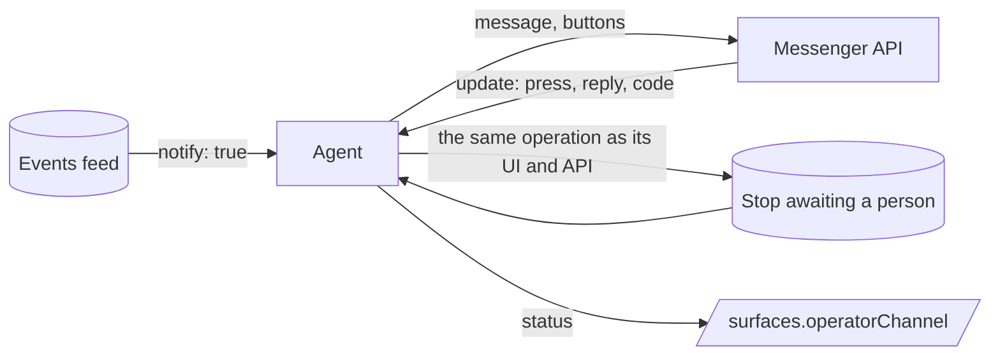

# Operator channel `fabric-operator-channel/0.1`

DEC-0034 · status schema [`operator-channel-status.schema.json`](../../schemas/operator-channel-status.schema.json)
· builds on [`fabric-service/0.1`](service.md) · beside [`fabric-project-comms/0.1`](project-comms.md)

An **operator channel** is an agent's own messenger channel to the person who operates it. The
agent sends what its [events feed](service.md#events-feed) asks to be noticed, and asks for the
decisions it stops for; the operator answers with a button or a reply, from a phone, without
opening the agent's dashboard. The first transport is the Telegram Bot API
([sources](../evidence/sources.md): Bot API 10.3).

It is a view of the agent's own state and an ingress to the agent's own operations. It is never a
second source of truth, never a second way to decide, and never a replacement for the
Project board.

The key words MUST, MUST NOT, SHOULD and MAY are used as in RFC 2119.

## Relation to the Project board

The Project board ([project-comms](project-comms.md), DEC-0022) carries messages between agents
and Projects. Its Telegram mirror ([Transport mirror](project-comms.md#transport-mirror), choice
C8 in [OQ-0008](../OPEN_QUESTIONS.md)) projects the **board**. The operator channel connects **one
agent** with **its operator**. They complement each other:

| | Board mirror (C8) | Operator channel (this profile) |
|---|---|---|
| Who speaks | the board, for a Project | one agent, for itself |
| Source of truth | the board | the agent's own state and events feed |
| Default | off | off (OC-1) |
| Who may cause an effect | allowlisted numeric user ids | allowlisted numeric user ids (OC-3) |
| Lost send response | durable `outcome_unknown`, never resent | the same (OC-4) |
| Loops between bots | bounded by causal origin, depth, deadline, rate, cost | bot messages ignored; no commands to bots (OC-12) |

The operator channel reuses the mirror's principles and adds what a single agent needs: binding,
buttons for stops, a confirmation for money, and a status a host can show. An agent MUST NOT
mirror board threads into its operator channel, and a board request MUST NOT be answered through
it; the board's own mirror is the place for those. A board mirror and an operator channel MUST
NOT share a bot token (OC-2).

## Rules

**OC-1 — Off by default; the credential by name.** The channel MUST be off until the operator
enables it. Only the operator enables it: an agent, its installer or another agent MUST NOT. The
transport credential (for Telegram, the bot token) MUST be held in the operator's secret store and
referred to by its **name**. Its value MUST NOT appear in configuration, code, state, logs,
events, prompts, the status document or an error message, and MUST NOT travel in a URL the agent
logs.

**OC-2 — One bot, one receiver.** An agent SHOULD have a bot of its own; a token MUST NOT be
shared with another agent or with a board mirror. Exactly one receiver serves a token: long polling
**or** a webhook, never both, and never two processes. The agent MUST hold an exclusive lease or
lock for receiving; a second process of the same agent is `standby` and MUST NOT poll. A webhook
found set on a token that the agent is configured to poll makes the channel `degraded`
(`webhook-set`) with an explanation; the agent MUST NOT delete it silently. Removing it is the
operator's action. A conflict answer from the transport (another `getUpdates` running) makes the
channel `degraded` (`receiver-conflict`).

**OC-3 — Binding by a one-time code.** The agent issues a link code locally — from its command
line or its dashboard, never through the channel. The code MUST carry at least 40 bits of
randomness, MUST be valid for at most 10 minutes and for one use, and MUST be stored only as a
hash. The operator types it in the chat with the bot. On a match, the agent binds that chat id and
the numeric user id of the sender, records both privately, and invalidates the code. **Chat
membership is not consent:** only an allowlisted numeric user id causes an effect. A message or
press from anyone else MUST cause no effect; the agent MAY answer with a short refusal that names
nothing private. Usernames and display names are never identity.

**OC-4 — Messages from the events feed.** What the channel sends comes from the agent's own
`fabric-service/0.1` events feed: every event with `notify: true` MUST be sent. The agent MAY add
messages that deliver a result (OC-10). The agent MUST keep a durable cursor over the feed and
MUST send at most one message per event id. It records a send as begun before it calls the
transport and as done when the transport answers. A send whose response was lost (a timeout, a
crash between the two records) becomes `outcome_unknown`, is counted in the status, and MUST NOT
be resent automatically; the operator may resend it. A confirmed send proves that the transport
accepted the message, not that anyone read it.

**OC-5 — Decisions with buttons.** A stop awaiting a person is sent with inline buttons, one per
action the stop allows. Each button carries an opaque token as its callback data (Telegram: 1–64
bytes). The agent maps the token, on its side, to the subject, the stop's round or revision and
the action, and binds it to the chat and the message it was sent in. Tokens MUST be unguessable
(at least 64 bits) because a client can send any callback data.

- Pressing a button MUST execute the **same** operation that the agent's own dashboard or API
  performs for that action, under the same authorization rules. There is no side path and no
  operation that only the channel can perform.
- Handling MUST be idempotent on the update id and on the token: a repeated update or a second
  press changes nothing more.
- A press for a stop already answered elsewhere, or for a round that has moved on, answers
  "already decided", says how, and removes the keyboard.
- The agent MUST answer every callback query (`answerCallbackQuery`), including refused and
  duplicate ones, so the operator's client stops waiting.

**OC-6 — Money and irreversible actions are confirmed.** An action that spends money or cannot be
undone MUST take a second, confirming press. The first press sends a confirmation that shows what
is at stake — the amount and currency, or "cost unknown" when it is unknown, never `0` — and
carries a separate confirm token that expires within 5 minutes. Only the confirm token executes.
An agent MAY exclude safety stops (for example an emergency spending stop) from the channel
entirely. It MUST then say, in the channel and in its status (`excluded`), where each excluded
stop is lifted instead.

**OC-7 — Free text as a reply.** A correction, a reason or any other free text arrives only as a
reply to the request message (Telegram: a `force_reply` prompt), from an allowlisted user id, at
most 2,000 characters. Text that is not a reply to an open request, or comes from anyone else,
causes no effect. Longer text is refused with the limit.

**OC-8 — Every effect is audited.** Every effect caused through the channel MUST be recorded in
the agent's audit or event log with the channel (`operator-channel:telegram-bot-api`) and the
numeric user id of the person — never the token, the link code or the message text of a secret.

**OC-9 — Status, and failure stays in the channel.** The agent MUST expose the channel's status
as [`operator-channel-status.schema.json`](../../schemas/operator-channel-status.schema.json)
at the path its well-known document names in `surfaces.operatorChannel.path`, token-protected
like the events feed. It SHOULD also show the state as a `summary` tile (`attention: true` when
`degraded`) and MAY print it as a line of its `doctor` command. A transport failure degrades the
channel, never the service: the service's `status` and `degraded` list are not changed by the
channel's state, and the service keeps serving. A rate-limit answer (HTTP 429) is waited out for
exactly the `retry_after` seconds it names before the request is repeated — never less — and a
request refused by a rate limit was not accepted, so repeating it is not a resend.

**OC-10 — Results.** A result file within the transport's upload ceiling is sent as media.
Telegram: photos up to 10 MB, other files up to 50 MB; an album has 2–10 items and **carries no
buttons**, so a decision about an album follows it as a separate message. A larger file is named
with its size and where to get it. A machine-local URL (`http://127.0.0.1:…`, `localhost`, a file
path) MUST NOT be presented as reachable from a phone; the message says that the file is on the
computer running the agent.

**OC-11 — The proposal duty.** An agent that has human stops or `notify` events proposes the
channel to its operator **once**: when it is created or adapted to Fabric, or at its first human
stop while the channel is off. The proposal lists the four steps that are the operator's:

1. create a bot with @BotFather;
2. put its token into the secret store under the name the agent states;
3. run the agent's link command;
4. type the code it shows in the chat with the bot.

The agent records the answer — `accepted`, `declined` or `later` — and shows it in its status
(`proposal`). A recorded answer ends the duty: the agent does not repeat the proposal on its
own. It MUST NOT create a bot, store a token or enable the channel itself.

**OC-12 — Loops are bounded.** The agent MUST ignore every message, reply and press whose sender
is a bot, even when bot-to-bot communication is enabled, and the channel MUST NOT send commands
to other bots.

**OC-13 — A group that becomes a supergroup keeps its binding.** When the transport reports that
a bound group migrated (Telegram: `migrate_to_chat_id` in a message or in an error's
`parameters`), the agent moves the binding to the new chat id, keeps the allowlist unchanged, and
audits the move (OC-8).

## Status

Schema: [`operator-channel-status.schema.json`](../../schemas/operator-channel-status.schema.json).

| State | Meaning | Requires |
|---|---|---|
| `off` | the operator has not enabled the channel (the default) | — |
| `unlinked` | enabled; no chat is bound yet, the agent waits for a code | `credential`, `receiver`; no `binding` |
| `linked` | bound; this process holds the receiving lease | `credential` present, `receiver.lease: held`, `binding`; no `reason` |
| `standby` | bound; another process of the same agent holds the lease | `reason`, `credential`, `receiver.lease: elsewhere`, `binding` |
| `degraded` | enabled, but the transport or its credential fails | `reason`, `credential` |

The document carries no chat id, user id, username or token: `binding` holds counts only, and
`credential` holds the secret's name and whether it is present. `lastSendAt` and
`lastReceiveAt` are `null` until the first send or update. `outcomeUnknown` counts sends kept
under OC-4; `pendingDecisions` counts decision requests not yet answered anywhere.

Known `reason.code` values (an open vocabulary; a host shows an unknown code as it is):

| Code | State | Meaning |
|---|---|---|
| `credential-missing` | `degraded` | the named secret is not in the store |
| `credential-refused` | `degraded` | the transport refused the credential |
| `webhook-set` | `degraded` | a webhook is set on a token the agent polls (OC-2) |
| `receiver-conflict` | `degraded` | another receiver uses the token (OC-2) |
| `transport-unreachable` | `degraded` | the transport did not answer |
| `rate-limited` | `degraded` | waiting out a 429; `retryAt` says until when (OC-9) |
| `chat-unavailable` | `degraded` | the bound chat blocked or removed the bot |
| `lease-held-elsewhere` | `standby` | another process of the agent receives (OC-2) |

## Not decided here

- Transports other than the Telegram Bot API; each is a later, additive revision of `transport`.
- Delivering a channel through a host (for example a dashboard relaying for several agents); a
  host that does so implements the same rules as the agent would.
- Semantic rules over a send ledger or a callback log. The rules above are normative under
  DEC-0034; the status document is checked by its schema and fixtures
  (`test/operator-channel.test.ts`).
