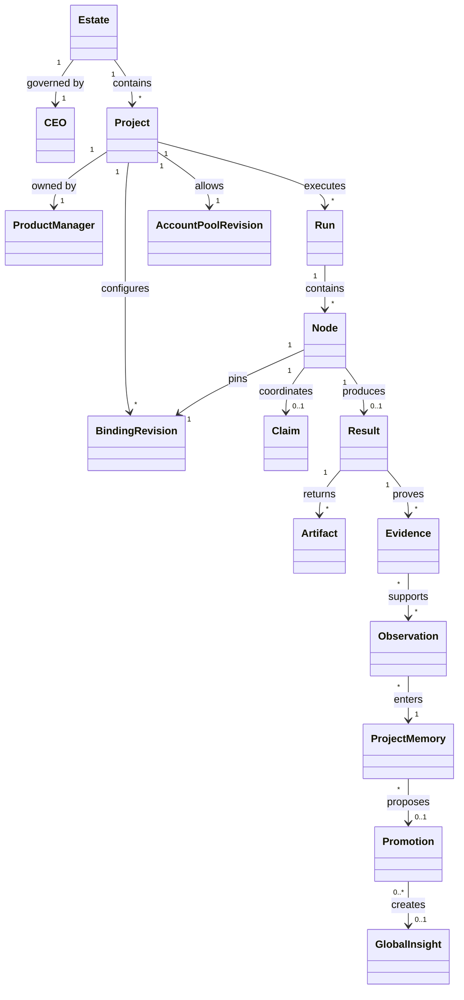

# Fabric Agent Contract 0.1.0

> Normative terms **MUST**, **MUST NOT**, **SHOULD**, **SHOULD NOT** and **MAY**
> express conformance obligations. Examples are non-normative.

`covers: REQ-001, REQ-002, REQ-003, REQ-006, REQ-013`

## Purpose

The Fabric Agent Contract lets an independently implemented provider participate
in a Fabric estate without sharing its internal agent loop, model, storage or
deployment. It defines a common description, admission, binding, execution,
evidence and governance layer over existing transports.

The contract version is `0.1.0`. All canonical JSON Schema identifiers begin
with `https://fabric.passioncode.ai/agent-contract/0.1.0/`.

## Conformance subjects

| Subject | Conforms when |
|---|---|
| Provider declaration | its manifest and referenced objects validate and its declared profile is internally consistent |
| Provider implementation | wire negotiation and mandatory semantic probes pass for an exact declared revision |
| Host | it enforces admission, binding, coordination, governance and evidence rules without relying on provider internals |
| Project configuration | all mutable choices are immutable revisions, references resolve, and role cardinality holds |
| Result | envelope shape validates and every proof or artifact URI resolves under the caller's authorization |

Shape conformance is necessary but not sufficient for implementation admission.

## Common identity and references

- Object IDs MUST be absolute URIs.
- Revisioned objects MUST carry `revision`, `contentHash`, `createdAt` and
  `createdBy`.
- `contentHash` MUST use `sha256:<64 lowercase hexadecimal digits>` over the
  canonical JSON representation with `contentHash` omitted.
- References MUST name an immutable object ID and revision. A moving alias MAY be
  used for discovery but MUST resolve before a run starts.
- Times use RFC 3339 UTC strings.
- Provider-private chain-of-thought is never a contract field.

## Object relationships

## Profiles

- **MCP capability profile:** a host invokes declared MCP tools or reads declared
  resources. The provider does not own the overall project task.
- **A2A peer profile:** an autonomous peer advertises an A2A Agent Card and owns
  an opaque task lifecycle that returns messages and artifacts.
- **Local runner profile:** a project-approved terminal adapter starts a local
  agent command in a constrained execution context.

Model choice is provider-internal in 0.1.0. A provider MAY expose model metadata
as an extension, but hosts MUST NOT depend on it for base conformance.

## Base role invariants

- An estate MUST have exactly one active `ceo` assignment.
- Each project MUST have exactly one active `product-manager` assignment.
- Each project MUST have at least one active `developer` assignment before a
  development node can become runnable.
- All other roles are optional registry values and MUST NOT alter the three base
  cardinality rules.

## Extension rule

Extension properties use an absolute-URI key under `extensions`. A host MUST
preserve unknown extensions it stores or forwards and MUST NOT treat an unknown
extension as satisfying a normative field. Breaking base-schema changes require a
new major contract version.
