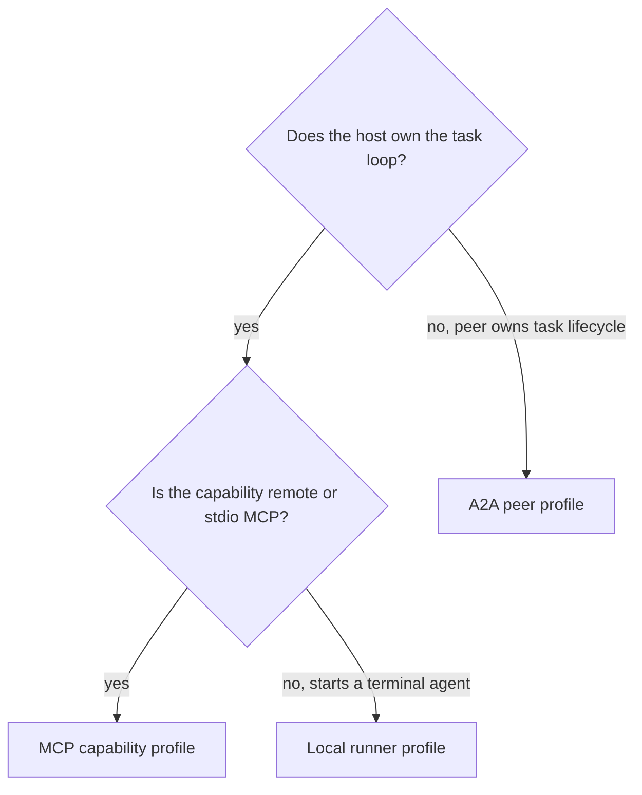

# Compatibility profiles

`covers: REQ-003, REQ-004, REQ-012, REQ-015`

Pinned upstream sources are listed in [the external source ledger](../evidence/sources.md).
The author path is SCN-001 and SCN-002.

## Common declaration

Every manifest declares one provider, one or more capabilities, and exactly one
profile per capability. A capability has a stable semantic name, input and output
schema references, side-effect class, idempotency declaration and required data
classifications.

## MCP capability profile

The profile MUST declare:

- MCP revision `2026-07-28` for contract 0.1.0;
- connection mode `streamable-http` or `stdio`;
- server identity and discovery endpoint or command reference;
- required MCP tools/resources/prompts by exact name;
- Fabric semantic probes, each with bounded input and a result assertion.

The host performs MCP initialization and capability negotiation before probes.
Missing negotiated capability or declared tool is `protocol-incompatible`.
Semantic probe failure is `probe-failed`, not a transport failure.

OAuth browser consent remains client-local and MUST NOT be converted into a
static gateway credential. Stdio environment values use secret references only.

## A2A peer profile

The profile MUST declare:

- A2A version `1.0` for contract 0.1.0;
- an HTTPS Agent Card URL, normally `/.well-known/agent-card.json`;
- the exact Agent Card skill IDs used to satisfy Fabric capabilities;
- supported binding (`REST`, `JSON-RPC` or `gRPC`) and optional streaming/push;
- task-state mapping and cancellation behavior;
- Fabric semantic probes.

The A2A task is opaque to Fabric except for protocol-visible messages, artifacts,
status and evidence explicitly returned. A provider MUST NOT be required to
expose internal planning or model reasoning.

## Local runner profile

The profile MUST declare:

- profile revision `fabric-local-runner/0.1`;
- runner kind such as `claude-code`, `codex`, `cursor`, `deepseek-cli` or a
  namespaced extension;
- executable reference and argument template with typed placeholders;
- input mode and result-envelope location;
- supported cancellation and heartbeat behavior;
- required execution-context capabilities.

The project chooses a default local runner. An agent binding MAY override it only
with a provider admitted to that project. The provider owns model choice.

Commands MUST be represented as an executable plus an argument array. Shell
strings are non-conforming because quoting and command substitution cannot be
validated safely.

## Profile selection

A provider exposing both MCP tools and an A2A peer declares two capabilities and
two profiles. One capability MUST NOT switch transport at runtime without a new
binding revision.

## Degradation

- Unreachable discovery endpoint: provider stays `discovered` with a transient
  finding; exponential retry is bounded by host policy.
- Unsupported protocol revision: reject before credentials or project context.
- Partial advertised features: admit only capabilities whose required probe set
  passes; never silently weaken the capability.
- Lost heartbeat: stop issuing new work, request cancellation where supported,
  expire the coordination claim, then reconcile residue.
