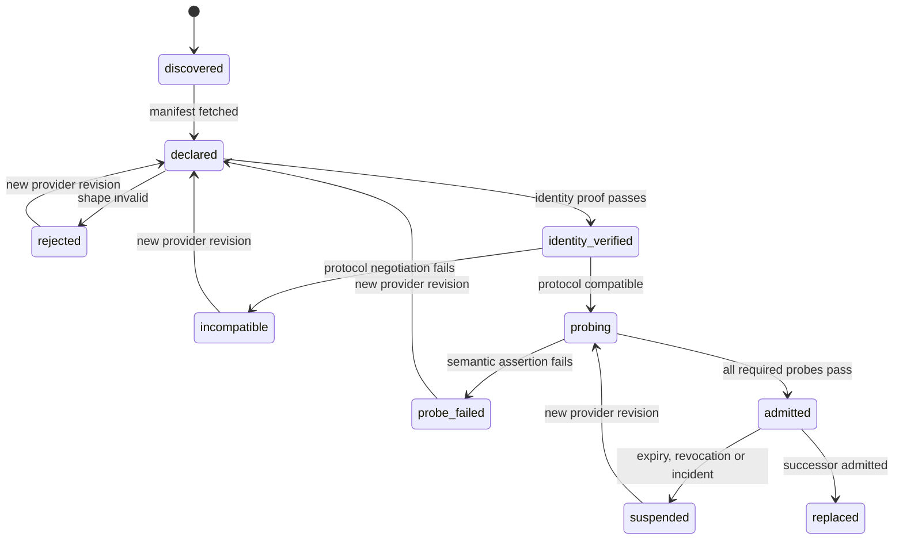
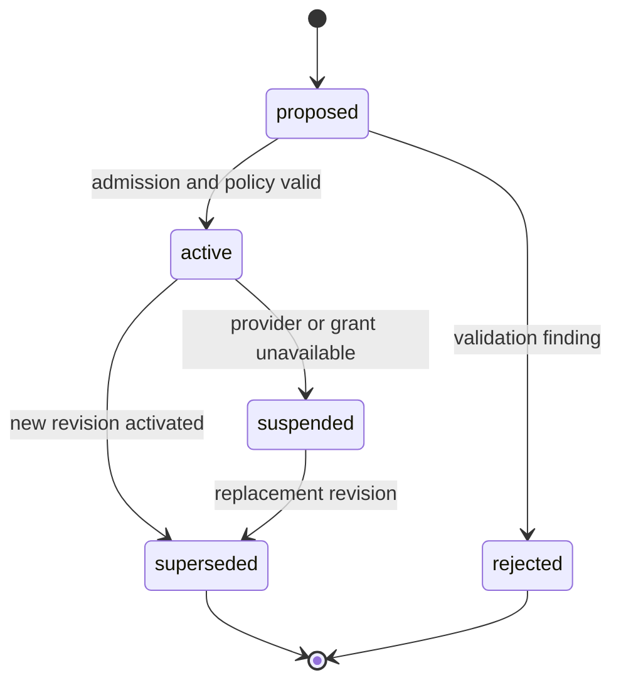

# Registry, admission and binding

`covers: REQ-004, REQ-009, REQ-014, REQ-015`

Admission and binding are distinct by DEC-0010. Operator behavior is SCN-003,
SCN-004 and SCN-005.

## Discovery sources

A host MAY discover a provider through direct configuration, a private registry,
an A2A well-known Agent Card, MCP configuration, or a local runner catalogue.
Discovery records provenance and grants no project access.

## Admission state machine

Each transition creates an immutable admission record with input revisions,
decision, actor, time, evidence URIs and findings. An implementation MUST NOT
edit the prior record to represent a retry.

## Identity and trust

Provider identity is a URI plus an authentication method appropriate to the
transport. Trust tier is one of:

- `untrusted`: declaration is known; no project execution;
- `verified`: identity and protocol verified; probes not all accepted;
- `admitted`: named capabilities passed required probes;
- `privileged`: admitted plus explicit operator policy for higher-risk effects.

Trust tier is capability-scoped. One successful capability does not admit every
capability owned by the provider.

## Semantic probes

A probe declares a bounded input fixture, timeout, expected result schema,
assertions, side-effect ceiling and required evidence. Admission probes MUST be
safe, deterministic enough for repeatable assertions, and MUST NOT publish,
charge, message external recipients or use production credentials.

## Binding lifecycle

A binding revision pins project, capability, provider revision, admission record,
profile, execution context, account pool, grants, data policy, coordination
policy and checker policy. Run creation copies only these immutable references.

## Replacement

Replacement requires semantic capability compatibility and a new binding
revision. Existing runs MUST remain pinned to the old binding. Work not yet
claimed MAY use the new active revision; claimed or running nodes require an
explicit cancel/reconcile/requeue transition.
