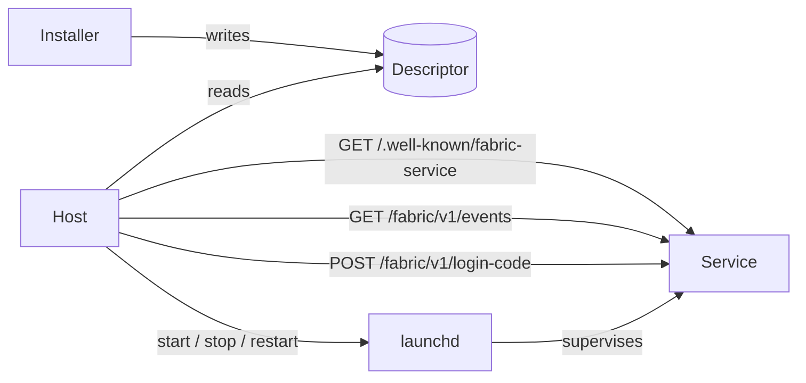

# Local service extension `fabric-service/0.1`

`covers: REQ-S01, REQ-S02, REQ-S03, REQ-S04, REQ-S05` — see the
[run brief](../evidence/specs/2026-09-28-fabric-service-brief.md) · DEC-0015

A **service** is a long-running agent process on the operator's own computer: it keeps
state, answers other agents, and usually shows a dashboard. This extension says how a
service is found, how it reports that it is alive, how it is started and stopped, how
an operator is let into its dashboard, and how it reports what it did. It lets a host
such as Fabric Dashboards watch every service on a machine without knowing any of them
in advance.

The extension key is `https://fabric.passioncode.ai/agent-contract/extensions/service/0.1`.
A provider that is also a service MAY carry that key under `provider.extensions` in its
manifest with the value `{ "descriptor": "<id>.<instance>" }`. A service with no
capabilities needs no manifest.

When the descriptor names a manifest (`fabricManifest`), the two MUST name each other:
that manifest carries the service key with `descriptor` equal to the descriptor's
`<id>.<instance>` (`FAC-SEM-020`, G-07). The key's one spelling is the constant in
[`src/extensions.ts`](../../src/extensions.ts); the manifest schema validates the
block's shape.

**Discovery grants nothing.** A descriptor makes a service visible to the operator who
installed it; it grants no Project access and does not replace admission or binding
([registry](registry.md)).

The key words MUST, MUST NOT, SHOULD and MAY are used as in RFC 2119.

## Descriptor

Schema: [`service-descriptor.schema.json`](../../schemas/service-descriptor.schema.json).

An installer MUST write one descriptor per installed service instance, and its
uninstaller MUST remove it. The running service MUST NOT write its own descriptor: the
descriptor describes an installation, not a run.

| Platform | Services directory |
|---|---|
| macOS | `~/Library/Application Support/ai.passioncode.fabric/services/` |
| Linux | `${XDG_DATA_HOME:-~/.local/share}/passioncode-fabric/services/` |
| any | the value of `FABRIC_SERVICES_DIR` when set |

- The file name MUST be `<id>.<instance>.json`, written atomically (temporary file,
  `fsync`, rename) with mode `0600`.
- `id` and `instance` together MUST be unique on the machine. A second copy of the same
  service (a preview, a branch build) MUST be a second `instance`, never a second `id`.
- `origin` MUST be `http://127.0.0.1:<port>`. **A port is a claim:** before writing, an
  installer MUST read every descriptor in the directory and refuse a port that another
  `id.instance` already declares. Semantic rule `FAC-SEM-010` checks a directory.
- Paths MAY start with `~/`. Commands MUST be argument arrays; a shell string is
  invalid, as for the local runner ([profiles](profiles.md)).
- Only two commands are defined: `doctor` and `update`. A host MUST NOT run any other
  command a descriptor lists.
- A host MUST preserve and ignore unknown `extensions`.

## Well-known document

Schema: [`service-well-known.schema.json`](../../schemas/service-well-known.schema.json).

`GET /.well-known/fabric-service` MUST answer without authentication, from memory, in
under 100 ms. Host and Origin checks (below) still apply.

- `service.id` and `service.instance` MUST equal the descriptor's. A different answer
  means another program holds the port; a host MUST report it as `foreign` and MUST NOT
  send it the descriptor's token (`FAC-SEM-009`).
- `service.build` MUST carry a commit or a package digest, so a host can tell a restart
  onto new code from one onto old code.
- `process.pid` and `process.startedAt` are the live process. A host compares the pid
  with its supervisor's to detect a second copy.
- `status` is `starting`, `ready`, `degraded` or `stopping`. A process that cannot
  serve does not answer; the host derives `down`.
- `degraded` MUST always be present. An empty list asserts full health. `status: ready`
  with a non-empty list is inconsistent (`FAC-SEM-011`).
- `summary` carries at most six tiles for a host card; a tile with `attention: true`
  asks for the operator.
- `update.available` is a newer version the service knows about, or `null`.
- `surfaces.mcp.capabilities` MAY list the capability names the MCP surface serves, so
  a host can show them without the token; the manifest remains the authority
  ([interop C3.6](interop.md#c36-discovery-surface)).

## Events feed

Schema: [`service-events-page.schema.json`](../../schemas/service-events-page.schema.json).

`GET /fabric/v1/events?after=<cursor>&limit=<n>` MUST require the service token.

- `id` is opaque and MUST increase within one service instance. `cursor` is the last
  `id` returned, or `null` when the page is empty. Without `after`, the newest `limit`
  events are returned. `limit` defaults to 50 and MUST NOT exceed 200.
- A service MUST retain at least seven days or 1000 events, whichever is more.
- `text` MUST be one sentence a person can read without the service's source code.
- `notify: true` asks a host to raise an operator notification; `link` is a path under
  the service origin that the notification opens. The host MAY suppress it by the
  operator's settings.
- A service SHOULD implement the feed as a view over the log it already keeps rather
  than a second store.
- A service MAY offer `GET /fabric/v1/events/stream` (Server-Sent Events carrying the
  same event objects) and declare it in `surfaces.events.stream`.
- An event about work that was traced carries `traceId` and `spanId` together
  ([interop C3.4](interop.md#c34-trace)); an event about untraced work MUST NOT invent
  them (DEC-0017).

## Operator login

Schema: [`service-login-code.schema.json`](../../schemas/service-login-code.schema.json).

When `surfaces.dashboard.login` is `true`, the dashboard requires an operator session.

- `POST /fabric/v1/login-code` with the service token returns a single-use URL that
  MUST expire within 120 seconds. The service MUST record the code as used before it
  honours it, so a restart cannot replay it.
- `GET /fabric/v1/login?code=` MUST set an `HttpOnly`, `SameSite=Strict` cookie and
  redirect to `surfaces.dashboard.path`.
- A host MUST read the token in a privileged process and MUST NOT expose it to a page,
  a URL or a log.

## Authentication and network

- A service MUST bind `127.0.0.1` only.
- It MUST reject a `Host` header other than `127.0.0.1:<port>`, `localhost:<port>` or
  `[::1]:<port>`, an `Origin` other than its own, and `Sec-Fetch-Site: cross-site`.
- The token lives in the file named by `auth.tokenFile`, mode `0600`, and travels only
  in the declared header — never in a query string, an argument vector or a launchd
  plist.
- Browser writes that rely on the session cookie MUST also require a custom request
  header, which forces a CORS preflight the service never answers.

Loopback reachability is not authorization: any process running as the same user can
read the token file. This extension protects against a web page and against a mistake,
not against a hostile process of the same user.

## Lifecycle

| Rule | Requirement |
|---|---|
| One copy | Before any side effect (resuming jobs, starting a scheduler, migrating a store), a service MUST take an exclusive lock on `service.lock` in its data directory. If the lock is held it MUST print one sentence naming the holder's pid and exit with status 75. Binding a port is not a lock. |
| Supervisor | On macOS the supervisor is launchd: `RunAtLoad` true, `KeepAlive` true, `ThrottleInterval` 10, `ExitTimeOut` above the drain time. The plist carries no secret. |
| Install | Write the plist, `bootout` and wait until the job is unloaded, `bootstrap` (retrying the transient I/O error), then poll the well-known document until `service.id` matches, for at most 40 seconds. |
| Stop | `SIGTERM` drains in-flight work and exits; interrupted work resumes on the next start. |
| Off | A host stops a service with `bootout` then `disable`, so it stays off across logins, and starts it with `enable` then `bootstrap`. A host MUST NOT start a service process itself. |
| Code | Code runs from an immutable release directory. An upgrade rewrites the plist and restarts. |
| State | Data and configuration live in `~/Library/Application Support/<id>/`, logs in `~/Library/Logs/<id>/`, cache in `~/Library/Caches/<id>/` — never inside the service's own code checkout or a release directory. A repository that exists to version the data itself (a registry, a plan) is a store, not code, and is allowed; the descriptor's `source.repository` tells the two apart. Writes are atomic; logs rotate. |
| Uninstall | `bootout`, delete the plist, delete the descriptor. Data stays unless the operator asks to purge it. |

## Surfaces

| Caller | Surface |
|---|---|
| Another agent on the same machine | MCP `2026-07-28`, `streamable-http`, at `surfaces.mcp.path` on the service origin, token in the declared header |
| The operator, a script | the service's CLI, delegating start, stop and restart to the supervisor |
| A remote agent | A2A `1.0` over HTTPS, or MCP behind an authenticated gateway |
| The dashboard page | same-origin requests with the session cookie and the custom request header |

## Semantic rules

| Code | Kind | Rule |
|---|---|---|
| `FAC-SEM-009` | `service-observation` | the well-known identity matches the descriptor |
| `FAC-SEM-010` | `service-directory` | no two descriptors claim one port or one `id.instance` |
| `FAC-SEM-011` | `service-well-known` | `ready` carries no degraded source |
| `FAC-SEM-012` | `service-descriptor` | every command starts with an absolute or `~/` executable path |
| `FAC-SEM-020` | `service-manifest` | a descriptor's `fabricManifest` and that manifest's service key name each other |
