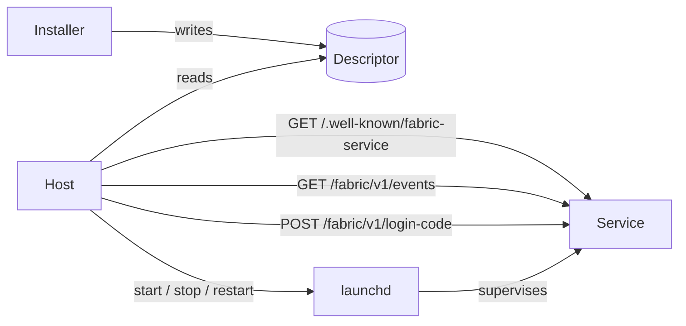

# Local service extension `fabric-service/0.1`

`covers: REQ-S01, REQ-S02, REQ-S03, REQ-S04, REQ-S05` — see the
[run brief](../evidence/specs/2026-09-28-fabric-service-brief.md) · DEC-0015;
`covers: REQ-R01…REQ-R05` — [remote placement brief](../evidence/specs/2026-10-02-remote-service-brief.md) · DEC-0019

A **service** is a long-running agent process — on the operator's own computer (a **local**
placement) or online at an `https` origin (a **remote** placement, [below](#remote-placement)): it keeps
state, answers other agents, and usually shows a dashboard. This extension says how a
service is found, how it reports that it is alive, how it is started and stopped, how
an operator is let into its dashboard, and how it reports what it did. It lets a host
such as Fabric Dashboards watch every service on a machine without knowing any of them
in advance.

The extension key is `https://fabric.passioncode.ai/agent-contract/extensions/service/0.1`.
A provider that is also a service MAY carry that key under `provider.extensions` in its
manifest with the value `{ "descriptor": "<id>.<instance>" }`. A service with no
capabilities needs no manifest.

When the descriptor names a manifest (`fabricManifest`), the two MUST name each other:
that manifest carries the service key with `descriptor` equal to the descriptor's
`<id>.<instance>` (`FAC-SEM-020`, G-07). The key's one spelling is the constant in
[`src/extensions.ts`](../../src/extensions.ts); the manifest schema validates the
block's shape.

**Discovery grants nothing.** A descriptor makes a service visible to the operator who
installed it; it grants no Project access and does not replace admission or binding
([registry](registry.md)).

The key words MUST, MUST NOT, SHOULD and MAY are used as in RFC 2119.

## Descriptor

Schema: [`service-descriptor.schema.json`](../../schemas/service-descriptor.schema.json).

An installer MUST write one descriptor per installed service instance, and its
uninstaller MUST remove it. The running service MUST NOT write its own descriptor: the
descriptor describes an installation, not a run.

| Platform | Services directory |
|---|---|
| macOS | `~/Library/Application Support/ai.passioncode.fabric/services/` |
| Linux | `${XDG_DATA_HOME:-~/.local/share}/passioncode-fabric/services/` |
| any | the value of `FABRIC_SERVICES_DIR` when set |

- The file name MUST be `<id>.<instance>.json`, written atomically (temporary file,
  `fsync`, rename) with mode `0600`.
- `id` and `instance` together MUST be unique on the machine. A second copy of the same
  service (a preview, a branch build) MUST be a second `instance`, never a second `id`.
- `placement` is `local` (the default when absent) or `remote`. Every rule in this document
  applies to a local placement; [Remote placement](#remote-placement) states what changes for a
  remote one.
- For a local placement `origin` MUST be `http://127.0.0.1:<port>`. **A port is a claim:**
  before writing, an installer MUST read every descriptor in the directory and refuse a port
  that another local `id.instance` already declares. Semantic rule `FAC-SEM-010` checks a
  directory; a remote origin claims no port here.
- Paths MAY start with `~/`. Commands MUST be argument arrays; a shell string is
  invalid, as for the local runner ([profiles](profiles.md)).
- Only two commands are defined: `doctor` and `update`. A host MUST NOT run any other
  command a descriptor lists.
- A host MUST preserve and ignore unknown `extensions`.

## Well-known document

Schema: [`service-well-known.schema.json`](../../schemas/service-well-known.schema.json).

`GET /.well-known/fabric-service` MUST answer without authentication, from memory, in
under 100 ms, for a local placement. Host and Origin checks (below) still apply. A remote
placement requires the token here too ([Remote placement](#remote-placement)).

- `service.id` and `service.instance` MUST equal the descriptor's. A different answer
  means another program holds the port; a host MUST report it as `foreign` and MUST NOT
  send it the descriptor's token (`FAC-SEM-009`).
- `service.build` MUST carry a commit or a package digest, so a host can tell a restart
  onto new code from one onto old code.
- `process.pid` and `process.startedAt` are the live process. A host compares the pid
  with its supervisor's to detect a second copy.
- `status` is `starting`, `ready`, `degraded` or `stopping`. A process that cannot
  serve does not answer; the host derives `down`.
- `degraded` MUST always be present. An empty list asserts full health. `status: ready`
  with a non-empty list is inconsistent (`FAC-SEM-011`).
- `summary` carries at most six tiles for a host card; a tile with `attention: true`
  asks for the operator.
- `update.available` is a newer version the service knows about, or `null`.
- `surfaces.mcp.capabilities` MAY list the capability names the MCP surface serves, so
  a host can show them without the token; the manifest remains the authority
  ([interop C3.6](interop.md#c36-discovery-surface)).
- `surfaces.usage` MAY name the path of the service's usage report
  ([Usage report](#usage-report), DEC-0021).

## Events feed

Schema: [`service-events-page.schema.json`](../../schemas/service-events-page.schema.json).

`GET /fabric/v1/events?after=<cursor>&limit=<n>` MUST require the service token.

- `id` is opaque and MUST increase within one service instance. `cursor` is the last
  `id` returned, or `null` when the page is empty. Without `after`, the newest `limit`
  events are returned. `limit` defaults to 50 and MUST NOT exceed 200.
- A service MUST retain at least seven days or 1000 events, whichever is more.
- `text` MUST be one sentence a person can read without the service's source code.
- `notify: true` asks a host to raise an operator notification; `link` is a path under
  the service origin that the notification opens. The host MAY suppress it by the
  operator's settings.
- A service SHOULD implement the feed as a view over the log it already keeps rather
  than a second store.
- A service MAY offer `GET /fabric/v1/events/stream` (Server-Sent Events carrying the
  same event objects) and declare it in `surfaces.events.stream`.
- An event about work that was traced carries `traceId` and `spanId` together
  ([interop C3.4](interop.md#c34-trace)); an event about untraced work MUST NOT invent
  them (DEC-0017).

## Usage report

Schema: [`service-usage.schema.json`](../../schemas/service-usage.schema.json). Optional; a
service that calls paid models or tools SHOULD offer it (DEC-0021).

`GET <surfaces.usage.path>` (conventionally `/fabric/v1/usage`) MUST require the service token
and answers what the service spent, self-reported from its own usage receipts, so a host can
show every agent's spend beside its health without knowing any provider.

- `days` covers at most the last 31 UTC days, oldest first, one entry per date, today last if
  there was activity today. A day without calls MAY be omitted. There is no paging and no query.
- Each day carries totals and `byModel` rows (`provider`, `model`); the totals are the sums of
  the rows, and a day without rows has no calls, tokens or cost (`FAC-SEM-025`). Tokens follow the interop `usage` block
  ([interop C3.2](interop.md#c32-jobs), `common.schema.json#/$defs/usage`): the same call reported in a job
  result and here is counted with the same numbers.
- **An unknown cost is `null`, never `0`.** `unpricedCalls` counts calls whose cost the service
  could not establish. A row whose calls are all unpriced has `costUsd: null`; a row with some
  priced calls carries the known part, and a host MUST show it as a lower bound while
  `unpricedCalls > 0` (`FAC-SEM-025`).
- `costBasis` says where a row's cost came from: `provider` (the provider reported the charge),
  `price-list` (computed from a published price list), `mixed`, or `unknown`.
- `budget` MAY state the service's own spending limit for the current day or UTC month and what
  it has spent against it; the service enforces its limit, the host only shows it.
- The report is the provider-side cost of running the service. It is not a customer's bill: a
  commercial agent's quotes and settlements are a separate ledger.
- A service SHOULD compute the report from the log it already keeps rather than a second store,
  and MUST NOT put prompts, outputs or caller identities in it.

## Operator login

Schema: [`service-login-code.schema.json`](../../schemas/service-login-code.schema.json).

When `surfaces.dashboard.login` is `true`, the dashboard requires an operator session.

- `POST /fabric/v1/login-code` with the service token returns a single-use URL that
  MUST expire within 120 seconds. The service MUST record the code as used before it
  honours it, so a restart cannot replay it.
- `GET /fabric/v1/login?code=` MUST set an `HttpOnly`, `SameSite=Strict` cookie and
  redirect to `surfaces.dashboard.path`.
- A host MUST read the token in a privileged process and MUST NOT expose it to a page,
  a URL or a log.
- **An ended session is answered on the page.** When the operator session has ended, a request
  for a dashboard page (a top-level navigation under `surfaces.dashboard.path`) SHOULD answer
  `401`. The body can be a page that explains the state. A host that sees `401` on a page it
  embeds MAY sign in again with a new login code and reopen the same page, at most once a minute
  per page, so a service that refuses every code cannot loop. A `401` on the page's own API calls
  does not tell a host to reload the page: that would discard what the operator is doing. A
  single-page dashboard whose shell answers `200` therefore also answers `401` for the page itself
  once its session is gone.

## Authentication and network

These rules are the local placement's; a remote one replaces the first two
([Remote placement](#remote-placement)).

- A service MUST bind `127.0.0.1` only.
- It MUST reject a `Host` header other than `127.0.0.1:<port>`, `localhost:<port>` or
  `[::1]:<port>`, an `Origin` other than its own, and `Sec-Fetch-Site: cross-site`.
- The token lives in the file named by `auth.tokenFile`, mode `0600`, and travels only
  in the declared header — never in a query string, an argument vector or a launchd
  plist.
- Browser writes that rely on the session cookie MUST also require a custom request
  header, which forces a CORS preflight the service never answers.

Loopback reachability is not authorization: any process running as the same user can
read the token file. This extension protects against a web page and against a mistake,
not against a hostile process of the same user.

## Remote placement

A **remote** service is an online agent or dashboard that runs outside the operator's computer
— on a platform, a server, a hosted app — and is shown by a host beside the local ones. It is the
same protocol: the well-known document, the events feed and the login code are the same objects
at the same paths. Only reachability, supervision and the trust anchor change (DEC-0019).

| | Local placement | Remote placement |
|---|---|---|
| `origin` | `http://127.0.0.1:<port>` | `https://<dns-name>[:<port>]` |
| Trust anchor | loopback and the Host/Origin guard | the origin's TLS certificate and the service token |
| Supervisor | launchd, or `lifecycle.manager: "none"` | its platform; `lifecycle.manager: "none"` |
| Well-known document | unauthenticated, under 100 ms | the token is required |
| Port claim (`FAC-SEM-010`) | yes | no; `id.instance` stays unique |
| Commands | `doctor`, `update` | `doctor` only |
| Session cookie | `HttpOnly; SameSite=Strict` | `__Host-` name, `Secure; HttpOnly; SameSite=Strict; Path=/` |

**Descriptor.** A remote descriptor MUST carry `placement: "remote"`. Its `origin` MUST be
`https://` followed by a DNS name and an optional port — no path, query, fragment or userinfo,
and never an IP literal. The name MUST NOT be a reserved one (`localhost`, `*.local`,
`*.internal`, `*.home.arpa`, `*.lan`, `*.localdomain`; `FAC-SEM-024`). `lifecycle.manager` MUST be
`none` and the descriptor MUST NOT carry `label` or `plist`. `paths` is optional. `commands`
MAY carry `doctor` (a local executable, `FAC-SEM-012`) and MUST NOT carry `update`. The token
file is local, as for every placement: the installer writes it on the operator's computer with
mode `0600`, and the same value lives on the hosting platform as a secret.

**The service.**

- It MUST be reachable only over `https` at its origin. Behind a platform that ends TLS before
  the process, it MUST refuse a request whose platform-set forwarded scheme is not `https`.
- It MUST refuse a `Host` other than its origin's host (and port, where the origin names one),
  a foreign `Origin`, and `Sec-Fetch-Site: cross-site` on every protocol route.
- `GET /.well-known/fabric-service` MUST require the service token. Without it — or with a
  wrong one, compared in constant time — the answer MUST be `401` with an empty body: no build,
  pid, status or tiles. With it, the document is the one this extension defines.
- The events feed, the login code and the login redirect are as for a local placement. The
  session cookie's name MUST start with `__Host-`, and it MUST carry `Secure`, `HttpOnly`,
  `SameSite=Strict` and `Path=/` and no `Domain`.
- `process.pid` and `process.startedAt` describe the answering process; on a platform with
  several processes behind one origin they MAY differ between answers, and a host MUST NOT read
  a changed pid as a second copy for a remote placement.

**The host.**

- A host MUST send the token only to the descriptor's own `https` origin, MUST verify the
  certificate against the system trust store, and MUST NOT follow a redirect from any protocol
  route; a redirect is reported as the service's state, never followed.
- A host MUST NOT offer start, stop or restart, and MUST NOT run `update`, for a remote
  placement. It MAY run `doctor`.
- A `401` is reported as the service refusing the token — not as `foreign`, because nothing was
  disclosed. A well-known answer naming another `id.instance` is `foreign`, and the host MUST NOT
  send the token again until the descriptor changes (`FAC-SEM-009`).
- The 100 ms budget is a local rule. A host SHOULD give a remote probe several seconds and MUST
  NOT report one missed probe as an outage.
- A host that does not implement this section MUST treat a remote descriptor as invalid rather
  than contact it — which hosts written against the local text already do, because the origin
  does not match `http://127.0.0.1:<port>`.

Discovery still grants nothing: a remote descriptor makes an online service visible to the
operator who installed it, on that operator's computer only.

## Lifecycle

| Rule | Requirement |
|---|---|
| One copy | Before any side effect (resuming jobs, starting a scheduler, migrating a store), a service MUST take an exclusive lock on `service.lock` in its data directory. If the lock is held it MUST print one sentence naming the holder's pid and exit with status 75. Binding a port is not a lock. |
| Supervisor | On macOS the supervisor is launchd: `RunAtLoad` true, `KeepAlive` true, `ThrottleInterval` 10, `ExitTimeOut` above the drain time. The plist carries no secret. |
| Install | Write the plist, `bootout` and wait until the job is unloaded, `bootstrap` (retrying the transient I/O error), then poll the well-known document until `service.id` matches, for at most 40 seconds. |
| Stop | `SIGTERM` drains in-flight work and exits; interrupted work resumes on the next start. |
| Off | A host stops a service with `bootout` then `disable`, so it stays off across logins, and starts it with `enable` then `bootstrap`. A host MUST NOT start a service process itself. |
| Code | Code runs from an immutable release directory. An upgrade rewrites the plist and restarts. |
| State | Data and configuration live in `~/Library/Application Support/<id>/`, logs in `~/Library/Logs/<id>/`, cache in `~/Library/Caches/<id>/` — never inside the service's own code checkout or a release directory. A repository that exists to version the data itself (a registry, a plan) is a store, not code, and is allowed; the descriptor's `source.repository` tells the two apart. Writes are atomic; logs rotate. |
| Uninstall | `bootout`, delete the plist, delete the descriptor. Data stays unless the operator asks to purge it. |

## Surfaces

| Caller | Surface |
|---|---|
| Another agent on the same machine | MCP `2026-07-28`, `streamable-http`, at `surfaces.mcp.path` on the service origin, token in the declared header — unless `surfaces.mcp.auth` is `own` ([below](#mcp-credentials)) |
| The operator, a script | the service's CLI, delegating start, stop and restart to the supervisor |
| A remote agent | A2A `1.0` over HTTPS, or MCP behind an authenticated gateway |
| The dashboard page | same-origin requests with the session cookie and the custom request header |

### MCP credentials (DEC-0024)

The descriptor's token is the **host's** credential: the well-known document of a remote
placement, the events feed, the usage report and the operator login code. By default
(`surfaces.mcp.auth` absent or `descriptor`) the MCP surface takes the same token in the declared
header.

A service MAY declare `surfaces.mcp.auth: "own"` when its MCP surface authenticates callers with
credentials of its own. Examples are a token per calling agent, or a gateway's caller identity.
The reason is that an MCP credential sits in every client's configuration, and such a credential
must not be able to mint an operator login code. When a service declares `own`:

- a host and a probe MUST NOT call the MCP surface with the descriptor's token, and MUST NOT
  report its refusal (`401`/`403`) as nonconformance;
- the MCP surface MUST NOT accept the descriptor's token either, so the two roles stay apart;
- the capability list in `surfaces.mcp.capabilities` is still what a host shows without any token.

## Semantic rules

| Code | Kind | Rule |
|---|---|---|
| `FAC-SEM-009` | `service-observation` | the well-known identity matches the descriptor |
| `FAC-SEM-010` | `service-directory` | no two local descriptors claim one port; no two descriptors claim one `id.instance` |
| `FAC-SEM-011` | `service-well-known` | `ready` carries no degraded source |
| `FAC-SEM-012` | `service-descriptor` | every command starts with an absolute or `~/` executable path |
| `FAC-SEM-024` | `service-descriptor` | a remote placement lives on a public DNS name and carries no launchd field |
| `FAC-SEM-025` | `service-usage` | a day's totals are the sums of its models; an all-unpriced row costs `null`, a priced row a number; days run forward without a repeat |
| `FAC-SEM-020` | `service-manifest` | a descriptor's `fabricManifest` and that manifest's service key name each other |
