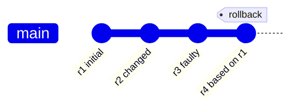

# Immutable configuration versioning

`covers: REQ-009, REQ-012`

## Versioned surfaces

Prompts, pipelines, policies, bindings, execution contexts, account pools,
runner routes, schedules, grants and checker rules are immutable revisioned
objects. A run MUST pin every revision it can observe before its first node
becomes runnable.

## Revision shape

A revision contains object URI, monotonically increasing revision number within
that object, parent revision references, canonical content hash, author, creation
time, reason and payload. A merge revision MAY have multiple parents. Payload
validation is selected by `kind` and schema URI.

## Diff

A diff is derived from two immutable payloads and MUST NOT be the only record of a
change. Human summaries are advisory; content hashes and payloads are normative.

## Rollback

Rollback creates a new revision whose payload is based on an earlier revision and
whose `rollbackBasis` points to it. It does not delete, reactivate or edit the old
revision. New runs MAY select the rollback revision after approval; existing runs
remain pinned.

## Activation

An alias such as `active` MAY point to a revision for operator convenience. Run
creation resolves it once. Alias movement is an audited event and does not alter
the revision. A provider or host MUST NOT fetch `active` again mid-run.

## One contract pin

A repository that builds against this contract pins it **once**, in
`fabric-contract.lock.json` at its root
([`contract-pin.schema.json`](../../schemas/contract-pin.schema.json)): contract name,
version, repository and the full 40-character commit. Every other place that names the
contract revision — a README line, skill metadata, a constant in code — MUST equal that
commit, in full or abbreviated to at least seven characters (G-11). Dated records
(retrospectives, handoffs, changelog entries) name the revision of their day and are
excluded by the consumer.

`pnpm pin:check <repository> [--pin <file>] [--exclude <path>]…` runs the reference
check ([`src/pin-check.ts`](../../src/pin-check.ts)): a commit-like hash on a line that
mentions the contract and differs from the pin fails, with its file and line. A
consumer MAY carry an equivalent check in its own language; the Fabric Agent Adapter's
`test/validate.py` does.

Moving the pin is a compatibility change: the consumer reviews what changed between the
two commits, updates the lock and every mention in one change, and releases.
