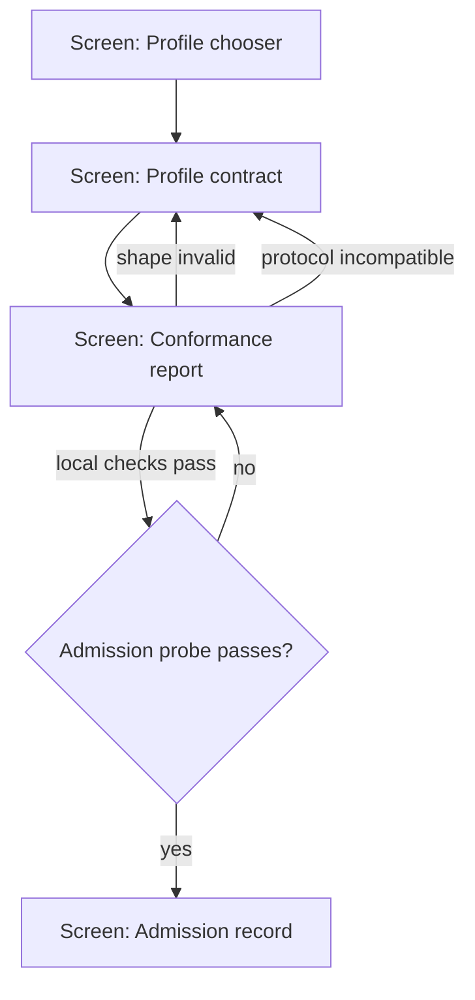
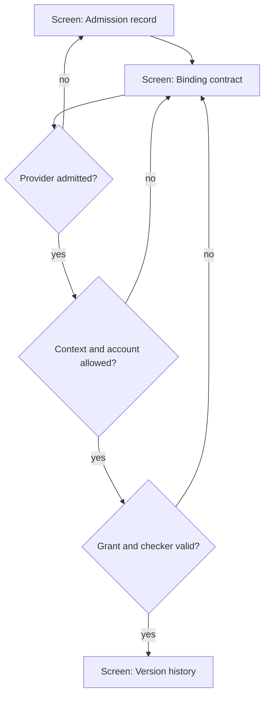
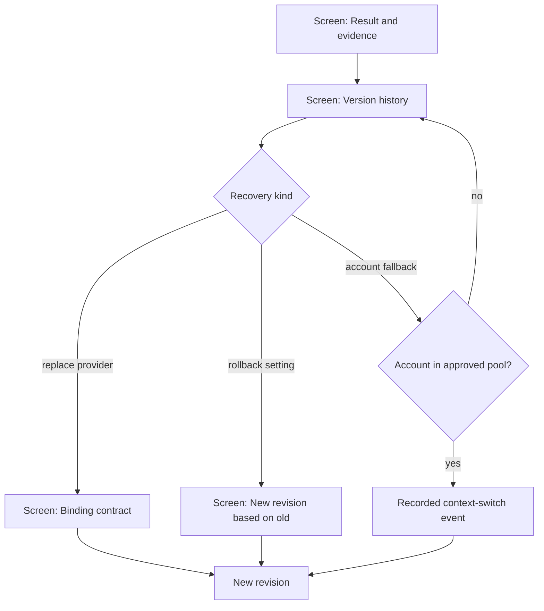
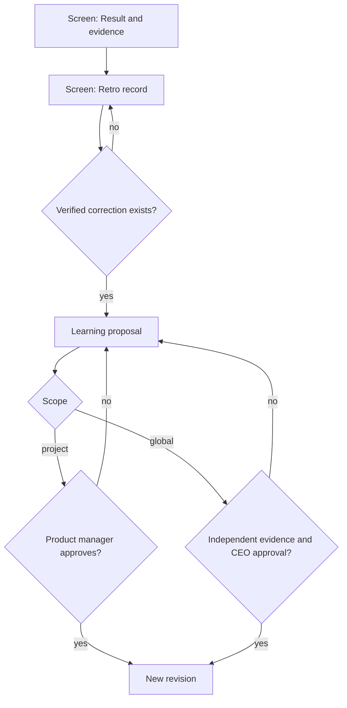
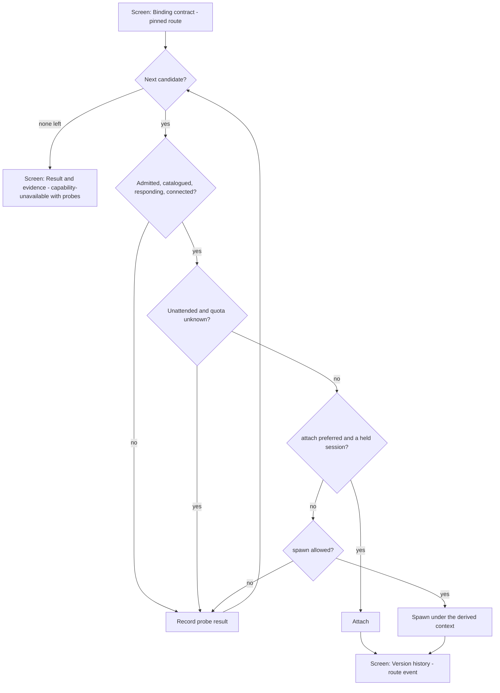
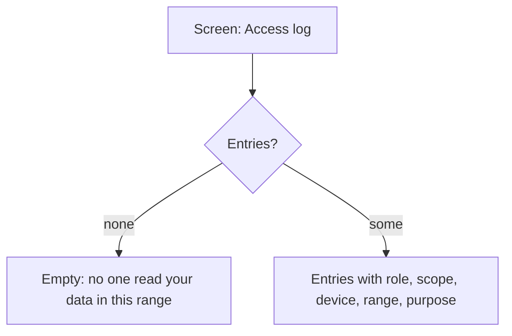
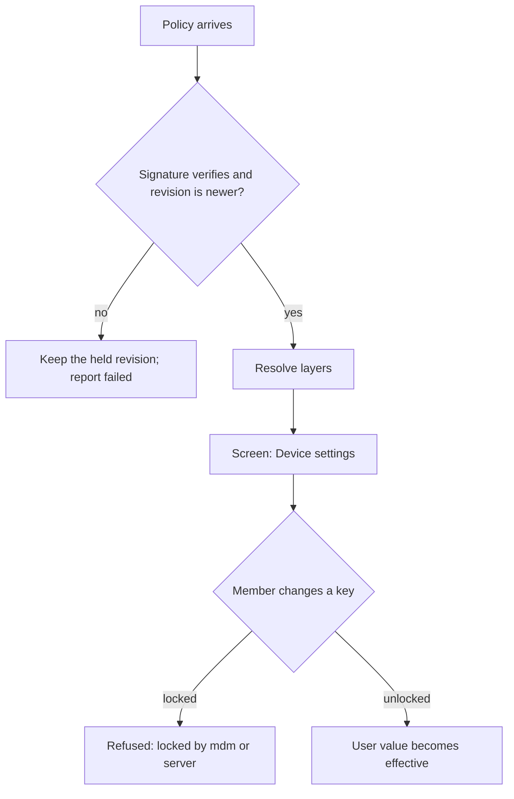

<!-- Managed with super-ux (ux-contract v4). The HOW layer: task analysis and user flows scenarios trace to. -->

# User flows

No reference-flow server was available in this session. The flows derive from
the approved brief and foundation. Diagrams describe user-observable contract
states, not a promised runtime UI.

### FLW-01: Author proves compatibility

- **Traces:** ST-001 (JTBD-01, JRN-01/#2, JRN-01/#3, JRN-01/#4)
- **Goal:** author has an admission-ready provider declaration or a precise correction list
- **Entry points:** README profile chooser; direct profile specification link
- **Success exit:** conformance report says shape, protocol and semantic gates passed
- **Task analysis:**
  1. Choose MCP, A2A or local profile.
  2. Copy the minimal profile fixture and replace identities and capabilities.
  3. Run conformance and follow the first failed gate.
  4. Expose the profile's discovery mechanism and inspect admission outcome.
- **Rejected shape:** a universal setup wizard that hides profile differences — rejected because it would imply an executable UI and conceal transport-specific proof.
- **Flow:**

- **Screens traversed:**

  | Screen | States used here |
  |---|---|
  | SCR-01 Profile chooser | success |
  | SCR-02 Profile contract | success |
  | SCR-03 Conformance report | loading, error, success |
  | SCR-04 Admission record | error, success |

### FLW-02: Operator binds a provider to a project

- **Traces:** ST-002, ST-003 (JTBD-02, JRN-02/#1, JRN-02/#2)
- **Goal:** a project has a safe immutable capability binding
- **Entry points:** admitted provider record; project capability gap
- **Success exit:** binding revision pins admitted capability, execution context and policies
- **Task analysis:** compare admission evidence → select project pool/context →
  declare grant and checker → validate and record binding.
- **Rejected shape:** binding directly from discovery — rejected because discovery must not grant project access.
- **Flow:**

- **Screens traversed:** SCR-04 error/success; SCR-05 error/success; SCR-06 success.

### FLW-03: Operator recovers without rewriting history

- **Traces:** ST-004 (JTBD-03, JRN-02/#4, JRN-02/#5)
- **Goal:** new work uses a known-good configuration while prior runs remain reproducible
- **Entry points:** failed result; suspended provider; configuration history
- **Success exit:** new immutable binding or setting revision is active for new runs
- **Task analysis:** inspect evidence → choose replace, fallback or rollback →
  validate policy → create revision → verify old run pins.
- **Rejected shape:** mutate the current binding in place — rejected because it erases provenance.
- **Flow:**

- **Screens traversed:** SCR-06 success; SCR-07 partial/error/success; SCR-05 error/success.

### FLW-04: Operator turns a failure into governed learning

- **Traces:** ST-005 (JTBD-03, JRN-02/#6)
- **Goal:** a verified correction becomes an approved future revision without self-mutation
- **Entry points:** checker failure; repeated-stage loop guard
- **Success exit:** project learning approved, or global insight promoted with independent evidence
- **Task analysis:** compare failed attempt and correction → record scope and
  proof → propose change → PM approves project change or CEO considers global
  promotion → create a new revision.
- **Rejected shape:** allow the failing agent to patch its active prompt — rejected because the evaluator and causal record would change mid-run.
- **Flow:**

- **Screens traversed:** SCR-07 error/success; SCR-08 empty/error/success; SCR-06 success.

### FLW-05: Host serves a request through a runner route

- **Traces:** ST-006 (JTBD-02, JTBD-03, JRN-02/#2, JRN-02/#5)
- **Goal:** the first runner that can serve a request serves it, and every pass-over is explained
- **Entry points:** agent chat; managed task start; unattended routine or chain
- **Success exit:** `runner-selected` or `runner-switched` recorded with the derived execution context
- **Task analysis:** read pinned route → probe candidate → attach held session or spawn → record
  pass-over and try next → answer capability-unavailable when exhausted.
- **Rejected shape:** attach to whatever terminal is running the runner — rejected because the
  host would inject work into a session it does not own and cannot scope to the project.
- **Flow:**

- **Screens traversed:** SCR-05 success; SCR-06 success; SCR-07 error.

### FLW-06: Member reads their access log

- **Traces:** ST-007 (JTBD-04, JRN-03/#3)
- **Goal:** every read of the member's data is visible with its purpose
- **Entry points:** the organization's member page; a link in the notice
- **Success exit:** the access log lists reads of raw events and of devices bound to the member
- **Task analysis:** sign in → the receiver resolves the member's `user.id` and bound devices → list `access-log/1` entries newest first.
- **Rejected shape:** log only reads keyed by `user.id` — rejected because device health and check-ins reveal a person's device state too.
- **Flow:**

- **Screens traversed:** SCR-09 empty; SCR-09 success.

### FLW-07: Device applies policy layers

- **Traces:** ST-008 (JTBD-04, JRN-03/#2)
- **Goal:** the effective setting is the resolution of signed layers, and a locked key is never overridden locally
- **Entry points:** a policy in a check-in response; a local settings change
- **Success exit:** effective settings shown with the layer each came from and its lock
- **Task analysis:** verify signature and revision → resolve lock, then the user's value, then the highest default → show each key's source → refuse a local change to a locked key.
- **Rejected shape:** let the highest layer always win — rejected because an unlocked default would leave the person no choice at all.
- **Flow:**

- **Screens traversed:** SCR-10 success; SCR-10 error.

## Practice compliance

| Practice | Verdict | How / why not |
|---|---|---|
| PRN-01..24 | adapted (band) | each gate has visible state, plain-language recovery and checkable claims; no graphical interaction exists |
| BP-001 | applied | every flow traces to a confirmed job and story |
| BP-207 | adapted | README leads with the minimal contract objects and check command rather than a screenshot |
| BP-208 | applied | overview, profiles and reference pages have separate canonical homes rather than one long page |
| BP-209 | rejected | no executable setup checklist ships in v0.1; the ordered author path is documentation only |
| BP-210 | applied | each profile page answers one compatibility question and points to its schema |
| BP-235 | adapted | an unavailable optional provider remains an explicit capability gap rather than disappearing |
| BP-004, BP-012 | adapted (band) | empty and recovery states name the next action; there is no onboarding screen |
| BP-182, BP-185, BP-189 | applied (band) | normative language uses one glossary and separates obligations from examples |
| BP-186..188 | applied (band) | errors name gate, consequence and recovery without exposing secrets |
| BP-079..181 | rejected (band) | no graphical UI, forms, motion, navigation shell or public web surface ships in v0.1 |
