<!-- Managed with super-ux (ux-contract v4). The HOW layer: task analysis and user flows scenarios trace to. -->

# User flows

No reference-flow server was available in this session. The flows derive from
the approved brief and foundation. Diagrams describe user-observable contract
states, not a promised runtime UI.

### FLW-01: Author proves compatibility

- **Traces:** ST-001 (JTBD-01, JRN-01/#2, JRN-01/#3, JRN-01/#4)
- **Goal:** author has an admission-ready provider declaration or a precise correction list
- **Entry points:** README profile chooser; direct profile specification link
- **Success exit:** conformance report says shape, protocol and semantic gates passed
- **Task analysis:**
  1. Choose MCP, A2A or local profile.
  2. Copy the minimal profile fixture and replace identities and capabilities.
  3. Run conformance and follow the first failed gate.
  4. Expose the profile's discovery mechanism and inspect admission outcome.
- **Rejected shape:** a universal setup wizard that hides profile differences — rejected because it would imply an executable UI and conceal transport-specific proof.
- **Flow:**

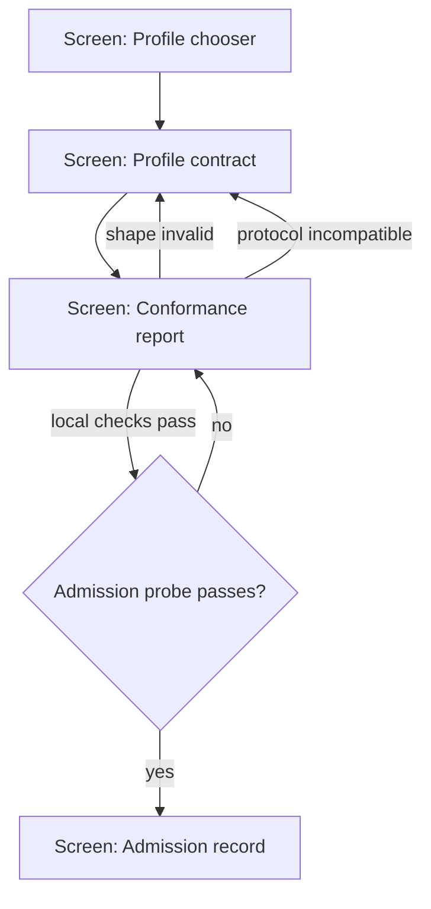
```mermaid
flowchart TD
  A[Screen: Profile chooser] --> B[Screen: Profile contract]
  B --> C[Screen: Conformance report]
  C -->|shape invalid| B
  C -->|protocol incompatible| B
  C -->|local checks pass| D{Admission probe passes?}
  D -->|no| C
  D -->|yes| E[Screen: Admission record]
```

- **Screens traversed:**

  | Screen | States used here |
  |---|---|
  | SCR-01 Profile chooser | success |
  | SCR-02 Profile contract | success |
  | SCR-03 Conformance report | loading, error, success |
  | SCR-04 Admission record | error, success |

### FLW-02: Operator binds a provider to a project

- **Traces:** ST-002, ST-003 (JTBD-02, JRN-02/#1, JRN-02/#2)
- **Goal:** a project has a safe immutable capability binding
- **Entry points:** admitted provider record; project capability gap
- **Success exit:** binding revision pins admitted capability, execution context and policies
- **Task analysis:** compare admission evidence → select project pool/context →
  declare grant and checker → validate and record binding.
- **Rejected shape:** binding directly from discovery — rejected because discovery must not grant project access.
- **Flow:**

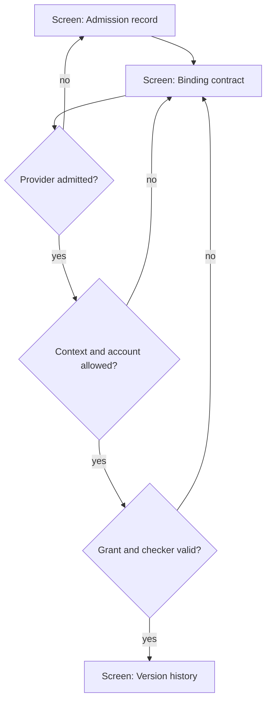
```mermaid
flowchart TD
  A[Screen: Admission record] --> B[Screen: Binding contract]
  B --> C{Provider admitted?}
  C -->|no| A
  C -->|yes| D{Context and account allowed?}
  D -->|no| B
  D -->|yes| E{Grant and checker valid?}
  E -->|no| B
  E -->|yes| F[Screen: Version history]
```

- **Screens traversed:** SCR-04 error/success; SCR-05 error/success; SCR-06 success.

### FLW-03: Operator recovers without rewriting history

- **Traces:** ST-004 (JTBD-03, JRN-02/#4, JRN-02/#5)
- **Goal:** new work uses a known-good configuration while prior runs remain reproducible
- **Entry points:** failed result; suspended provider; configuration history
- **Success exit:** new immutable binding or setting revision is active for new runs
- **Task analysis:** inspect evidence → choose replace, fallback or rollback →
  validate policy → create revision → verify old run pins.
- **Rejected shape:** mutate the current binding in place — rejected because it erases provenance.
- **Flow:**

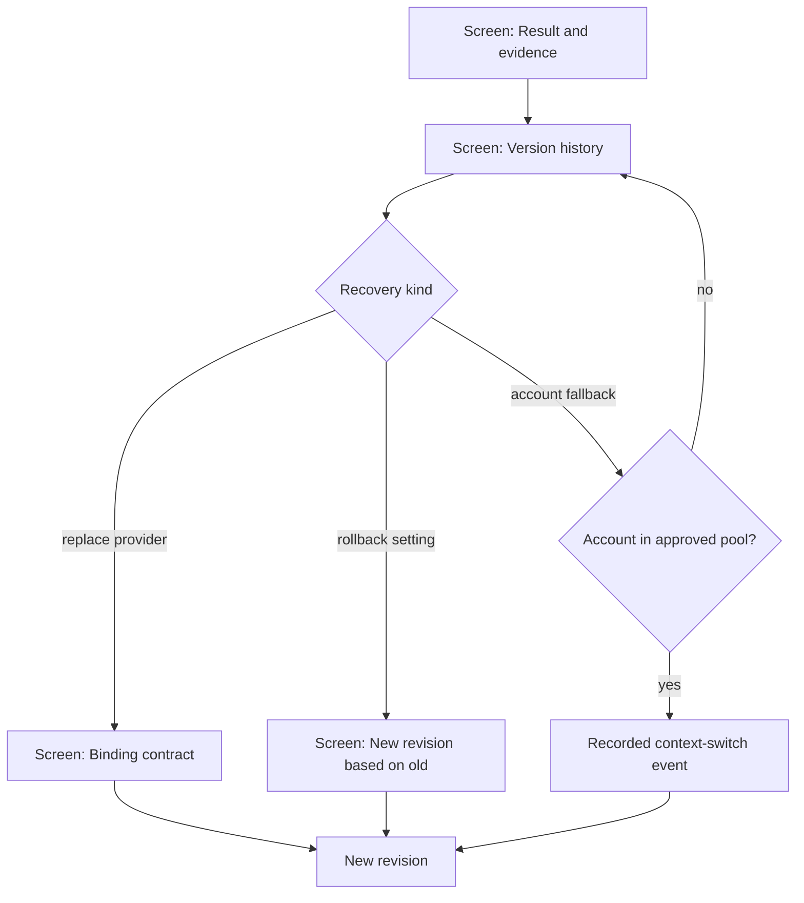
```mermaid
flowchart TD
  A[Screen: Result and evidence] --> B[Screen: Version history]
  B --> C{Recovery kind}
  C -->|replace provider| D[Screen: Binding contract]
  C -->|rollback setting| E[Screen: New revision based on old]
  C -->|account fallback| F{Account in approved pool?}
  F -->|no| B
  F -->|yes| G[Recorded context-switch event]
  D --> H[New revision]
  E --> H
  G --> H
```

- **Screens traversed:** SCR-06 success; SCR-07 partial/error/success; SCR-05 error/success.

### FLW-04: Operator turns a failure into governed learning

- **Traces:** ST-005 (JTBD-03, JRN-02/#6)
- **Goal:** a verified correction becomes an approved future revision without self-mutation
- **Entry points:** checker failure; repeated-stage loop guard
- **Success exit:** project learning approved, or global insight promoted with independent evidence
- **Task analysis:** compare failed attempt and correction → record scope and
  proof → propose change → PM approves project change or CEO considers global
  promotion → create a new revision.
- **Rejected shape:** allow the failing agent to patch its active prompt — rejected because the evaluator and causal record would change mid-run.
- **Flow:**

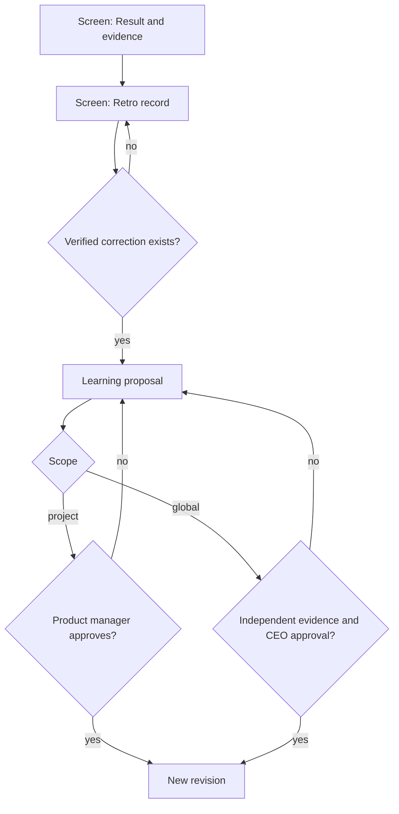
```mermaid
flowchart TD
  A[Screen: Result and evidence] --> B[Screen: Retro record]
  B --> C{Verified correction exists?}
  C -->|no| B
  C -->|yes| D[Learning proposal]
  D --> E{Scope}
  E -->|project| F{Product manager approves?}
  E -->|global| G{Independent evidence and CEO approval?}
  F -->|no| D
  G -->|no| D
  F -->|yes| H[New revision]
  G -->|yes| H
```

- **Screens traversed:** SCR-07 error/success; SCR-08 empty/error/success; SCR-06 success.

### FLW-05: Host serves a request through a runner route

- **Traces:** ST-006 (JTBD-02, JTBD-03, JRN-02/#2, JRN-02/#5)
- **Goal:** the first runner that can serve a request serves it, and every pass-over is explained
- **Entry points:** agent chat; managed task start; unattended routine or chain
- **Success exit:** `runner-selected` or `runner-switched` recorded with the derived execution context
- **Task analysis:** read pinned route → probe candidate → attach held session or spawn → record
  pass-over and try next → answer capability-unavailable when exhausted.
- **Rejected shape:** attach to whatever terminal is running the runner — rejected because the
  host would inject work into a session it does not own and cannot scope to the project.
- **Flow:**

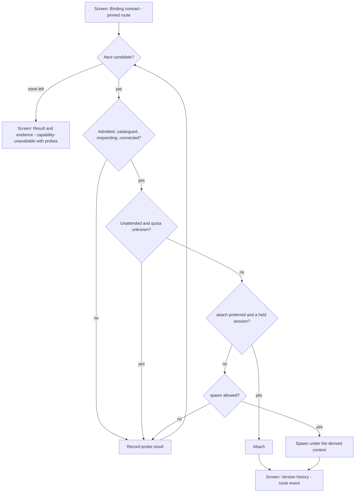
```mermaid
flowchart TD
  A[Screen: Binding contract - pinned route] --> B{Next candidate?}
  B -->|none left| X[Screen: Result and evidence - capability-unavailable with probes]
  B -->|yes| C{Admitted, catalogued, responding, connected?}
  C -->|no| P[Record probe result] --> B
  C -->|yes| G{Unattended and quota unknown?}
  G -->|yes| P
  G -->|no| D{attach preferred and a held session?}
  D -->|yes| E[Attach]
  D -->|no| F{spawn allowed?}
  F -->|no| P
  F -->|yes| H[Spawn under the derived context]
  E --> R[Screen: Version history - route event]
  H --> R
```

- **Screens traversed:** SCR-05 success; SCR-06 success; SCR-07 error.

### FLW-06: Member reads their access log

- **Traces:** ST-007 (JTBD-04, JRN-03/#3)
- **Goal:** every read of the member's data is visible with its purpose
- **Entry points:** the organization's member page; a link in the notice
- **Success exit:** the access log lists reads of raw events and of devices bound to the member, and a partner
  organization's reads of usage sums that include the member (DEC-0090)
- **Task analysis:** sign in → the receiver resolves the member's `user.id` and bound devices → list `access-log/1` entries newest first.
- **Rejected shape:** log only reads keyed by `user.id` — rejected because device health and check-ins reveal a person's device state too.
- **Flow:**

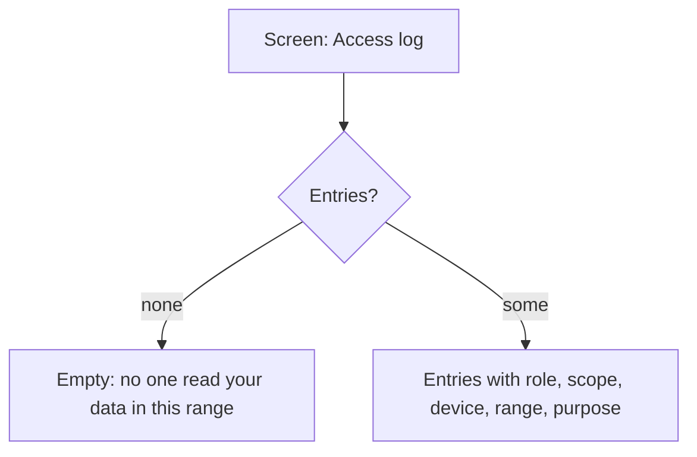
```mermaid
flowchart TD
  A[Screen: Access log] --> B{Entries?}
  B -->|none| E[Empty: no one read your data in this range]
  B -->|some| L[Entries with role, scope, device, range, purpose]
```

- **Screens traversed:** SCR-09 empty; SCR-09 success.

### FLW-07: Device applies policy layers

- **Traces:** ST-008 (JTBD-04, JRN-03/#2)
- **Goal:** the effective setting is the resolution of signed layers, and a locked key is never overridden locally
- **Entry points:** a policy in a check-in response; a local settings change
- **Success exit:** effective settings shown with the layer each came from and its lock
- **Task analysis:** verify signature and revision → resolve lock, then the user's value (never for `harness.baseline` or `repair.packages`, DEC-0102), then the highest default → show each key's source → refuse a local change to a locked key.
- **Rejected shape:** let the highest layer always win — rejected because an unlocked default would leave the person no choice at all.
- **Flow:**

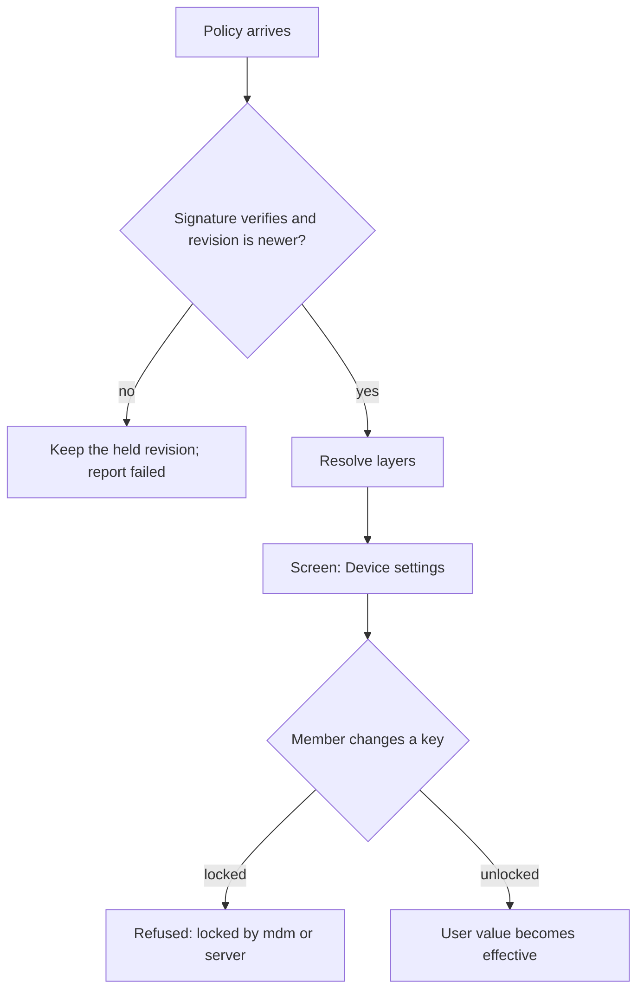
```mermaid
flowchart TD
  P[Policy arrives] --> V{Signature verifies and revision is newer?}
  V -->|no| K[Keep the held revision; report failed]
  V -->|yes| R[Resolve layers]
  R --> S[Screen: Device settings]
  S --> C{Member changes a key}
  C -->|locked| X[Refused: locked by mdm or server]
  C -->|unlocked| U[User value becomes effective]
```

- **Screens traversed:** SCR-10 success; SCR-10 error.

### FLW-08: Operator answers an agent's stop in the messenger

- **Traces:** ST-009, ST-010 (JTBD-05, JRN-04/#2, JRN-04/#3, JRN-04/#4)
- **Goal:** a stop is decided from the chat by the same operation the dashboard runs, and money never moves on one press
- **Entry points:** the proposal of the channel; a stop sent with buttons
- **Success exit:** the decision recorded and audited; the keyboard removed
- **Task analysis:** link by a local code → receive a stop with buttons → check the sender's numeric id and the token → for money, confirm with the amount → run the agent's own operation → answer the callback.
- **Rejected shape:** a chat command that performs the action directly — rejected because it is a second path that skips the agent's authorization (DEC-0034 OC-5).
- **Flow:**

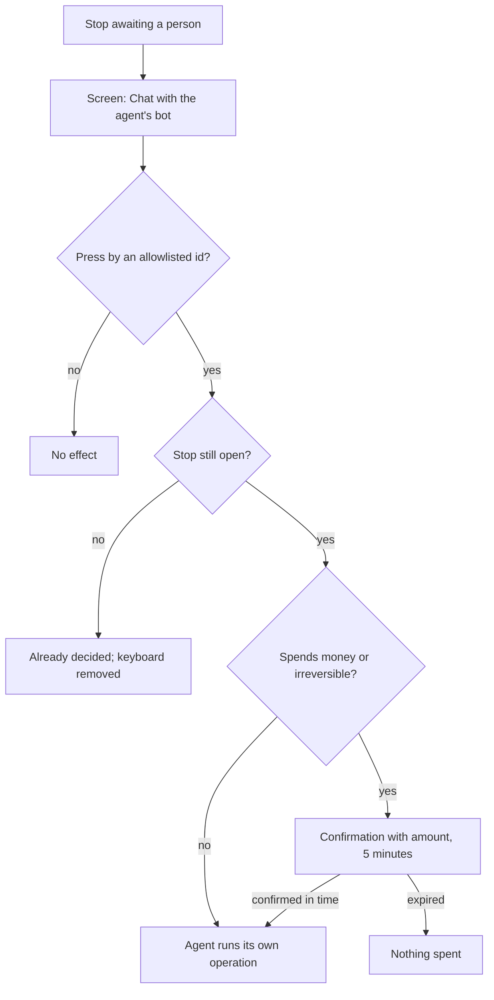
```mermaid
flowchart TD
  P[Stop awaiting a person] --> M[Screen: Chat with the agent's bot]
  M --> B{Press by an allowlisted id?}
  B -->|no| N[No effect]
  B -->|yes| D{Stop still open?}
  D -->|no| A[Already decided; keyboard removed]
  D -->|yes| S{Spends money or irreversible?}
  S -->|no| O[Agent runs its own operation]
  S -->|yes| C[Confirmation with amount, 5 minutes]
  C -->|confirmed in time| O
  C -->|expired| X[Nothing spent]
```

- **Screens traversed:** SCR-11 empty; SCR-11 success; SCR-11 error.

### FLW-09: Operator opens Fabric from a product

- **Traces:** ST-011 (JTBD-06, JRN-05/#1, JRN-05/#2, JRN-05/#4)
- **Goal:** Fabric opens on the product's service and project in one press, and nothing runs until the person acts
- **Entry points:** Fabric's button on a service dashboard
- **Success exit:** the conversation or the session view open in Fabric on the right service and project
- **Task analysis:** press the button → choose chat or session → the page follows a `fabric://` link built by the kit → Fabric validates the ids and opens the view → the person types or starts the runner.
- **Rejected shape:** a link that carries a prompt or starts the runner — rejected because any page can emit a link (DEC-0040 FB-8, FL-4).
- **Flow:**

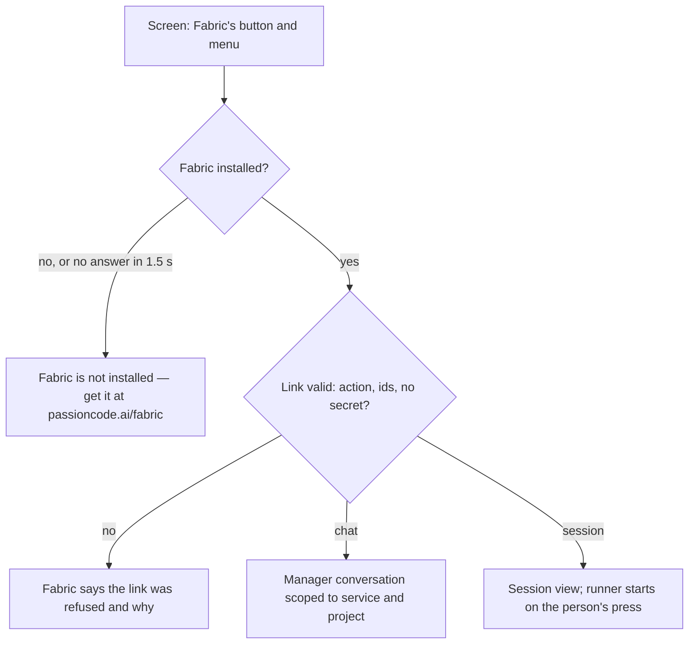
```mermaid
flowchart TD
  B[Screen: Fabric's button and menu] --> C{Fabric installed?}
  C -->|no, or no answer in 1.5 s| N[Fabric is not installed — get it at passioncode.ai/fabric]
  C -->|yes| L{Link valid: action, ids, no secret?}
  L -->|no| R[Fabric says the link was refused and why]
  L -->|chat| T[Manager conversation scoped to service and project]
  L -->|session| S[Session view; runner starts on the person's press]
```

- **Screens traversed:** SCR-12 success; SCR-12 empty; SCR-12 error.

### FLW-10: Operator sets a spend limit and answers what exceeds it

- **Traces:** ST-012, ST-013 (JTBD-07, JRN-06/#1, JRN-06/#2)
- **Goal:** a project spends within a limit the operator chose once, and a spend above the threshold waits for one answer
- **Entry points:** the first run of a project that would spend money; a grant check above `autoApproveUsd`
- **Success exit:** the policy recorded with its inputs; the request answered and the spend allowed or not
- **Task analysis:** the launcher computes options → the operator picks one (one is preselected) → the meter checks each spend against the levels → above the threshold it denies with one filed request → the operator confirms the amount in the operator channel → the agent asks again and is allowed.
- **Rejected shape:** a fixed list of budgets, or an approval in a chat message — rejected because the options must come from the project (spend policy) and a chat message is never the approval (spend policy rule 3).
- **Flow:**

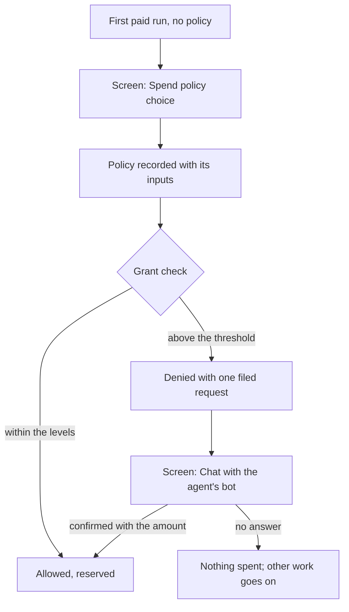
```mermaid
flowchart TD
  F[First paid run, no policy] --> P[Screen: Spend policy choice]
  P --> R[Policy recorded with its inputs]
  R --> C{Grant check}
  C -->|within the levels| A[Allowed, reserved]
  C -->|above the threshold| Q[Denied with one filed request]
  Q --> M[Screen: Chat with the agent's bot]
  M -->|confirmed with the amount| A
  M -->|no answer| W[Nothing spent; other work goes on]
```

- **Screens traversed:** SCR-13 success; SCR-13 empty; SCR-11 success; SCR-11 error.

### FLW-11: Operator approves one action for an outside caller

- **Traces:** ST-014 (JTBD-07, JRN-06/#3)
- **Goal:** an effect asked for across the machine boundary happens only once, after an approval of exactly that action
- **Entry points:** a callee's `approval-required` refusal to a T2 caller
- **Success exit:** the action taken once; the approval's `jti` consumed
- **Task analysis:** the callee refuses with the action's digest → the caller asks the hub → Fabric shows the operator the action → the operator approves → the hub signs `approval/1` (`method: prompt`) → the caller repeats the call → the callee checks the token, the grant, then the approval, and acts.
- **Rejected shape:** a standing approval for a kind of action — rejected because an approval binds one action's digest, one callee and one use (DL-17, DL-18).
- **Flow:**

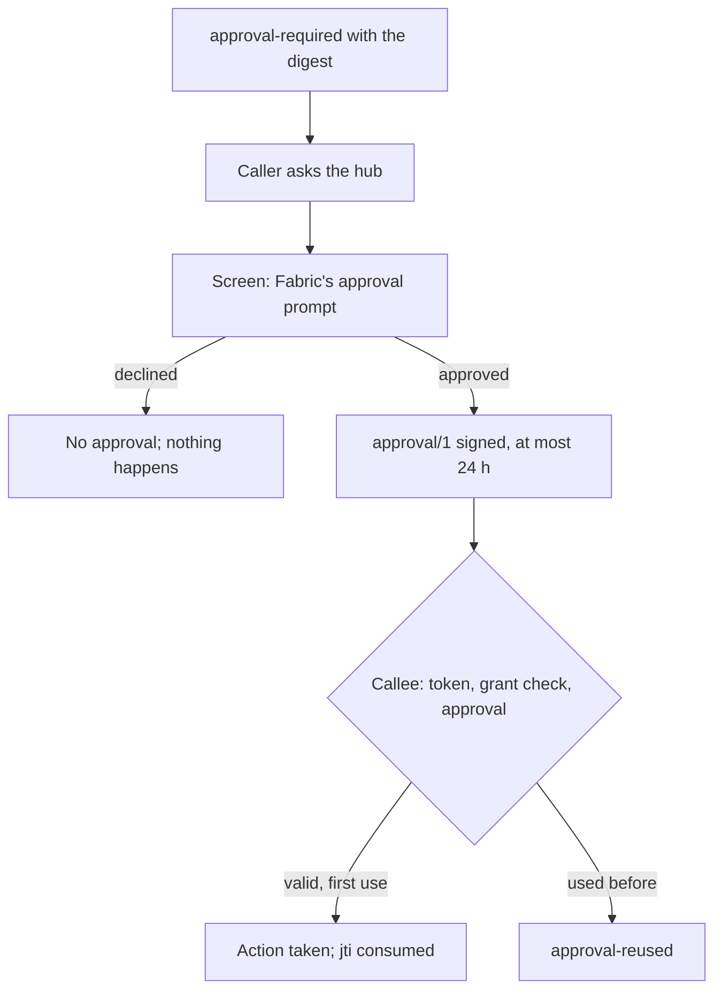
```mermaid
flowchart TD
  R[approval-required with the digest] --> H[Caller asks the hub]
  H --> P[Screen: Fabric's approval prompt]
  P -->|declined| N[No approval; nothing happens]
  P -->|approved| D[approval/1 signed, at most 24 h]
  D --> C{Callee: token, grant check, approval}
  C -->|valid, first use| A[Action taken; jti consumed]
  C -->|used before| U[approval-reused]
```

- **Screens traversed:** SCR-14 success; SCR-14 error.

### FLW-12: The host signs in again after a dashboard session ends

- **Traces:** ST-015 (JTBD-06, JRN-05/#3)
- **Goal:** an ended session is visible on the page and recovered by the host without a loop
- **Entry points:** a dashboard page requested after the session ended
- **Success exit:** the same page open again under a new session
- **Task analysis:** the page answers `401` with an explanation → the host asks for a new login code with the descriptor token → it reopens the same page → it does so at most once a minute per page.
- **Rejected shape:** reloading the page on any `401` from its API — rejected because it would discard what the operator is doing (service, Operator login).
- **Flow:**

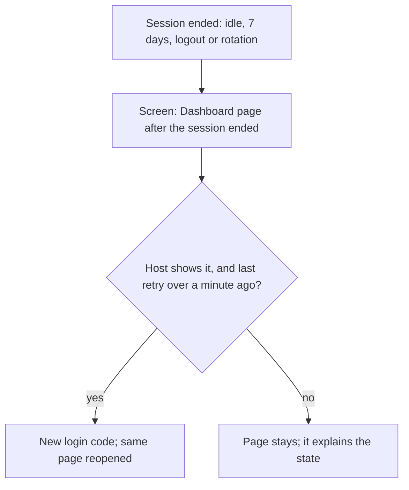
```mermaid
flowchart TD
  E[Session ended: idle, 7 days, logout or rotation] --> P[Screen: Dashboard page after the session ended]
  P --> H{Host shows it, and last retry over a minute ago?}
  H -->|yes| L[New login code; same page reopened]
  H -->|no| S[Page stays; it explains the state]
```

- **Screens traversed:** SCR-15 error; SCR-15 success.

### FLW-13: Operator works in a dashboard beside the console

- **Traces:** ST-016, ST-017 (JTBD-08, JRN-07/#1, JRN-07/#2, JRN-07/#3, JRN-07/#4)
- **Goal:** the page stays usable at every console width the host allows, and shows the appearance the operator chose for the fields it declared
- **Entry points:** an agent's dashboard opened in a host pane beside the console
- **Success exit:** the operator works in the page with the console as wide as the host allows, every destination reachable
- **Task analysis:** the host reads the page's declaration and validates it → it keeps `max(480, minWidth)` CSS pixels for the page (480 when nothing valid is declared) → the operator drags the console → the console stops at the host floor → the operator picks a scheme and a theme → the host rewrites `fabric_appearance` → the page applies the fields it declared and hides only those controls.
- **Rejected shape:** zooming the page to fit, or a sideways-scrolling tab strip — rejected because zoom changes what the page measured and a hidden scrollbar hides destinations (ED-3, ED-7).
- **Flow:**

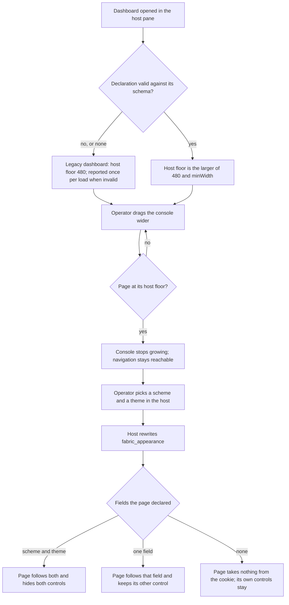
```mermaid
flowchart TD
  O[Dashboard opened in the host pane] --> V{Declaration valid against its schema?}
  V -->|no, or none| L[Legacy dashboard: host floor 480; reported once per load when invalid]
  V -->|yes| F[Host floor is the larger of 480 and minWidth]
  L --> W[Operator drags the console wider]
  F --> W
  W --> S{Page at its host floor?}
  S -->|no| W
  S -->|yes| X[Console stops growing; navigation stays reachable]
  X --> A[Operator picks a scheme and a theme in the host]
  A --> C[Host rewrites fabric_appearance]
  C --> D{Fields the page declared}
  D -->|scheme and theme| B[Page follows both and hides both controls]
  D -->|one field| H[Page follows that field and keeps its other control]
  D -->|none| P[Page takes nothing from the cookie; its own controls stay]
```

- **Screens traversed:** SCR-16 success; SCR-16 narrow; SCR-16 legacy.

### FLW-14: An agent proceeds under a standing grant

- **Traces:** ST-018 (JTBD-07, JRN-06/#4)
- **Goal:** a spend a standing grant allows goes ahead on the record, without a question to the operator
- **Entry points:** an agent about to spend within a project that has a standing grant with `spend`
- **Success exit:** the spend settled against the receipt, visible under the grant in the usage report
- **Task analysis:** the agent asks the meter with the amount → the meter reads the grant and the levels → `allowed` with a receipt and a reservation → the agent spends → the usage report lists the receipt under the grant.
- **Rejected shape:** asking the operator in a chat whether the spend is fine — rejected because a record that exists is the proof, and a chat message is never the approval (spend policy rule 3).
- **Flow:**

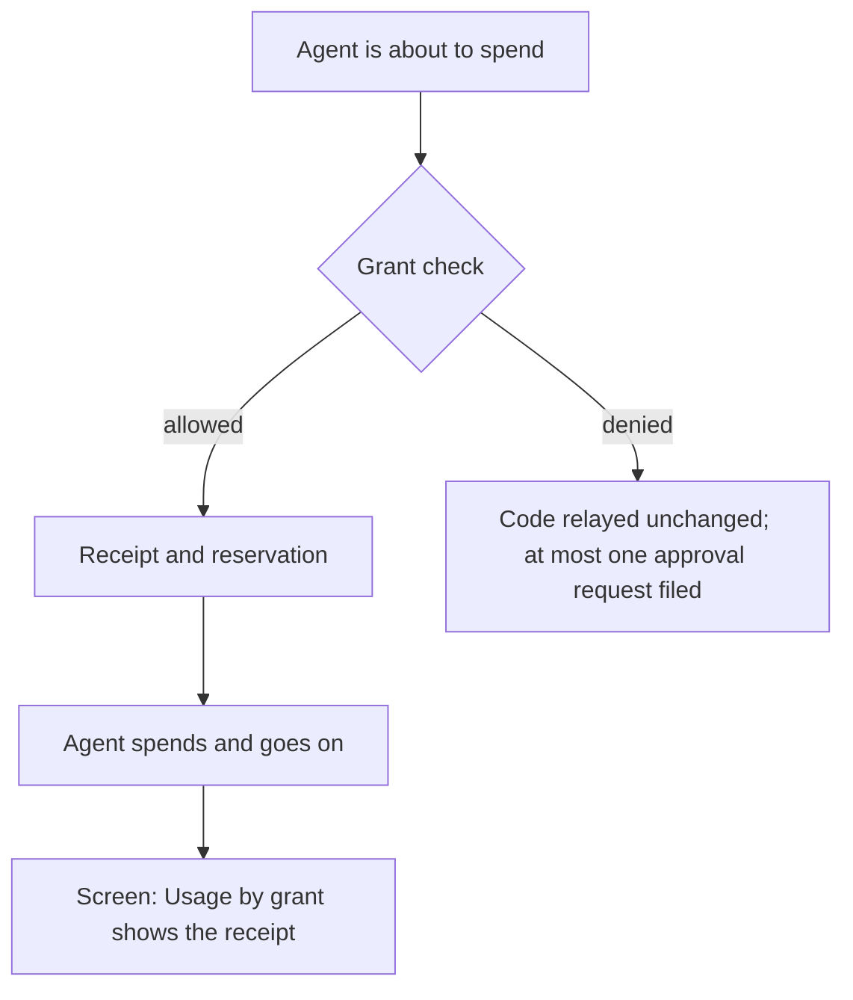
```mermaid
flowchart TD
  S[Agent is about to spend] --> M{Grant check}
  M -->|allowed| R[Receipt and reservation]
  R --> P[Agent spends and goes on]
  P --> U[Screen: Usage by grant shows the receipt]
  M -->|denied| D[Code relayed unchanged; at most one approval request filed]
```

- **Screens traversed:** SCR-17 success; SCR-17 error.

### FLW-15: Operator restores settings

- **Traces:** ST-019 (JTBD-03, JRN-02/#5)
- **Goal:** what the operator decided comes back after a lost or wrongly migrated data directory, and nothing that exists is overwritten
- **Entry points:** a service starting on a fresh database; the operator choosing a snapshot by hand
- **Success exit:** the restore report: rows inserted, rows refused with their reasons, snapshots skipped
- **Task analysis:** the service finds its snapshots → on a fresh database it restores the newest intact one with content → otherwise the operator opens a preview → the operator applies it → the report names what was inserted, dropped, defaulted and refused.
- **Rejected shape:** a restore that replaces existing rows, or an agent applying a manual restore — rejected because restore adds and never overwrites, and applying it is the operator's action (service, Settings backup).
- **Flow:**

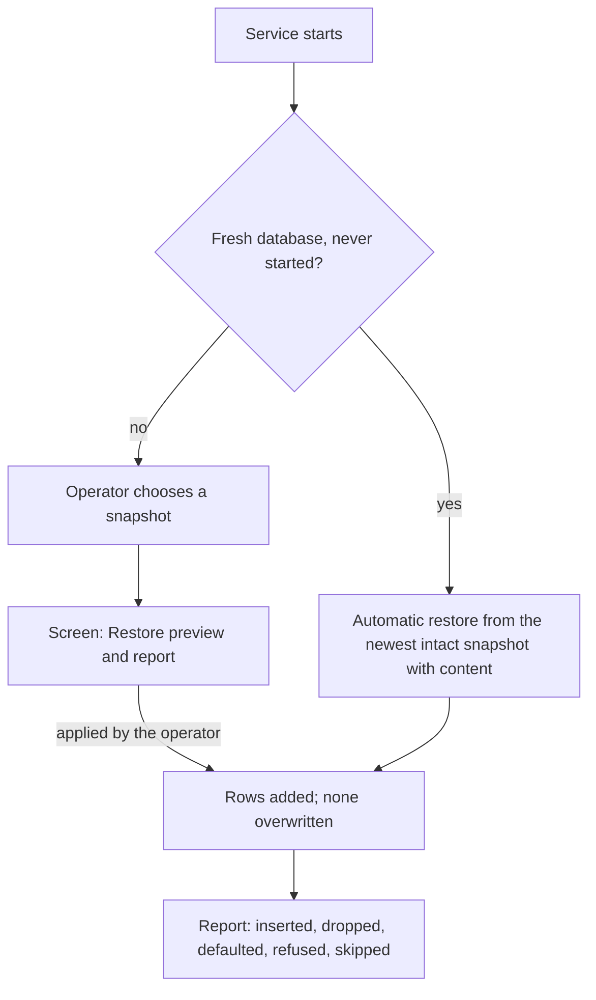
```mermaid
flowchart TD
  B[Service starts] --> F{Fresh database, never started?}
  F -->|yes| A[Automatic restore from the newest intact snapshot with content]
  F -->|no| M[Operator chooses a snapshot]
  M --> V[Screen: Restore preview and report]
  V -->|applied by the operator| I[Rows added; none overwritten]
  A --> I
  I --> R[Report: inserted, dropped, defaulted, refused, skipped]
```

- **Screens traversed:** SCR-18 preview; SCR-18 success; SCR-18 error.

### FLW-16: Operator follows a request on the Project board

- **Traces:** ST-020 (JTBD-09, JRN-08/#1, JRN-08/#2, JRN-08/#3)
- **Goal:** the operator reads each request between Projects with its request state and its effect state, and a lost result stays visible
- **Entry points:** a request submitted to a Project's capability on the board
- **Success exit:** the request terminal with an observed result, or `outcome_unknown` until reconciled by the responder or, when none holds the slot, by the estate owner, or `answered` when the target replied to it while it was queued (DEC-0098)
- **Task analysis:** an agent submits a request → a responder claims and accepts it → it begins the effect → it completes with an observed result, or the result is lost → the operator reads the state in the thread.
- **Rejected shape:** inferring completion from a delivery, a read mark or a live process — rejected because request state and effect state are separate facts (project comms, Request lifecycle).
- **Flow:**

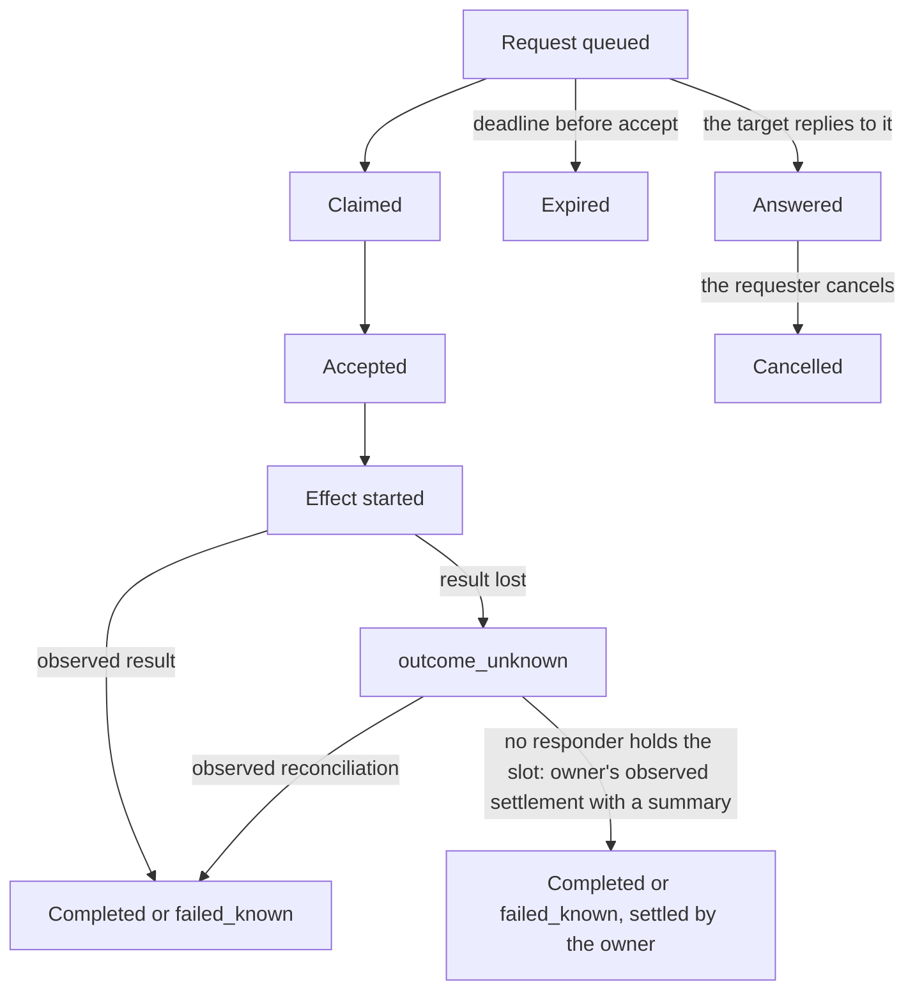
```mermaid
flowchart TD
  Q[Request queued] --> C[Claimed]
  C --> A[Accepted]
  A --> E[Effect started]
  E -->|observed result| D[Completed or failed_known]
  E -->|result lost| U[outcome_unknown]
  U -->|observed reconciliation| D
  U -->|no responder holds the slot: owner's observed settlement with a summary| O[Completed or failed_known, settled by the owner]
  Q -->|deadline before accept| X[Expired]
  Q -->|the target replies to it| N[Answered]
  N -->|the requester cancels| K[Cancelled]
```

- **Screens traversed:** SCR-19 success; SCR-19 unknown; SCR-19 expired; SCR-19 answered.

### FLW-17: A second copy of a service starts while one runs

- **Traces:** ST-021 (JTBD-03, JRN-02/#3)
- **Goal:** a second copy changes nothing, and what the operator sees says what happened, never an outage
- **Entry points:** the operator runs the service by hand; its supervisor starts it again
- **Success exit:** one copy runs and answers; the second has exited 75 or taken over after the first left
- **Task analysis:** the second copy reads the supervisor marker → by hand it tries the lock once and exits 75 naming the holder → marked, it waits up to 300 s touching nothing and exits 75, or takes the lock if the holder leaves → markers that disagree exit 75 at once → the host keeps showing the holder's health.
- **Rejected shape:** exiting at once under a supervisor — rejected because launchd and systemd restart it every 10 s, forever (service, One copy).
- **Flow:**

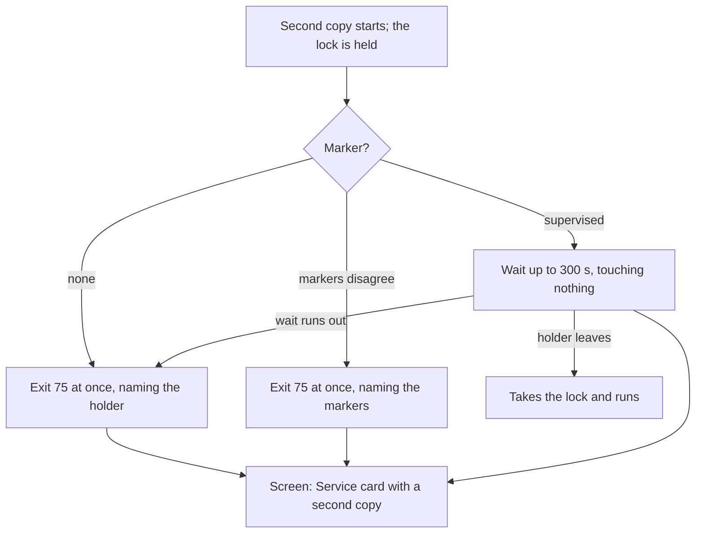
```mermaid
flowchart TD
  S[Second copy starts; the lock is held] --> M{Marker?}
  M -->|none| X[Exit 75 at once, naming the holder]
  M -->|markers disagree| C[Exit 75 at once, naming the markers]
  M -->|supervised| W[Wait up to 300 s, touching nothing]
  W -->|holder leaves| T[Takes the lock and runs]
  W -->|wait runs out| X
  X --> V[Screen: Service card with a second copy]
  C --> V
  W --> V
```

- **Screens traversed:** SCR-20 loading (the wait); SCR-20 error (exit 75); SCR-20 success (one copy runs).

### FLW-18: Operator unlists a Project

- **Traces:** ST-022 (JTBD-09, JRN-08/#4)
- **Goal:** a Project the operator keeps to itself is absent from the project directory and still reachable by a sender that knows its id
- **Entry points:** the host's Project settings (in Fabric, per Project); no tool sets it
- **Success exit:** the Project absent from every directory page and capability filter; a request addressed to its id is queued as before
- **Task analysis:** the operator turns the Project's listing off in the host → the next `com.directory` page of every session of the estate omits it → a sender that already knows its id submits a request → the board queues it as for any Project.
- **Rejected shape:** unlisting as a block list that refuses messages — rejected because a listing is discovery, not authority (project comms, Project directory).
- **Flow:**

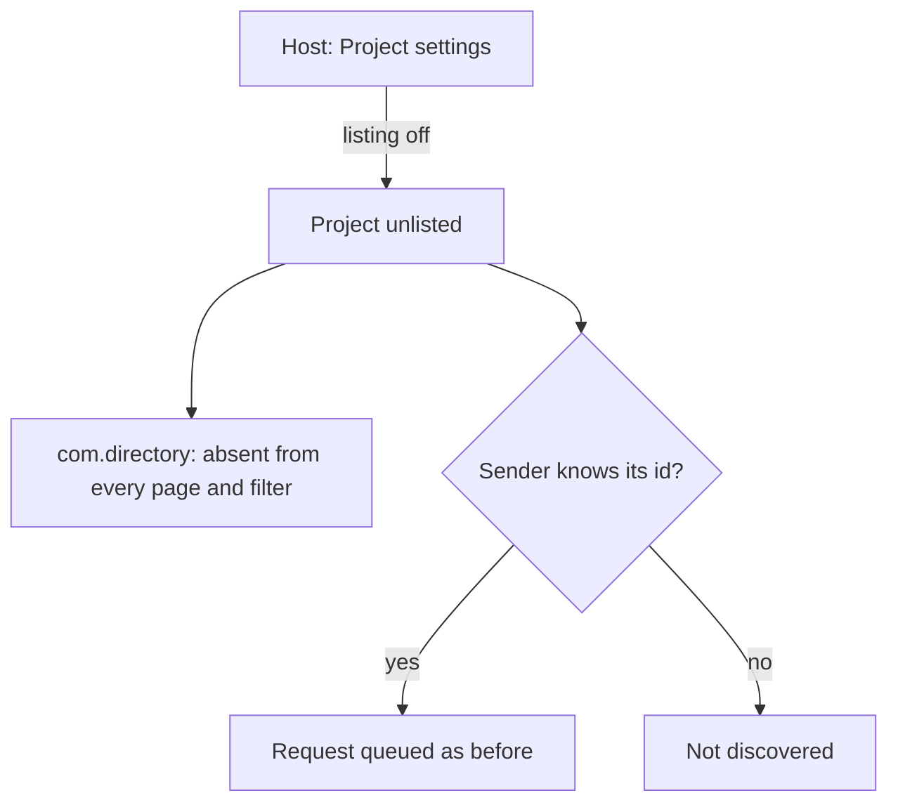
```mermaid
flowchart TD
  S[Host: Project settings] -->|listing off| U[Project unlisted]
  U --> D[com.directory: absent from every page and filter]
  U --> K{Sender knows its id?}
  K -->|yes| Q[Request queued as before]
  K -->|no| N[Not discovered]
```

- **Screens traversed:** SCR-21 success (unlisted); SCR-21 error (the host could not save the change and says so).

### FLW-19: Operator adds a machine to their network

- **Traces:** ST-023 (JTBD-10, JRN-09/#2)
- **Goal:** the new machine is in the network, listed with the keys it generated, and has pinned the person's network
- **Entry points:** Fabric's "Add a machine" on a trusted machine; the new machine's node (its own screen, or a terminal for a headless server)
- **Success exit:** a passkey-signed revision lists the new machine; the new machine applied it offline
- **Task analysis:** the new machine makes its keys → nearby, it shows a code; from afar, the trusted machine opens a one-time rendezvous (at most 10 minutes) → both commit, then reveal → both screens show the same six-digit code and the network's fingerprint → the person confirms and signs with the passkey on the trusted machine → the new machine checks the chain starts at the revealed network and lists its keys, and applies it.
- **Rejected shape:** a code taken from one key's fingerprint — rejected because 20 bits are brute-forced offline (DV-REL-01); the commitment leaves one guess per rendezvous.
- **Flow:**

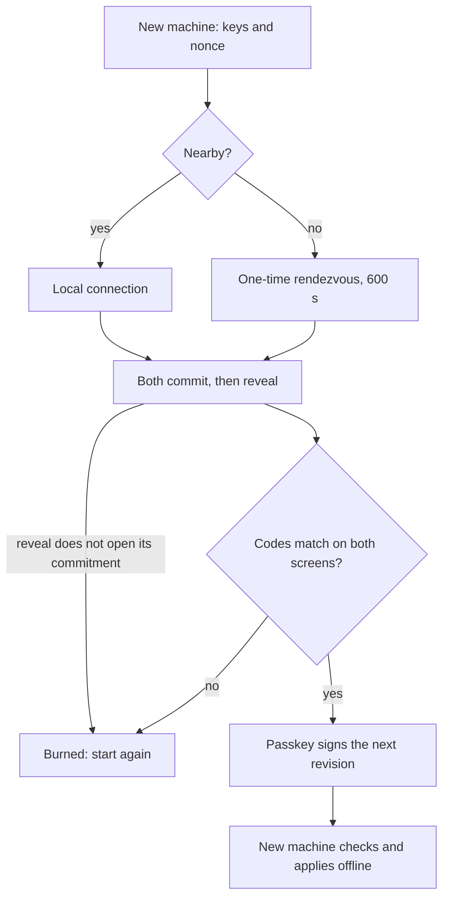
```mermaid
flowchart TD
  K[New machine: keys and nonce] --> M{Nearby?}
  M -->|yes| L[Local connection]
  M -->|no| R[One-time rendezvous, 600 s]
  L --> C[Both commit, then reveal]
  R --> C
  C -->|reveal does not open its commitment| X[Burned: start again]
  C --> D{Codes match on both screens?}
  D -->|no| X
  D -->|yes| S[Passkey signs the next revision]
  S --> A[New machine checks and applies offline]
```

- **Screens traversed:** SCR-22 loading (waiting for the other side), error (codes differ, rendezvous expired), success (joined).

### FLW-20: Operator creates the network, removes or re-keys a machine

- **Traces:** ST-024, ST-025 (JTBD-10, JRN-09/#1, JRN-09/#3)
- **Goal:** a signed revision that creates the network, drops a machine, or replaces a machine's keys, revoking what it drops
- **Entry points:** Fabric's "Create my network", and the network's machine list with "Remove" and "Replace key" per machine
- **Success exit:** the person signed; machines apply the revision, and the delta carries each revocation within seconds
- **Task analysis:** create: the first machine makes its keys → Fabric drafts revision 1 → the passkey signs → the machine pins it and shows the fingerprint. Remove: choose the machine → Fabric drafts the revision that revokes it and its hub key → the passkey signs. Re-key: the machine pairs again under its id (or, alone in its network, makes new keys) → Fabric drafts the revision with the new keys and the old ones revoked by reference → the passkey signs.
- **Rejected shape:** dropping a machine or a key without revoking it — rejected because a revision that drops without revoking leaves caches and deltas without the revocation (`FAC-SEM-114`).
- **Flow:**

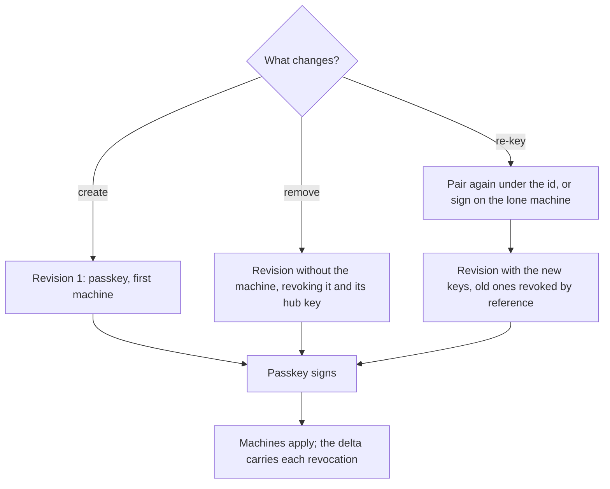
```mermaid
flowchart TD
  A{What changes?} -->|create| C[Revision 1: passkey, first machine]
  A -->|remove| R[Revision without the machine, revoking it and its hub key]
  A -->|re-key| K[Pair again under the id, or sign on the lone machine]
  K --> N[Revision with the new keys, old ones revoked by reference]
  C --> S[Passkey signs]
  R --> S
  N --> S
  S --> P[Machines apply; the delta carries each revocation]
```

- **Screens traversed:** SCR-23 success (signed), error (the passkey ceremony failed; nothing changed).

### FLW-21: Operator reads what an agent uses

- **Traces:** ST-026 (JTBD-11, JRN-10/#1, JRN-10/#2, JRN-10/#3)
- **Goal:** the operator sees an agent's connections with the failing ones marked, or learns that its declaration is invalid and why
- **Entry points:** an agent's Connections tab in the host
- **Success exit:** the operator names the failing connection and the agent or connector behind it
- **Task analysis:** the host reads the agent's well-known document → it validates the value under the connections extension key → it checks each id is named once and no member carries a credential → it marks each connection whose id a `degraded[].source` names → the operator follows a failing connection to its target.
- **Rejected shape:** showing the valid part of an invalid declaration, rejected because a partial map reads as complete, and a declaration that carried a credential would put it on screen (DEC-0096).
- **Flow:**

```mermaid
flowchart TD
  O[Host reads the well-known document] --> K{Connections key present?}
  K -->|no| N[Nothing declared]
  K -->|yes| V{Valid, each id once, no credential?}
  V -->|no| R[Reported: none of it shown, the reasons are]
  V -->|yes| D[Each connection shown with kind, target and state]
  D --> F{A degraded source equals its id?}
  F -->|yes| X[Connection marked failing]
  F -->|no| Y[Connection shown as declared]
```

- **Screens traversed:** SCR-24 success; SCR-24 failing; SCR-24 invalid.

## Practice compliance

| Practice | Verdict | How / why not |
|---|---|---|
| PRN-01..24 | adapted (band) | each gate has visible state, plain-language recovery and checkable claims; no graphical interaction exists |
| BP-001 | applied | every flow traces to a confirmed job and story |
| BP-207 | adapted | README leads with the minimal contract objects and check command rather than a screenshot |
| BP-208 | applied | overview, profiles and reference pages have separate canonical homes rather than one long page |
| BP-209 | rejected | no executable setup checklist ships in v0.1; the ordered author path is documentation only |
| BP-210 | applied | each profile page answers one compatibility question and points to its schema |
| BP-235 | adapted | an unavailable optional provider remains an explicit capability gap rather than disappearing |
| BP-004, BP-012 | adapted (band) | empty and recovery states name the next action; there is no onboarding screen |
| BP-182, BP-185, BP-189 | applied (band) | normative language uses one glossary and separates obligations from examples |
| BP-186..188 | applied (band) | errors name gate, consequence and recovery without exposing secrets |
| BP-079..181 | rejected (band) | no graphical UI, forms, motion, navigation shell or public web surface ships in v0.1 |
